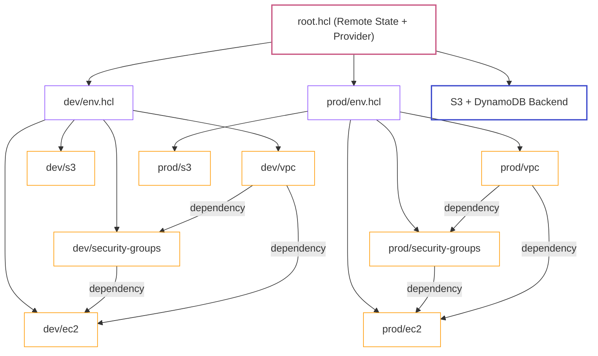

# Capstone Project: Infrastructure as Code Mastery

| Difficulty | Est. Time | Prerequisites |
|------------|-----------|---------------|
| Advanced | 4–5 Hours | Labs 8–13 |

## 🎯 Vision

You are an **IaC Engineer** building a platform team's foundational infrastructure repository from the ground up. A company is moving from manual Console deployments to a fully automated, pull-request-driven infrastructure workflow. Your job is to:

1. **Author reusable Terraform modules** from scratch (no community modules allowed).
2. **Wire them together** using a Terragrunt DRY multi-environment structure.
3. **Prove state integrity** by safely migrating, moving, and recovering Terraform state.
4. **Simulate a production deployment pipeline** by running ordered, layered plans and applies.

> **Pluralsight Sandbox Note**: All AWS services used here (VPC, EC2, S3, IAM, DynamoDB) are supported in the Pluralsight sandbox. All Terraform and Terragrunt tools need to be installed in the sandbox shell. Installation commands are provided.

---

## 🗺️ Target Repository Structure

You will build **two environments** (dev and prod) from a single set of reusable modules using Terragrunt dependency blocks to wire outputs as inputs.



---

## 📋 Technical Specifications

---

### Phase 0: Environment Setup

#### 🛠️ Install Required Tools

> Run these commands in your sandbox shell. All installs are local to your session.

```bash
# Install Terraform v1.7
curl -Lo /tmp/tf.zip https://releases.hashicorp.com/terraform/1.7.5/terraform_1.7.5_linux_amd64.zip
unzip /tmp/tf.zip -d /usr/local/bin/

# Install Terragrunt v0.55
curl -Lo /usr/local/bin/terragrunt https://github.com/gruntwork-io/terragrunt/releases/download/v0.55.21/terragrunt_linux_amd64
chmod +x /usr/local/bin/terragrunt

# Verify
terraform version
terragrunt --version
```

#### Create the State Backend (Manual — One Time Only)

```bash
# Create the S3 state bucket
aws s3api create-bucket \
  --bucket iac-capstone-tfstate-[yourname] \
  --region us-east-1

# Enable versioning
aws s3api put-bucket-versioning \
  --bucket iac-capstone-tfstate-[yourname] \
  --versioning-configuration Status=Enabled

# Enable encryption
aws s3api put-bucket-encryption \
  --bucket iac-capstone-tfstate-[yourname] \
  --server-side-encryption-configuration \
    '{"Rules":[{"ApplyServerSideEncryptionByDefault":{"SSEAlgorithm":"AES256"}}]}'

# Create DynamoDB lock table
aws dynamodb create-table \
  --table-name iac-capstone-tfstate-lock \
  --attribute-definitions AttributeName=LockID,AttributeType=S \
  --key-schema AttributeName=LockID,KeyType=HASH \
  --billing-mode PAY_PER_REQUEST
```

> **Why create this manually?** The state backend itself cannot be managed by Terraform — it must exist before Terraform can store its own state. This is a common real-world bootstrapping pattern called "chicken-and-egg state".

---

### Phase 1: Author the Terraform Modules

> **Rule**: You may NOT use any modules from the Terraform Registry (e.g., `terraform-aws-modules`). Every module must be authored by you. This phase tests your understanding of Terraform resource syntax, variable design, and output contracts.

#### 📦 Deliverables
- `modules/vpc/` — fully authored VPC module
- `modules/security-groups/` — SG module
- `modules/ec2/` — EC2 instance module
- `modules/s3/` — S3 bucket module

---

#### 1.1 Module: VPC (`modules/vpc/`)

**Required files**: `main.tf`, `variables.tf`, `outputs.tf`

**Resources this module must manage**:

| Resource | Terraform Type |
| :--- | :--- |
| VPC | `aws_vpc` |
| Public Subnet A | `aws_subnet` |
| Public Subnet B | `aws_subnet` |
| Private Subnet A | `aws_subnet` |
| Private Subnet B | `aws_subnet` |
| Internet Gateway | `aws_internet_gateway` |
| NAT Gateway | `aws_nat_gateway` |
| Elastic IP (for NAT) | `aws_eip` |
| Public Route Table | `aws_route_table` |
| Private Route Table | `aws_route_table` |
| Public RT Associations | `aws_route_table_association` |
| Private RT Associations | `aws_route_table_association` |

**Required Variables** (`variables.tf`):

```hcl
variable "vpc_cidr"             { type = string }
variable "public_subnet_cidrs"  { type = list(string) }
variable "private_subnet_cidrs" { type = list(string) }
variable "availability_zones"   { type = list(string) }
variable "environment"          { type = string }
variable "tags"                 { type = map(string), default = {} }
```

**Required Outputs** (`outputs.tf`) — these will be consumed by other modules via Terragrunt `dependency` blocks:

```hcl
output "vpc_id"             { value = aws_vpc.this.id }
output "public_subnet_ids"  { value = [aws_subnet.public_a.id, aws_subnet.public_b.id] }
output "private_subnet_ids" { value = [aws_subnet.private_a.id, aws_subnet.private_b.id] }
output "public_rt_id"       { value = aws_route_table.public.id }
output "private_rt_id"      { value = aws_route_table.private.id }
```

**Constraint**: Use `for_each` or `count` for subnet creation — not individual resource blocks for each subnet.

---

#### 1.2 Module: Security Groups (`modules/security-groups/`)

**Resources this module must manage**:

| Resource | Terraform Type |
| :--- | :--- |
| EC2 Security Group | `aws_security_group` |
| EC2 SG Inbound Rule (SSH) | `aws_vpc_security_group_ingress_rule` |
| EC2 SG Inbound Rule (HTTP) | `aws_vpc_security_group_ingress_rule` |
| EC2 SG Outbound Rule | `aws_vpc_security_group_egress_rule` |

**Design requirement**: Do not use inline `ingress` / `egress` blocks inside the `aws_security_group` resource. Use the separate `aws_vpc_security_group_ingress_rule` / `aws_vpc_security_group_egress_rule` resources instead. Explain in a comment why this avoids Terraform conflicts.

**Required Variables**:

```hcl
variable "vpc_id"            { type = string }
variable "environment"       { type = string }
variable "allowed_ssh_cidrs" { type = list(string) }
variable "tags"              { type = map(string), default = {} }
```

**Required Outputs**:

```hcl
output "ec2_sg_id" { value = aws_security_group.ec2.id }
```

---

#### 1.3 Module: EC2 (`modules/ec2/`)

**Resources this module must manage**:

| Resource | Terraform Type |
| :--- | :--- |
| EC2 Instance | `aws_instance` |
| IAM Role | `aws_iam_role` |
| IAM Instance Profile | `aws_iam_instance_profile` |
| IAM Policy Attachment (SSM) | `aws_iam_role_policy_attachment` |

**IAM Requirement**: The EC2 instance must be launched with an **IAM instance profile** that attaches the `AmazonSSMManagedInstanceCore` managed policy. This allows connection via Session Manager without a key pair.

**Required Variables**:

```hcl
variable "ami_id"          { type = string }
variable "instance_type"   { type = string, default = "t3.micro" }
variable "subnet_id"       { type = string }
variable "security_group_ids" { type = list(string) }
variable "environment"     { type = string }
variable "tags"            { type = map(string), default = {} }
variable "user_data"       { type = string, default = "" }
```

**Required Outputs**:

```hcl
output "instance_id"  { value = aws_instance.this.id }
output "private_ip"   { value = aws_instance.this.private_ip }
output "iam_role_arn" { value = aws_iam_role.this.arn }
```

**Constraint**: Do not hardcode any AMI ID or instance type. All values must come from variables.

---

#### 1.4 Module: S3 (`modules/s3/`)

**Resources this module must manage**:

| Resource | Terraform Type |
| :--- | :--- |
| S3 Bucket | `aws_s3_bucket` |
| Block Public Access | `aws_s3_bucket_public_access_block` |
| Encryption Config | `aws_s3_bucket_server_side_encryption_configuration` |
| Versioning Config | `aws_s3_bucket_versioning` |
| Lifecycle Rule | `aws_s3_bucket_lifecycle_configuration` |

**Required Variables**:

```hcl
variable "bucket_name_prefix" { type = string }
variable "environment"        { type = string }
variable "versioning_enabled" { type = bool, default = true }
variable "noncurrent_expiry_days" { type = number, default = 30 }
variable "tags"               { type = map(string), default = {} }
```

**Design requirement**: The bucket name must be constructed **inside the module** using `"${var.bucket_name_prefix}-${var.environment}-${random_id.suffix.hex}"` to ensure global uniqueness. Add `resource "random_id" "suffix" { byte_length = 4 }` to `main.tf`.

**Required Outputs**:

```hcl
output "bucket_name" { value = aws_s3_bucket.this.id }
output "bucket_arn"  { value = aws_s3_bucket.this.arn }
```

---

#### 1.5 Module Validation

Before wiring modules into Terragrunt, validate each module in isolation using a temporary `test/` directory. This is a standard practice for module development.

```bash
# Create a temporary test directory for each module
mkdir -p test/vpc && cat > test/vpc/main.tf <<'EOF'
module "vpc" {
  source               = "../../modules/vpc"
  vpc_cidr             = "10.99.0.0/16"
  public_subnet_cidrs  = ["10.99.1.0/24", "10.99.3.0/24"]
  private_subnet_cidrs = ["10.99.2.0/24", "10.99.4.0/24"]
  availability_zones   = ["us-east-1a", "us-east-1b"]
  environment          = "test"
}
EOF

cd test/vpc
terraform init
terraform validate
terraform plan
terraform destroy -auto-approve  # Clean up test resources
cd ../..
```

Repeat for each module. Do not proceed to Phase 2 until all modules pass `terraform validate`.

---

### Phase 2: Terragrunt Multi-Environment Wiring

Now wire your modules together with Terragrunt. Use `dependency` blocks to pass outputs between stacks without hardcoding any IDs.

#### 📦 Deliverables
- Complete `infrastructure/` directory tree as specified below.
- `terragrunt run-all plan` output showing resources to be created across all environments.
- `terragrunt run-all apply` output confirming all resources created successfully.

---

#### 2.1 Full Directory Structure

```text
infrastructure/
├── root.hcl
├── dev/
│   ├── env.hcl
│   ├── vpc/
│   │   └── terragrunt.hcl
│   ├── security-groups/
│   │   └── terragrunt.hcl
│   ├── ec2/
│   │   └── terragrunt.hcl
│   └── s3/
│       └── terragrunt.hcl
└── prod/
    ├── env.hcl
    ├── vpc/
    │   └── terragrunt.hcl
    ├── security-groups/
    │   └── terragrunt.hcl
    ├── ec2/
    │   └── terragrunt.hcl
    └── s3/
        └── terragrunt.hcl
```

---

#### 2.2 `root.hcl`

```hcl
locals {
  env_vars    = read_terragrunt_config(find_in_parent_folders("env.hcl"))
  environment = local.env_vars.locals.environment
  project     = "iac-capstone"
  region      = "us-east-1"
  aws_account = get_aws_account_id()
}

remote_state {
  backend = "s3"
  generate = {
    path      = "backend.tf"
    if_exists = "overwrite_terragrunt"
  }
  config = {
    bucket         = "iac-capstone-tfstate-[yourname]"
    key            = "${local.project}/${local.environment}/${path_relative_to_include()}/terraform.tfstate"
    region         = local.region
    encrypt        = true
    dynamodb_table = "iac-capstone-tfstate-lock"
  }
}

generate "provider" {
  path      = "provider.tf"
  if_exists = "overwrite_terragrunt"
  contents  = <<EOF
provider "aws" {
  region = "${local.region}"
  default_tags {
    tags = {
      Project     = "${local.project}"
      Environment = "${local.environment}"
      ManagedBy   = "Terragrunt"
    }
  }
}

provider "random" {}
EOF
}
```

---

#### 2.3 `dev/env.hcl`

```hcl
locals {
  environment          = "dev"
  vpc_cidr             = "10.0.0.0/16"
  public_subnet_cidrs  = ["10.0.1.0/24", "10.0.3.0/24"]
  private_subnet_cidrs = ["10.0.2.0/24", "10.0.4.0/24"]
  availability_zones   = ["us-east-1a", "us-east-1b"]
  instance_type        = "t3.micro"
  ami_id               = "ami-0c02fb55956c7d316"  # Amazon Linux 2023 us-east-1
}
```

---

#### 2.4 `dev/vpc/terragrunt.hcl`

```hcl
include "root" {
  path = find_in_parent_folders("root.hcl")
}

locals {
  env_vars = read_terragrunt_config(find_in_parent_folders("env.hcl"))
  env      = local.env_vars.locals
}

terraform {
  source = "../../../modules//vpc"
}

inputs = {
  vpc_cidr             = local.env.vpc_cidr
  public_subnet_cidrs  = local.env.public_subnet_cidrs
  private_subnet_cidrs = local.env.private_subnet_cidrs
  availability_zones   = local.env.availability_zones
  environment          = local.env.environment
}
```

---

#### 2.5 `dev/security-groups/terragrunt.hcl`

Use a `dependency` block to receive the VPC ID from the VPC stack. This is the core DRY pattern — no hardcoded VPC IDs.

```hcl
include "root" {
  path = find_in_parent_folders("root.hcl")
}

locals {
  env_vars = read_terragrunt_config(find_in_parent_folders("env.hcl"))
  env      = local.env_vars.locals
}

terraform {
  source = "../../../modules//security-groups"
}

dependency "vpc" {
  config_path = "../vpc"
  mock_outputs = {
    vpc_id = "vpc-00000000000000000"
  }
  mock_outputs_allowed_terraform_commands = ["validate", "plan"]
}

inputs = {
  vpc_id            = dependency.vpc.outputs.vpc_id
  environment       = local.env.environment
  allowed_ssh_cidrs = ["10.0.0.0/8"]
}
```

---

#### 2.6 `dev/ec2/terragrunt.hcl`

Use **two** `dependency` blocks — one for the VPC (subnet IDs) and one for the security groups (SG ID).

```hcl
include "root" {
  path = find_in_parent_folders("root.hcl")
}

locals {
  env_vars = read_terragrunt_config(find_in_parent_folders("env.hcl"))
  env      = local.env_vars.locals
}

terraform {
  source = "../../../modules//ec2"
}

dependency "vpc" {
  config_path = "../vpc"
  mock_outputs = {
    private_subnet_ids = ["subnet-00000000000000000", "subnet-11111111111111111"]
  }
  mock_outputs_allowed_terraform_commands = ["validate", "plan"]
}

dependency "security_groups" {
  config_path = "../security-groups"
  mock_outputs = {
    ec2_sg_id = "sg-00000000000000000"
  }
  mock_outputs_allowed_terraform_commands = ["validate", "plan"]
}

inputs = {
  ami_id             = local.env.ami_id
  instance_type      = local.env.instance_type
  subnet_id          = dependency.vpc.outputs.private_subnet_ids[0]
  security_group_ids = [dependency.security_groups.outputs.ec2_sg_id]
  environment        = local.env.environment
  user_data          = <<-EOF
    #!/bin/bash
    yum update -y
    yum install -y httpd
    echo "<h1>IaC Capstone - ${local.env.environment}</h1>" > /var/www/html/index.html
    systemctl start httpd && systemctl enable httpd
  EOF
}
```

---

#### 2.7 Task: Wire `prod/` Independently

Now replicate the same wiring for `prod/` using `prod/env.hcl` with CIDR `10.1.0.0/16`. The `prod` configs must be **entirely independent** — no dependency or reference to the `dev` stacks.

> **Validation**: Run `terragrunt run-all validate` from within `infrastructure/dev/` only. Confirm it does not trigger any `prod` runs.

---

#### 2.8 Deploy Both Environments

```bash
# From infrastructure/
terragrunt run-all apply
```

Observe the ordered apply — Terragrunt resolves the dependency graph and applies stacks in the correct order (VPC → SGs → EC2 → S3). Document the apply order from the log.

---

### Phase 3: State Management Deep Dive

> **This phase tests your ability to safely manipulate Terraform state.** You will perform operations that are dangerous if done incorrectly, and you will recover from a deliberately induced state disaster.

#### 📦 Deliverables
- State inspection outputs proving resource addresses.
- `state mv` log and subsequent "No changes" plan.
- Force-unlock log with recovered Lock ID.
- State export/import proof showing successful recovery.

---

#### 3.1 Inspect & Understand Your State

From within `infrastructure/dev/ec2/`:

```bash
# List all resources currently in state
terragrunt state list

# Show full details of the EC2 resource
terragrunt state show module.ec2.aws_instance.this

# Pull the raw state file to inspect it
terragrunt state pull | jq '.resources[].type' | sort | uniq
```

**Task**: Answer the following by reading the state output:
1. What is the `id` of the IAM instance profile in the state?
2. What `ami` was used? Is it the same as the AMI from `env.hcl`?
3. How many total resources are tracked in the `dev/ec2` state file?

---

#### 3.2 State Move (Refactoring)

Imagine the IaC team decided to rename the EC2 Terraform module's internal resource from `aws_instance.this` to `aws_instance.main`. Without a `state mv`, Terraform would destroy and recreate the instance.

**Simulate this refactor**:

1. In your module's `main.tf`, rename `resource "aws_instance" "this"` → `resource "aws_instance" "main"`.
2. Update all references (`outputs.tf`, etc.) to use `aws_instance.main`.
3. **Before** running plan, move the state:
   ```bash
   terragrunt state mv \
     module.ec2.aws_instance.this \
     module.ec2.aws_instance.main
   ```
4. Run `terragrunt plan`. Confirm output shows: `No changes. Your infrastructure matches the configuration.`
5. Rename back (`main` → `this`) and perform the `state mv` in reverse.

**Document**: The exact `state mv` command you ran and the "No changes" plan output.

---

#### 3.3 State Locking: Force-Unlock Recovery

You will deliberately simulate a stuck state lock and recover it.

1. Start a `terragrunt apply` in `dev/vpc/`:
   ```bash
   terragrunt apply &
   ```
2. Immediately kill the process before it finishes:
   ```bash
   kill %1
   ```
3. Attempt to run `terragrunt plan` in the same folder. It will fail with a lock error. **Copy the Lock ID from the error message.**
4. Unlock:
   ```bash
   terragrunt force-unlock [LOCK-ID]
   ```
5. Confirm `terragrunt plan` runs successfully after unlock.

**Document**: The full lock error message (including Lock ID) and the `force-unlock` command you used.

---

#### 3.4 State Export, Corrupt & Recover

This simulates a disaster recovery scenario.

1. Export the current clean state:
   ```bash
   terragrunt state pull > dev_ec2_backup.tfstate
   ```
2. **Corrupt the live state** by pushing an empty state (simulate accidental deletion):
   ```bash
   echo '{"version": 4, "terraform_version": "1.7.5", "serial": 999, "lineage": "", "outputs": {}, "resources": []}' | terragrunt state push /dev/stdin
   ```
3. Run `terragrunt plan`. Observe that Terraform now wants to **re-create all resources** (state is empty, but real resources exist).
4. **Recover** by pushing the backup state:
   ```bash
   terragrunt state push dev_ec2_backup.tfstate
   ```
5. Run `terragrunt plan` again. Confirm it shows "No changes."

**Document**: The plan output from step 3 (showing re-create) and the plan output from step 5 (showing No changes).

---

### Phase 4: Pipeline Simulation & Policy Enforcement

Simulate how a real CI/CD pipeline would handle infrastructure changes — with ordered approvals and policy enforcement.

#### 📦 Deliverables
- `plan_dev.txt` and `plan_prod.txt`: Saved plan files (binary format, then converted to human-readable with `terraform show`).
- `diff_report.md`: A table comparing what changed in dev vs. prod.
- `policy_check.sh`: A Bash script that fails if a plan contains any `destroy` actions.

---

#### 4.1 Generate and Save Plans

```bash
# Dev
cd infrastructure/dev/ec2
terragrunt plan -out=plan_dev.tfplan
terraform show -no-color plan_dev.tfplan > plan_dev.txt

# Prod
cd ../../prod/ec2
terragrunt plan -out=plan_prod.tfplan
terraform show -no-color plan_prod.tfplan > plan_prod.txt
```

---

#### 4.2 The Policy Gate: No Destroy Allowed

Write a Bash script that reads a plan file and **exits with code 1** if any resource is marked for destruction. This simulates a CI policy gate.

```bash
#!/bin/bash
# policy_check.sh — Fails if plan contains any destroy actions
PLAN_FILE="${1:-plan_dev.txt}"

if grep -q "# .* will be destroyed" "$PLAN_FILE"; then
  echo "❌ POLICY VIOLATION: Plan contains destroy actions. Aborting."
  grep "# .* will be destroyed" "$PLAN_FILE"
  exit 1
else
  echo "✅ Policy check passed. No destroy actions found."
  exit 0
fi
```

**Test the script**:
1. Run it against your current dev plan: `bash policy_check.sh plan_dev.txt` — should pass.
2. Modify your EC2 module to force a replacement (e.g., change `ami_id` to a different AMI). Run plan, save it, and run the policy check — it should detect the destroy and fail.
3. Revert the AMI change.

---

#### 4.3 Ordered Layered Apply

In a real pipeline, you apply environment layers in order (lowest risk first):

```bash
# Stage 1: Apply dev only
cd infrastructure/dev && terragrunt run-all apply

# Stage 2: Smoke test dev (substitute real ALB/instance verification)
INSTANCE_ID=$(aws ec2 describe-instances \
  --filters "Name=tag:Environment,Values=dev" "Name=instance-state-name,Values=running" \
  --query "Reservations[0].Instances[0].InstanceId" --output text)

STATE=$(aws ec2 describe-instance-status \
  --instance-ids $INSTANCE_ID \
  --query "InstanceStatuses[0].InstanceState.Name" --output text 2>/dev/null || echo "pending")
echo "Dev instance state: $STATE"

# Stage 3: Apply prod only if dev passed
if [ "$STATE" = "running" ]; then
  echo "✅ Dev smoke test passed. Promoting to prod..."
  cd ../prod && terragrunt run-all apply
else
  echo "❌ Dev smoke test failed. Halting prod deploy."
  exit 1
fi
```

---

#### 4.4 Tag Drift Detection

Simulate a scenario where someone manually added a tag via the Console (tag drift). Detect and remediate it via Terraform.

1. Manually add a tag to your dev EC2 instance in the Console: Key=`Manual`, Value=`TrueStory`.
2. Run `terragrunt plan` in `dev/ec2/`. Observe that Terraform **detects the drift** and plans to remove the manual tag.
3. Document: Does Terraform remove the manually added tag? Why or why not? (Hint: check `default_tags` behavior with `ignore_tags`.)
4. Add `ignore_changes = [tags["Manual"]]` to the EC2 resource's lifecycle block in your module.
5. Run plan again. Confirm the manual tag is now **ignored** (plan shows No changes for tags).

---

## 🧹 Cleanup

```bash
# Destroy all managed resources (both environments)
cd infrastructure/
terragrunt run-all destroy

# Destroy the state backend (manually)
aws dynamodb delete-table --table-name iac-capstone-tfstate-lock

aws s3 rm s3://iac-capstone-tfstate-[yourname] --recursive
aws s3 rb s3://iac-capstone-tfstate-[yourname]
```

---

## ✅ Final Deliverable Checklist

| # | Deliverable | Description |
| :--: | :--- | :--- |
| 1 | `modules/vpc/` | Fully authored VPC module with `for_each`/`count` for subnets |
| 2 | `modules/security-groups/` | SG module using separate ingress/egress rule resources |
| 3 | `modules/ec2/` | EC2 module with IAM role + SSM instance profile |
| 4 | `modules/s3/` | S3 module with encryption, versioning, lifecycle, and random suffix |
| 5 | Module Validation Logs | `terraform validate` + `terraform plan` passing for each module in isolation |
| 6 | `infrastructure/` (Git repo) | Full DRY Terragrunt tree with `dependency` blocks wiring all outputs |
| 7 | `terragrunt run-all apply` Log | Successful ordered apply across both environments |
| 8 | State Deep Dive Answers | Answers to §3.1 Q1–Q3 with CLI output |
| 9 | `state mv` + "No changes" Log | §3.2 state move + plan confirming no resource replacement |
| 10 | Force-Unlock Log | §3.3 lock error message + `force-unlock` command + successful plan |
| 11 | State Corrupt & Recovery Log | §3.4 corrupted plan (showing re-create) + recovered plan (No changes) |
| 12 | `policy_check.sh` | Script that detects destroy actions + proof it fails on a destructive plan |
| 13 | `plan_dev.txt` & `plan_prod.txt` | Human-readable plan files from §4.1 |
| 14 | Tag Drift Report | §4.4 — drift detected plan + `ignore_changes` fix + "No changes" plan |
