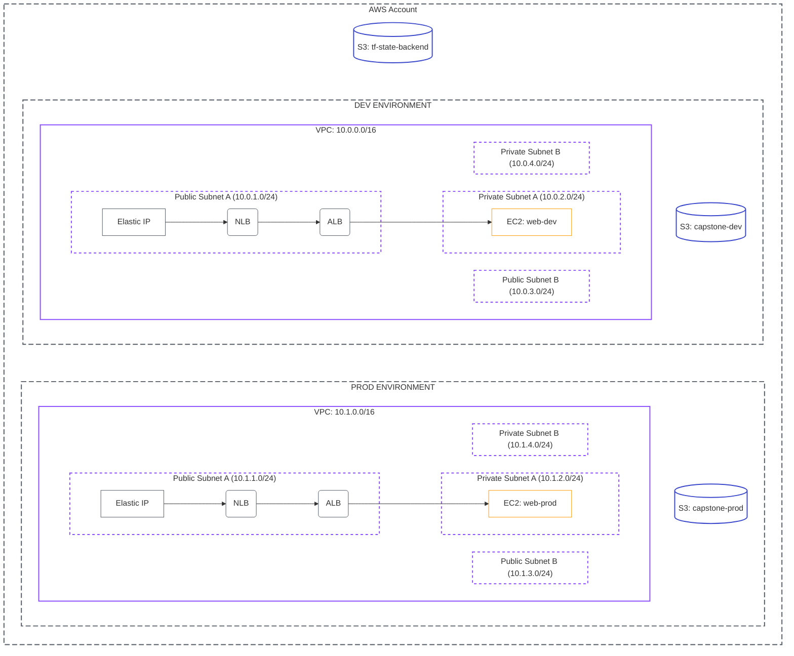
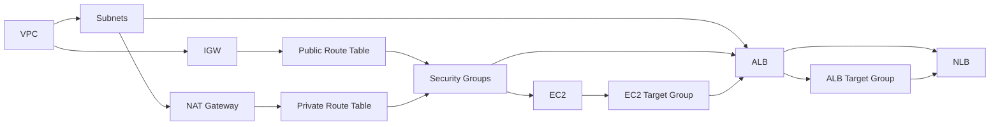

# Capstone Project: The Great Migration

| Difficulty | Est. Time | Prerequisites |
|------------|-----------|---------------|
| Advanced | 3–4 Hours | Labs 1–13 |

## 🎯 Vision

You are a Cloud Engineer tasked with modernizing a legacy environment. A previous team built a multi-environment setup **manually through the AWS Console — with no documentation**. Your mission is to:

1. **Discover** what was built by querying the live AWS account using the CLI and SDK.
2. **Validate** the discovered data by cross-referencing multiple AWS APIs.
3. **Codify** the infrastructure into a production-grade Terragrunt repository using `import` blocks.
4. **Prove control** by making infrastructure changes exclusively through code.

> **Pluralsight Sandbox Note**: All AWS resource types used in this project are supported within the Pluralsight sandbox environment. The sandbox provides a temporary AWS account with permissions for EC2, VPC, S3, ELB, and IAM. Ensure you note your sandbox session expiry before starting.

---

## 🗺️ Project Architecture

The project requires **two distinct environments** (Dev and Prod) within the same AWS account, each with its own isolated network stack and a shared S3 state bucket.



---

## 📋 Technical Specifications

---

### Phase 1: The Manual Build (Console)

You must build the following components manually through the AWS Console. **No automation is allowed in this phase.** This simulates a legacy environment left behind by a previous team.

#### 🛠️ Tools Needed
- **AWS Management Console**
- **Web Browser**

#### 📦 Deliverables
- **Live Infrastructure**: A fully functional Dev and Prod environment as defined below.
- **Console Screenshots**: Capture the detail page of each resource (VPC, Subnets, EC2, ALB, NLB, S3) showing its ID/ARN and Name tag.

---

#### 1. Networking (Per Environment)

Each environment requires **two** public and **two** private subnets (to satisfy ALB's multi-AZ requirement).

| Resource | Dev | Prod |
| :--- | :--- | :--- |
| **VPC CIDR** | `10.0.0.0/16` | `10.1.0.0/16` |
| **Public Subnet A** | `10.0.1.0/24` (AZ-a) | `10.1.1.0/24` (AZ-a) |
| **Public Subnet B** | `10.0.3.0/24` (AZ-b) | `10.1.3.0/24` (AZ-b) |
| **Private Subnet A** | `10.0.2.0/24` (AZ-a) | `10.1.2.0/24` (AZ-a) |
| **Private Subnet B** | `10.0.4.0/24` (AZ-b) | `10.1.4.0/24` (AZ-b) |
| **Internet Gateway** | Attached to VPC | Attached to VPC |
| **NAT Gateway** | In Public Subnet A, with Elastic IP | In Public Subnet A, with Elastic IP |
| **Public Route Table** | Routes `0.0.0.0/0` → IGW; Associated to both Public Subnets | Same |
| **Private Route Table** | Routes `0.0.0.0/0` → NAT GW; Associated to both Private Subnets | Same |

**Required Tags** (apply to every resource):

| Key | Value |
| :--- | :--- |
| `Name` | Descriptive name, e.g. `dev-vpc`, `prod-public-subnet-a` |
| `Environment` | `dev` or `prod` |
| `Project` | `capstone` |

---

#### 2. Compute

- **EC2 Instance** (one per environment):
  - Type: `t3.micro`, AMI: Amazon Linux 2023 (latest)
  - Placement: **Private Subnet A**
  - Security Group: `capstone-[env]-ec2-sg`
    - Inbound: HTTP (80) from ALB Security Group only
    - Inbound: SSH (22) from `10.0.0.0/8` (internal only)
  - User Data: Install and start a basic web server:
    ```bash
    #!/bin/bash
    yum update -y
    yum install -y httpd
    echo "<h1>Capstone [ENV] Server - $(hostname -f)</h1>" > /var/www/html/index.html
    systemctl start httpd
    systemctl enable httpd
    ```
  - Name Tag: `web-dev` / `web-prod`

---

#### 3. Load Balancing

- **ALB (Application Load Balancer)**:
  - Scheme: `internet-facing`
  - Subnets: **Both Public Subnets** of the same environment
  - Security Group: `capstone-[env]-alb-sg`, inbound HTTP (80) from `0.0.0.0/0`
  - Target Group: `capstone-[env]-ec2-tg`, HTTP, target: EC2 instance (port 80)
  - Listener: HTTP (80) → Forward to target group
  - Health Check Path: `/`

- **NLB (Network Load Balancer)**:
  - Scheme: `internet-facing`
  - Subnets: **Public Subnet A** with a new **Elastic IP** assigned
  - Target Group: `capstone-[env]-alb-tg`, type: `alb`, target: the ALB above
  - Listener: TCP (80) → Forward to ALB target group

---

#### 4. Storage

- **S3 Buckets** (create three total):
  - `capstone-dev-[yourname]-[random]`: Dev application bucket
  - `capstone-prod-[yourname]-[random]`: Prod application bucket
  - `capstone-tfstate-[yourname]-[random]`: Terraform state backend bucket
  - All buckets: Enable **AES-256 encryption**, **Block all public access**, **Enable Versioning**.

---

### Phase 2: Deep Discovery (CLI & SDK)

> **This is the core of the capstone.** Before you touch a single line of Terraform, you must understand your target environment completely. You will write scripts to query the live AWS account and cross-reference the data.

#### 🛠️ Tools Needed
- **AWS CLI** (v2)
- **Python 3** + **Boto3**
- **`jq`** (for JSON parsing in Bash)

#### 📦 Deliverables
- **`discovery.sh`**: A Bash script using AWS CLI to query and print resource IDs.
- **`audit.py`**: A Python/Boto3 script that builds the full `discovery.json` file.
- **`discovery.json`**: The structured output file, populated by `audit.py`.

---

#### 2.1 Querying VPCs

You must identify your VPCs by filtering on the `Project` tag, not by assuming IDs.

**CLI Task — Find VPCs by tag:**
```bash
aws ec2 describe-vpcs \
  --filters "Name=tag:Project,Values=capstone" \
  --query "Vpcs[*].{ID:VpcId, CIDR:CidrBlock, Name:Tags[?Key=='Name']|[0].Value}" \
  --output table
```

**CLI Task — Find the Internet Gateway attached to a specific VPC** (replace `vpc-xxxxxx`):
```bash
aws ec2 describe-internet-gateways \
  --filters "Name=attachment.vpc-id,Values=vpc-xxxxxx" \
  --query "InternetGateways[*].{IGW_ID:InternetGatewayId, State:Attachments[0].State}" \
  --output table
```

**CLI Task — List all Route Tables for a VPC and their associations:**
```bash
aws ec2 describe-route-tables \
  --filters "Name=vpc-id,Values=vpc-xxxxxx" \
  --query "RouteTables[*].{RT_ID:RouteTableId, Associations:Associations[*].SubnetId, Routes:Routes[*].{Dest:DestinationCidrBlock, GW:GatewayId}}" \
  --output json
```

**Validation Task**: Cross-reference the output. For each route table, confirm:
1. The public route table has a route to an IGW (`igw-*`).
2. The private route table has a route to a NAT Gateway (`nat-*`).
Document any discrepancies found.

---

#### 2.2 Querying Subnets

**CLI Task — List subnets with their type (public/private) using tags:**
```bash
aws ec2 describe-subnets \
  --filters "Name=vpc-id,Values=vpc-xxxxxx" \
  --query "Subnets[*].{ID:SubnetId, CIDR:CidrBlock, AZ:AvailabilityZone, Name:Tags[?Key=='Name']|[0].Value, AutoPublicIP:MapPublicIpOnLaunch}" \
  --output table
```

**Validation Task**: For each subnet, confirm the `MapPublicIpOnLaunch` value:
- Public subnets: should be `True`.
- Private subnets: should be `False`.
If any mismatch is found, correct it in the Console and document it.

---

#### 2.3 Querying EC2 Instances

**CLI Task — Find instances by tag and retrieve full network details:**
```bash
aws ec2 describe-instances \
  --filters "Name=tag:Project,Values=capstone" "Name=instance-state-name,Values=running" \
  --query "Reservations[*].Instances[*].{ID:InstanceId, Type:InstanceType, State:State.Name, PrivateIP:PrivateIpAddress, SubnetID:SubnetId, SG:SecurityGroups[*].GroupId, Name:Tags[?Key=='Name']|[0].Value}" \
  --output table
```

**CLI Task — Query the Security Group rules for a specific instance's SG** (replace `sg-xxxxxx`):
```bash
aws ec2 describe-security-group-rules \
  --filters "Name=group-id,Values=sg-xxxxxx" \
  --query "SecurityGroupRules[*].{RuleID:SecurityGroupRuleId, Direction:IsEgress, Protocol:IpProtocol, FromPort:FromPort, ToPort:ToPort, CIDR:CidrIpv4, SG_Source:ReferencedGroupInfo.GroupId}" \
  --output table
```

**Validation Task**: Confirm that port 80 inbound on the EC2 security group references the **ALB security group ID**, not `0.0.0.0/0`. Document the source SG ID.

---

#### 2.4 Querying Load Balancers

**CLI Task — List all ALBs with their DNS name and state:**
```bash
aws elbv2 describe-load-balancers \
  --query "LoadBalancers[?Type=='application'].{Name:LoadBalancerName, ARN:LoadBalancerArn, DNS:DNSName, State:State.Code, Scheme:Scheme}" \
  --output table
```

**CLI Task — Get the listeners for a specific ALB** (replace `arn:aws:elasticloadbalancing:...`):
```bash
aws elbv2 describe-listeners \
  --load-balancer-arn "arn:aws:elasticloadbalancing:..." \
  --query "Listeners[*].{ARN:ListenerArn, Port:Port, Protocol:Protocol, DefaultAction:DefaultActions[0].Type, TargetGroup:DefaultActions[0].TargetGroupArn}" \
  --output table
```

**CLI Task — List all NLBs:**
```bash
aws elbv2 describe-load-balancers \
  --query "LoadBalancers[?Type=='network'].{Name:LoadBalancerName, ARN:LoadBalancerArn, DNS:DNSName, State:State.Code}" \
  --output table
```

**CLI Task — Query Target Group health and target registration:**
```bash
# First, get all Target Group ARNs
aws elbv2 describe-target-groups \
  --query "TargetGroups[*].{Name:TargetGroupName, ARN:TargetGroupArn, Type:TargetType, Protocol:Protocol, Port:Port}" \
  --output table

# Then, for each TG ARN, check health:
aws elbv2 describe-target-health \
  --target-group-arn "arn:aws:elasticloadbalancing:..." \
  --query "TargetHealthDescriptions[*].{Target:Target.Id, Port:Target.Port, Health:TargetHealth.State, Reason:TargetHealth.Reason}" \
  --output table
```

**Validation Task**: All EC2 targets in the ALB target group must be `healthy`. If any are `unhealthy`, SSH to the instance (via Session Manager) and verify `httpd` is running (`systemctl status httpd`). Do not proceed to Phase 3 until all targets are healthy.

---

#### 2.5 Querying Elastic IPs & NAT Gateways

**CLI Task — List all Elastic IPs with their associated resources:**
```bash
aws ec2 describe-addresses \
  --query "Addresses[*].{AllocationID:AllocationId, PublicIP:PublicIp, AssociationID:AssociationId, AssociatedInstanceID:InstanceId, NatGateway:NetworkInterfaceId}" \
  --output table
```

**CLI Task — List NAT Gateways and confirm their EIP and subnet placement:**
```bash
aws ec2 describe-nat-gateways \
  --filter "Name=tag:Project,Values=capstone" \
  --query "NatGateways[*].{ID:NatGatewayId, State:State, SubnetID:SubnetId, EIP:NatGatewayAddresses[0].PublicIp, AllocationID:NatGatewayAddresses[0].AllocationId}" \
  --output table
```

**Validation Task**: Cross-reference the NAT Gateway's `SubnetId` against your subnet list from §2.2. Confirm each NAT Gateway is in a **public** subnet.

---

#### 2.6 Querying S3 Buckets

**CLI Task — List all project buckets:**
```bash
aws s3api list-buckets \
  --query "Buckets[?contains(Name, 'capstone')].{Name:Name, Created:CreationDate}" \
  --output table
```

**CLI Task — Verify encryption for each bucket** (replace `<bucket-name>`):
```bash
aws s3api get-bucket-encryption \
  --bucket <bucket-name> \
  --query "ServerSideEncryptionConfiguration.Rules[*].ApplyServerSideEncryptionByDefault.{Algorithm:SSEAlgorithm}" \
  --output table
```

**CLI Task — Verify versioning status:**
```bash
aws s3api get-bucket-versioning --bucket <bucket-name>
```

**CLI Task — Verify Block Public Access settings:**
```bash
aws s3api get-public-access-block --bucket <bucket-name>
```

**Validation Task**: Complete the following table in your `discovery.json`. All values must be confirmed, not assumed.

| Bucket Name | Encryption | Versioning | Public Access Blocked |
| :--- | :--- | :--- | :--- |
| `capstone-dev-...` | ✓/✗ | ✓/✗ | ✓/✗ |
| `capstone-prod-...` | ✓/✗ | ✓/✗ | ✓/✗ |
| `capstone-tfstate-...` | ✓/✗ | ✓/✗ | ✓/✗ |

---

#### 2.7 The Audit Script (`audit.py`)

Write a **Python script** using Boto3 that collects all the above data and writes it to a structured `discovery.json`. The script must:

1. Use `boto3` paginators (not simple list calls) to handle large result sets.
2. Filter resources using tags (`Project=capstone`) rather than hardcoded IDs.
3. Resolve **cross-references**: For each EC2 instance, embed its subnet's Name tag and its security group's inbound rules.
4. Resolve **cross-references**: For each ALB listener, embed the target group's health status.
5. Output a structured JSON file with the following top-level keys:

```json
{
  "discovery_timestamp": "...",
  "region": "us-east-1",
  "dev": {
    "vpc": { "id": "vpc-...", "cidr": "10.0.0.0/16", "igw_id": "igw-...", "nat_gateway_id": "nat-..." },
    "subnets": [ { "id": "subnet-...", "cidr": "...", "type": "public|private", "az": "..." } ],
    "route_tables": [ { "id": "rtb-...", "type": "public|private", "routes": [...] } ],
    "ec2": { "id": "i-...", "private_ip": "...", "security_group_id": "sg-..." },
    "alb": { "arn": "...", "dns": "...", "listener_arn": "...", "target_group_arn": "...", "target_health": "healthy|unhealthy" },
    "nlb": { "arn": "...", "dns": "...", "eip_allocation_id": "...", "target_group_arn": "..." },
    "s3": { "name": "...", "arn": "...", "encrypted": true, "versioning": true }
  },
  "prod": { "...": "same structure as dev" },
  "tfstate_bucket": { "name": "...", "arn": "..." }
}
```

**Run your script and verify the output is valid JSON:**
```bash
python3 audit.py
jq . discovery.json
```

---

### Phase 3: The Migration (Terragrunt + Import Blocks)

Your goal is to bring all resources under Terragrunt management **without triggering any Replacement** (Destroy/Create). You must use **Terraform `import` blocks** (not the `terragrunt import` CLI command) for this phase.

#### 🛠️ Tools Needed
- **Terragrunt** (v0.50+)
- **Terraform** (v1.5+)
- **Git**

#### 📦 Deliverables
- **Complete `infrastructure/` Repository**: A DRY Terragrunt structure as specified below.
- **`import.tf` files**: One `import.tf` per resource module, containing the `import` blocks.
- **`plan --no-changes` Logs**: Output of `terragrunt run-all plan` showing **"No changes"** for every module.

---

#### 3.1 Repository Structure

```text
infrastructure/
├── root.hcl                  # Root: remote state, provider config
├── dev/
│   ├── env.hcl               # Dev-specific locals (env = "dev", CIDR = "10.0.0.0/16")
│   ├── vpc/
│   │   └── terragrunt.hcl
│   ├── subnets/
│   │   └── terragrunt.hcl
│   ├── security-groups/
│   │   └── terragrunt.hcl
│   ├── alb/
│   │   └── terragrunt.hcl
│   ├── nlb/
│   │   └── terragrunt.hcl
│   ├── ec2/
│   │   └── terragrunt.hcl
│   └── s3/
│       └── terragrunt.hcl
└── prod/
    ├── env.hcl               # Prod-specific locals (env = "prod", CIDR = "10.1.0.0/16")
    ├── vpc/
    │   └── terragrunt.hcl
    ├── subnets/
    │   └── terragrunt.hcl
    ├── security-groups/
    │   └── terragrunt.hcl
    ├── alb/
    │   └── terragrunt.hcl
    ├── nlb/
    │   └── terragrunt.hcl
    ├── ec2/
    │   └── terragrunt.hcl
    └── s3/
        └── terragrunt.hcl
```

---

#### 3.2 The `import` Block Pattern

Each `terragrunt.hcl` must have a sibling `import.tf` file. Use the IDs you recorded in `discovery.json` to populate them.

**Example `dev/vpc/import.tf`:**
```hcl
import {
  to = module.vpc.aws_vpc.this
  id = "vpc-xxxxxxxxxxxxxxxxx"
}

import {
  to = module.vpc.aws_internet_gateway.this[0]
  id = "igw-xxxxxxxxxxxxxxxxx"
}
```

**Example `dev/subnets/import.tf`:**
```hcl
import {
  to = module.subnets.aws_subnet.public["public-a"]
  id = "subnet-xxxxxxxxxxxxxxxxx"
}

import {
  to = module.subnets.aws_subnet.public["public-b"]
  id = "subnet-xxxxxxxxxxxxxxxxx"
}

import {
  to = module.subnets.aws_subnet.private["private-a"]
  id = "subnet-xxxxxxxxxxxxxxxxx"
}

import {
  to = module.subnets.aws_subnet.private["private-b"]
  id = "subnet-xxxxxxxxxxxxxxxxx"
}
```

---

#### 3.3 Import Order (Dependency-Aware)

Resources have dependencies. You must import them **in this order** to avoid state errors:



Import and verify each layer before proceeding to the next. Check with `terragrunt plan` after each module import.

---

#### 3.4 The Root Configuration (`root.hcl`)

Your root config must configure the remote state backend using the `capstone-tfstate-*` bucket you created.

```hcl
# root.hcl
locals {
  env_vars    = read_terragrunt_config(find_in_parent_folders("env.hcl"))
  environment = local.env_vars.locals.environment
  region      = "us-east-1"
  project     = "capstone"
}

remote_state {
  backend = "s3"
  generate = {
    path      = "backend.tf"
    if_exists = "overwrite_terragrunt"
  }
  config = {
    bucket         = "capstone-tfstate-[yourname]-[random]"
    key            = "${local.project}/${local.environment}/${path_relative_to_include()}/terraform.tfstate"
    region         = local.region
    encrypt        = true
    dynamodb_table = "capstone-tfstate-lock"
  }
}

generate "provider" {
  path      = "provider.tf"
  if_exists = "overwrite_terragrunt"
  contents  = <<EOF
provider "aws" {
  region = "${local.region}"
  default_tags {
    tags = {
      Project     = "${local.project}"
      Environment = "${local.environment}"
      ManagedBy   = "Terragrunt"
    }
  }
}
EOF
}
```

> **Note**: You must also create the DynamoDB table `capstone-tfstate-lock` manually in the Console before running Terragrunt. This table is used for state locking.

---

#### 3.5 Success Criteria

A successful migration is achieved when **all** of the following are true:

1. `terragrunt run-all plan` returns **"No changes. Your infrastructure matches the configuration."** for **every single module**.
2. State is stored in the S3 backend. Verify by running:
   ```bash
   aws s3 ls s3://capstone-tfstate-[yourname]-[random]/capstone/ --recursive
   ```
3. Each resource is addressed logically (e.g., `module.vpc.aws_vpc.this`). Verify by running:
   ```bash
   # From within a module folder:
   terragrunt state list
   ```

---

### Phase 4: Verification & Cross-Validation

Before claiming success, you must verify the **live infrastructure** against your **Terraform state** using the CLI. This prevents "lazy" imports that match the state file but don't reflect reality.

#### 4.1 State vs. Reality Check

For each resource type below, run the CLI command and compare the output against what `terragrunt state show` outputs.

**VPC:**
```bash
# Get CIDR from state
terragrunt state show module.vpc.aws_vpc.this | grep cidr_block

# Compare against live reality
aws ec2 describe-vpcs --vpc-ids vpc-xxxxxx --query "Vpcs[0].CidrBlock"
```

**EC2 Instance:**
```bash
# Get private IP from state
terragrunt state show module.ec2.aws_instance.this | grep private_ip

# Compare against live reality
aws ec2 describe-instances --instance-ids i-xxxxxx \
  --query "Reservations[0].Instances[0].PrivateIpAddress"
```

**S3 Bucket Versioning:**
```bash
# Get versioning from state
terragrunt state show module.s3.aws_s3_bucket_versioning.this | grep status

# Compare against live reality
aws s3api get-bucket-versioning --bucket capstone-dev-[yourname]-[random]
```

**Task**: Run all three comparisons for **both** environments and document the results in a `verification_report.md` file. All values must match.

---

#### 4.2 End-to-End Connectivity Test

Query the NLB's public DNS name and verify the web server responds:

```bash
# Get NLB DNS from CLI (do not use Console)
NLB_DNS=$(aws elbv2 describe-load-balancers \
  --query "LoadBalancers[?contains(LoadBalancerName, 'capstone-dev')].DNSName" \
  --output text)

echo "NLB DNS: $NLB_DNS"

# Test HTTP response (may take 1-2 minutes for NLB to register ALB target)
curl -I http://$NLB_DNS
```

Expected response: `HTTP/1.1 200 OK` with the `web-dev` server hostname in the body.

Repeat for `capstone-prod`.

---

### Phase 5: Lifecycle Management & Hardening

To prove you are in full control, perform **all** of the following modifications exclusively via Terraform code changes. No Console changes are allowed.

#### 🛠️ Tools Needed
- **Terragrunt**
- **AWS CLI** (for verification only)

#### 📦 Deliverables
- **Clean `apply` Logs**: Showing only the expected changes (no replacements).
- **CLI Verification Output**: For each change below, a CLI command confirming the change was applied.

---

#### 5.1 Tagging Enforcement

Add two new tags to **all resources** via the `root.hcl` provider's `default_tags` block:

| Tag Key | Tag Value |
| :--- | :--- |
| `MigrationDate` | Today's date (`YYYY-MM-DD`) |
| `Owner` | Your name |

**Verify with CLI** after apply (check one EC2 instance as representative):
```bash
aws ec2 describe-instances \
  --instance-ids i-xxxxxx \
  --query "Reservations[0].Instances[0].Tags[?Key=='MigrationDate' || Key=='Owner']" \
  --output table
```

---

#### 5.2 Security Group Hardening

1. **Remove** the broad `10.0.0.0/8` SSH inbound rule from the EC2 security groups.
2. **Add** a new rule: allow SSH (22) **only from your current public IP**.

First, query your current public IP from the CLI:
```bash
MY_IP=$(curl -s https://checkip.amazonaws.com)/32
echo "Your IP: $MY_IP"
```

Add this value to your `security-groups/terragrunt.hcl` inputs. After apply, verify:
```bash
aws ec2 describe-security-group-rules \
  --filters "Name=group-id,Values=sg-xxxxxx" \
  --query "SecurityGroupRules[?!IsEgress && FromPort==\`22\`]" \
  --output table
```

Confirm: Only **one** SSH rule exists, and it references **your IP**.

---

#### 5.3 ALB Access Logging

Enable access logging on **both** ALBs. Logs should be written to a new prefix within the `capstone-dev` and `capstone-prod` S3 buckets.

In your `alb/terragrunt.hcl`:
```hcl
inputs = {
  # ... existing inputs
  access_logs = {
    bucket  = "capstone-[env]-[yourname]-[random]"
    prefix  = "alb-access-logs"
    enabled = true
  }
}
```

> **Note**: You must add an S3 bucket policy allowing the AWS ELB service account to write logs. Look up the ELB account ID for your region and add it as a bucket policy in your `s3/terragrunt.hcl`.

**Verify with CLI** after apply:
```bash
aws elbv2 describe-load-balancer-attributes \
  --load-balancer-arn "arn:aws:elasticloadbalancing:..." \
  --query "Attributes[?Key=='access_logs.s3.enabled']"
```

---

#### 5.4 S3 Lifecycle Policy

Add a **lifecycle rule** to **both** application S3 buckets to automatically expire non-current versions after **30 days**.

In your `s3/terragrunt.hcl`:
```hcl
inputs = {
  # ... existing inputs
  lifecycle_rules = [
    {
      id      = "expire-old-versions"
      enabled = true
      noncurrent_version_expiration = {
        days = 30
      }
    }
  ]
}
```

**Verify with CLI:**
```bash
aws s3api get-bucket-lifecycle-configuration --bucket capstone-dev-[yourname]-[random] \
  --query "Rules[*].{ID:ID, Status:Status, Expiration:NoncurrentVersionExpiration}"
```

---

## 🧹 Cleanup

Once the project is **fully verified**, destroy all Terragrunt-managed resources:

```bash
# From the infrastructure/ directory
terragrunt run-all destroy
```

Then manually delete resources **not managed by Terragrunt**:
1. The DynamoDB lock table (`capstone-tfstate-lock`) — delete from Console or CLI:
   ```bash
   aws dynamodb delete-table --table-name capstone-tfstate-lock
   ```
2. The state S3 bucket (must be emptied first before deletion):
   ```bash
   aws s3 rm s3://capstone-tfstate-[yourname]-[random] --recursive
   aws s3 rb s3://capstone-tfstate-[yourname]-[random]
   ```

> **Pluralsight Note**: The sandbox will automatically clean up any remaining resources at session expiry. However, proper cleanup is part of the assessment deliverables.

---

## ✅ Final Deliverable Checklist

| # | Deliverable | Description |
| :--: | :--- | :--- |
| 1 | Console Screenshots | Detail page of every manually created resource |
| 2 | `discovery.sh` | CLI-based discovery script |
| 3 | `audit.py` | Boto3 audit script with paginators and cross-references |
| 4 | `discovery.json` | Full structured resource map output by `audit.py` |
| 5 | `infrastructure/` (Git repo) | Complete DRY Terragrunt repo with `import.tf` files |
| 6 | Plan "No Changes" Log | `terragrunt run-all plan` log before Phase 5 changes |
| 7 | `verification_report.md` | State vs. reality comparison for all resources |
| 8 | Phase 5 Apply Log | Clean `terragrunt run-all apply` showing only tag/SG/S3 changes |
| 9 | CLI Verification Output | CLI output confirming each Phase 5 change |
| 10 | `curl` HTTP Test | 200 OK response from both NLB DNS endpoints |
