# Phase 3: Resilience & Observability Testing 🧪

Dokumen ini berisi panduan _step-by-step_ untuk melakukan pengujian ketahanan (resilience) dan observabilitas pada arsitektur AWS yang telah dibangun. Tujuan utama dari fase ini adalah membuktikan bahwa infrastruktur dapat melakukan _self-healing_ saat terjadi kegagalan.

---

## 🛠️ Alat yang Dibutuhkan

- **AWS CLI**: Untuk melakukan query pada CloudWatch dan event Auto Scaling Group (ASG).
- **AWS SSM Session Manager**: Untuk mengakses instance EC2 secara aman di subnet privat tanpa SSH key atau public IP.
- **Web Browser**: Untuk memverifikasi akses melalui DNS Application Load Balancer (ALB).

---

## 📦 Deliverables (Hasil Pengujian)

Pastikan Anda mendokumentasikan hasil pengujian berikut:

1. **AZ Failover Log**: Output CLI yang menunjukkan ASG mengganti instance di AZ yang gagal.
2. **CloudWatch Alarm Screenshot**: Screenshot alarm dalam status `ALARM` saat stress test CPU.
3. **ASG Scale-Out Log**: Output dari `describe-scaling-activities` yang menunjukkan peluncuran instance baru.

---

## 3.1 Test 1: Health Check Failure & Self-Healing 🛠️

_Simulasi kegagalan pada level aplikasi (web server crash)._

1.  **Hubungkan ke Instance**:
    Gunakan **Session Manager** melalui AWS Console atau CLI untuk masuk ke salah satu instance EC2 yang sedang berjalan.
2.  **Hentikan Web Server**:
    Jalankan perintah berikut untuk mensimulasikan _crash_ pada Apache:
    ```bash
    sudo systemctl stop httpd
    ```
    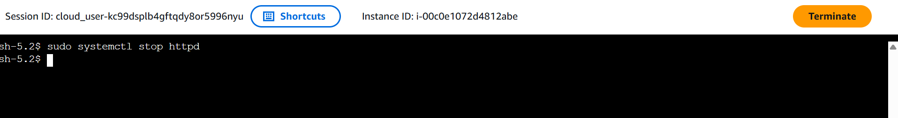
3.  **Pantau Target Group**:
    Buka AWS Console -> **Target Groups**. Dalam 1-2 interval health check, status target tersebut harus berubah menjadi `unhealthy`. <br>
    **BEFORE**
    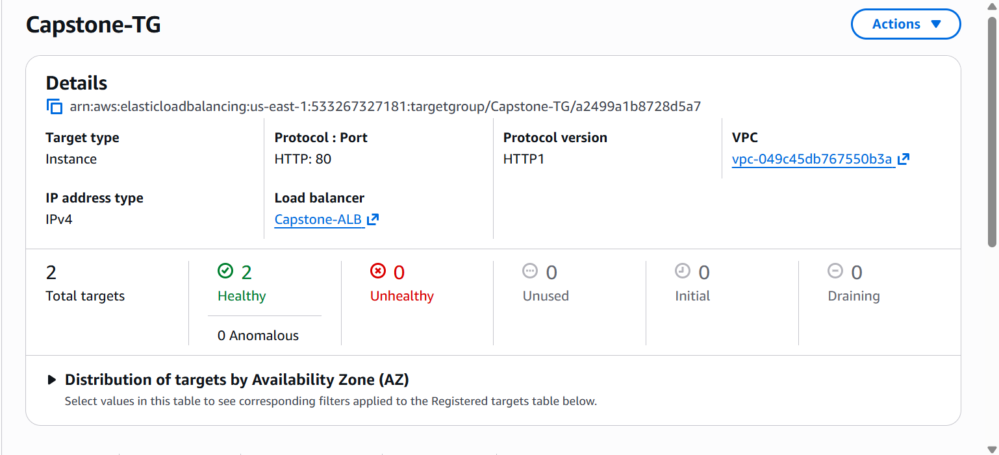
    **AFTER**
    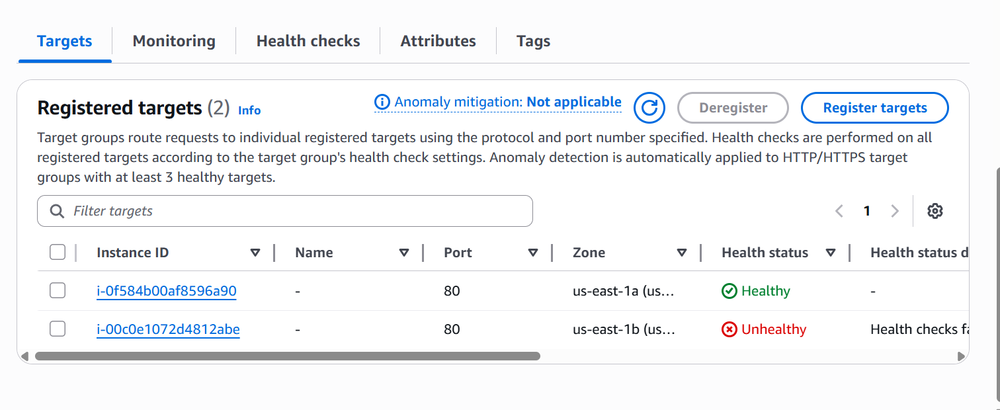
    **THEN**
    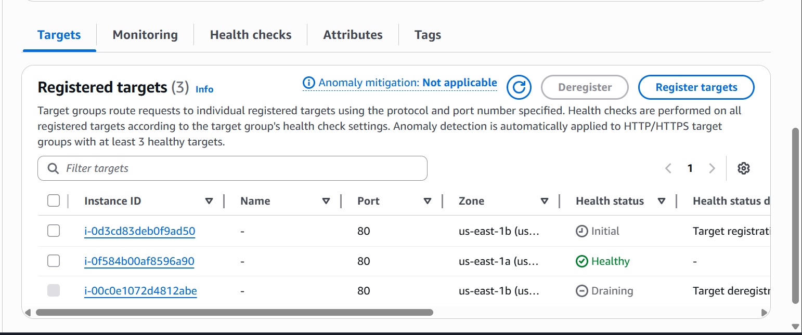
4.  **Verifikasi Penggantian Instance (CLI)**:
    Gunakan perintah berikut untuk melihat aktivitas ASG:
    ```bash
    aws autoscaling describe-scaling-activities \
      --auto-scaling-group-name [Nama-ASG-Anda] \
      --query "Activities[?Description != null].{Time:StartTime, Status:StatusCode, Desc:Description}" \
      --output table
    ```
    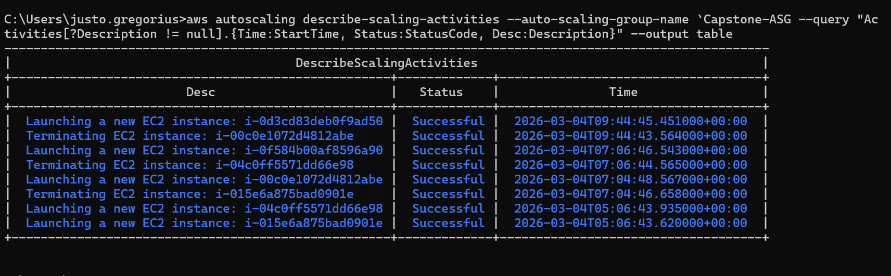
5.  **Konfirmasi Pemulihan**:
    Tunggu hingga instance baru terdaftar dan berstatus `healthy`:
    ```bash
    aws elbv2 describe-target-health \
      --target-group-arn "[ARN-Target-Group-Anda]" \
      --query "TargetHealthDescriptions[*].{Target:Target.Id, Health:TargetHealth.State}" \
      --output table
    ```
    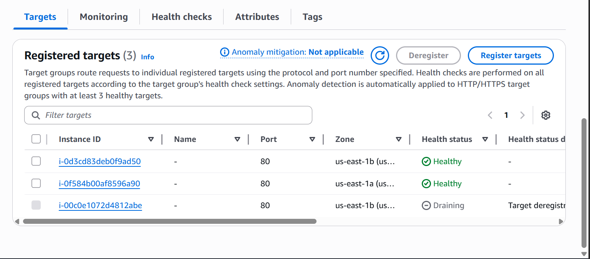
    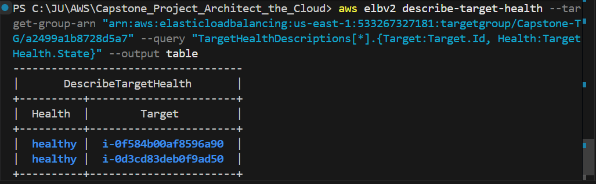

**Hasil yang Diharapkan**: ASG secara otomatis mematikan instance yang rusak dan meluncurkan penggantinya. Catat waktu dari _stop_ -> _unhealthy_ -> _replaced_ -> _healthy_.

---

## 3.2 Test 2: Availability Zone Failure Simulation 🌍

_Simulasi pemadaman total pada satu Availability Zone (AZ)._

1.  **Identifikasi Instance per AZ**:
    Jalankan perintah ini untuk melihat ID instance dan lokasinya:
    ```bash
    aws ec2 describe-instances \
      --filters "Name=tag:aws:autoscaling:groupName,Values=[Nama-ASG-Anda]" \
      --query "Reservations[*].Instances[*].{ID:InstanceId, AZ:Placement.AvailabilityZone, State:State.Name}" \
      --output table
    ```
    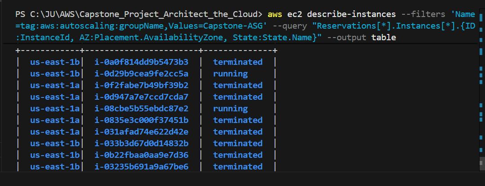
2.  **Hentikan Instance di Salah Satu AZ**:
    Hentikan instance di AZ tertentu (misal: `us-east-1a`) untuk mensimulasikan kegagalan zona:

    ```bash
    aws autoscaling terminate-instance-in-auto-scaling-group \
      --instance-id [ID-Instance-di-AZ-A] \
      --no-should-decrement-desired-capacity
    ```

    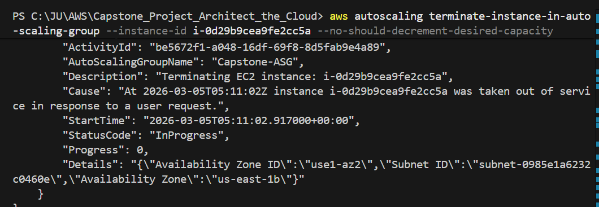
    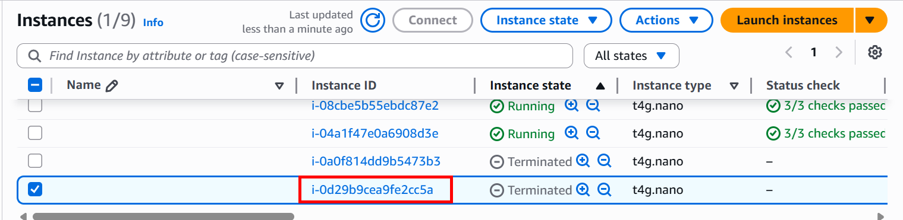
    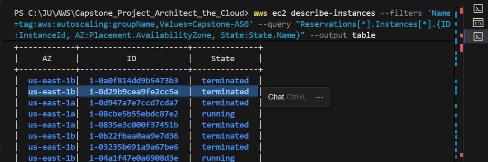

3.  **Observasi Self-Healing**:
    - ASG akan meluncurkan instance baru di AZ yang tersedia untuk menyeimbangkan beban kembali.
    - ALB akan terus mengarahkan traffic ke instance yang masih hidup di AZ lainnya.
4.  **Uji Downtime (Zero Downtime Check)**:
    Jalankan _loop_ perintah curl ke DNS ALB saat proses penggantian berlangsung:
    ```bash
    for i in {1..30}; do
      curl -so /dev/null -w "%{http_code} " http://[DNS-ALB-Anda]/
      echo "at $(date +%H:%M:%S)"
      sleep 2
    done
    ```
    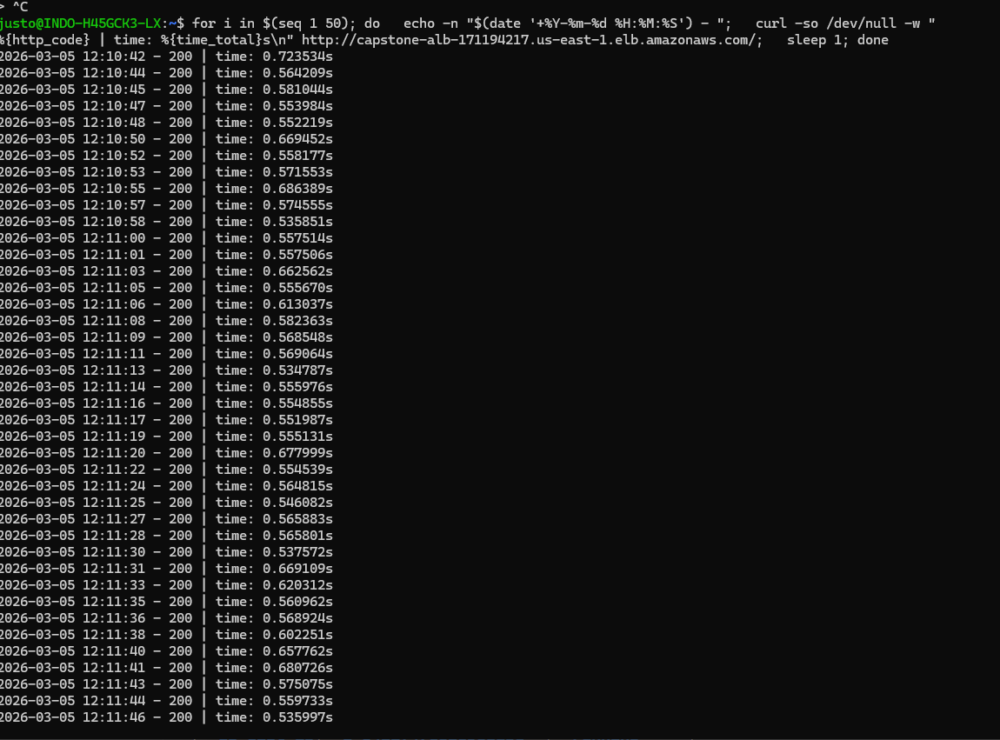

**Hasil yang Diharapkan**: Seluruh respon harus kembali dengan kode `200 OK`. Ini membuktikan sistem tetap tersedia meskipun satu AZ gagal total.

---

## 3.3 Test 3: CPU-Based Auto Scaling ⚡

_Simulasi lonjakan traffic yang memicu penambahan kapasitas otomatis._

1.  **Masuk ke Instance**: Gunakan Session Manager untuk masuk ke salah satu instance.
2.  **Jalankan Stress Test**:
    Gunakan tool `stress` untuk menaikkan beban CPU hingga 100% selama 5 menit:
    ```bash
    # Menggunakan seluruh core yang tersedia
    stress --cpu $(nproc) --timeout 300
    ```
    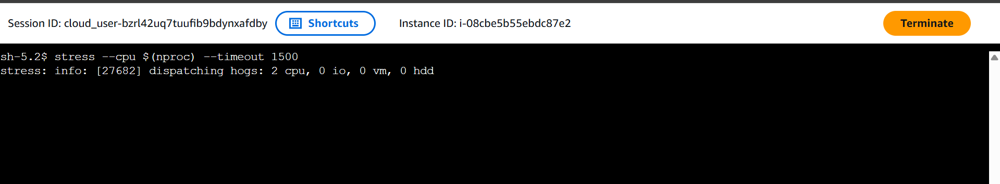
    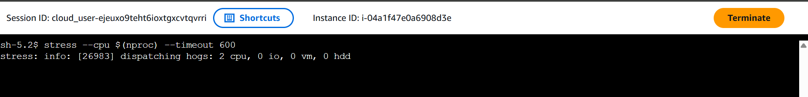
    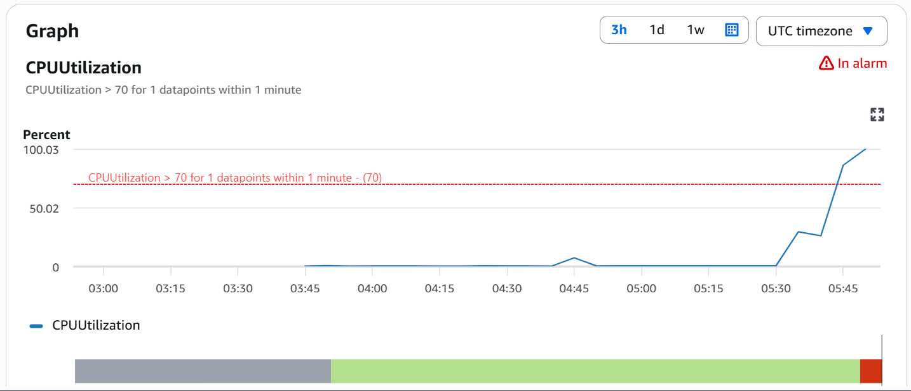
3.  **Monitor Alarm CloudWatch**:
    Gunakan CLI untuk memantau status alarm:
    ```bash
    aws cloudwatch describe-alarms \
      --alarm-names "[Nama-Alarm-CPU-High-Anda]" \
      --query "MetricAlarms[*].{Name:AlarmName, State:StateValue, Reason:StateReason}" \
      --output table
    ```
    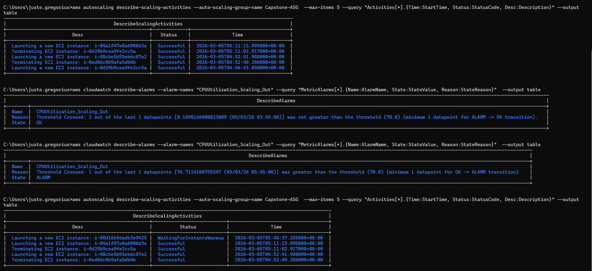
    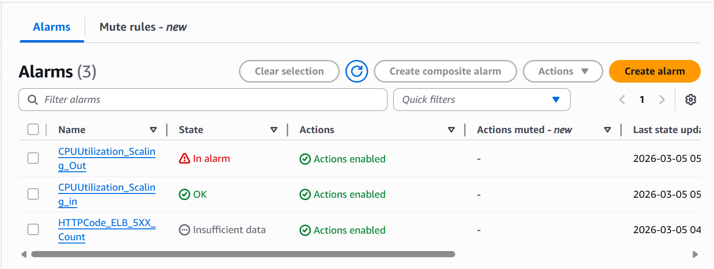
    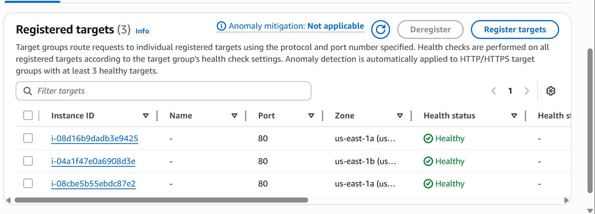
4.  **Cek Aktivitas Scaling**:
    Tunggu hingga alarm berubah menjadi status `ALARM`. Verifikasi peluncuran instance tambahan:
    ```bash
    aws autoscaling describe-scaling-activities \
      --auto-scaling-group-name [Nama-ASG-Anda] \
      --max-items 5 \
      --query "Activities[*].{Time:StartTime, Status:StatusCode, Desc:Description}" \
      --output table
    ```
    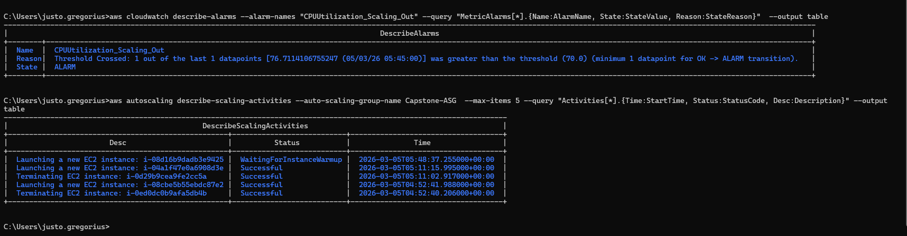

**Hasil yang Diharapkan**: Ketika CPU melampaui ambang batas (>70%) selama periode yang ditentukan, ASG akan menambah instance baru. Setelah proses `stress` selesai, verifikasi bahwa _scale-in_ (pengurangan instance) terjadi setelah masa _cooldown_ berakhir.

Scaling In
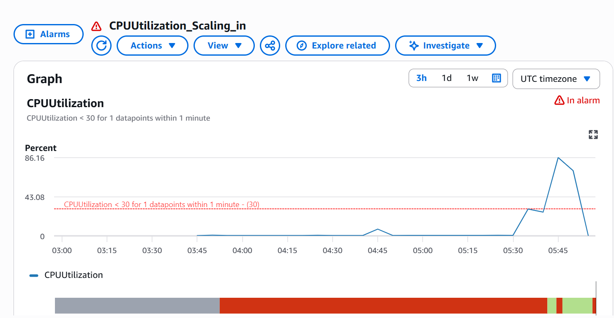
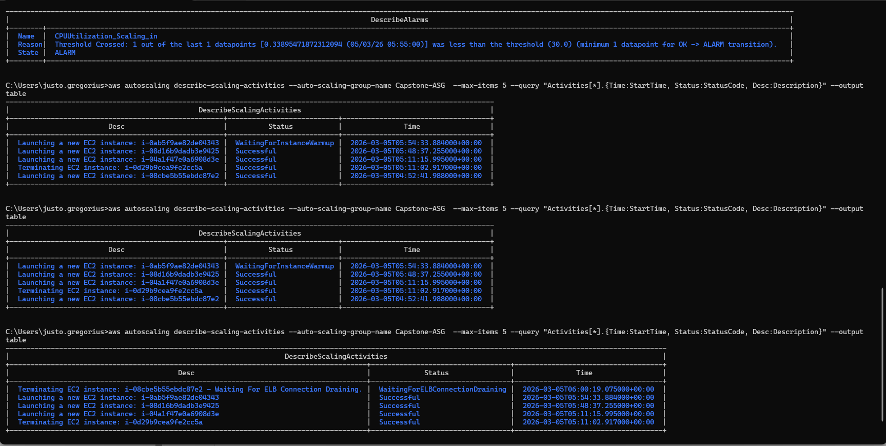
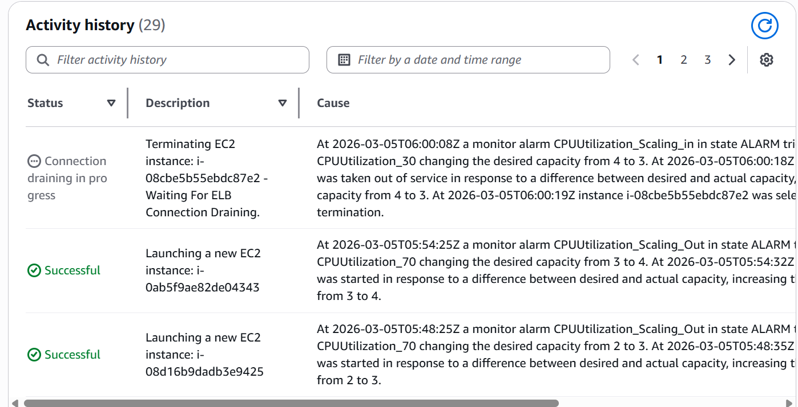
