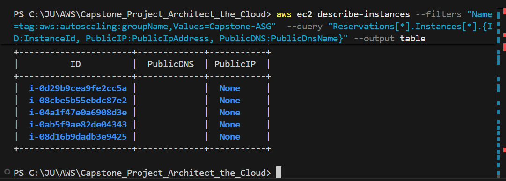
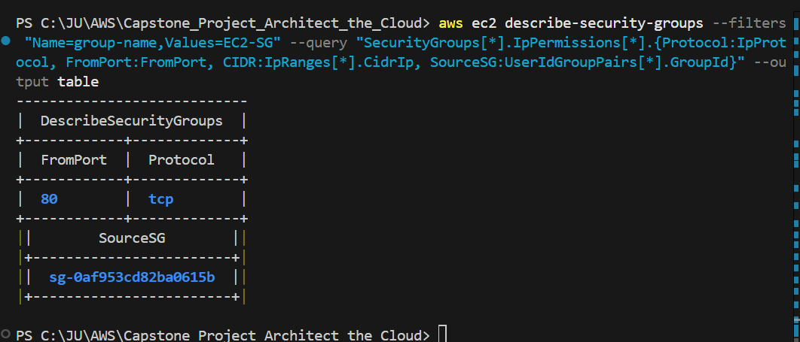
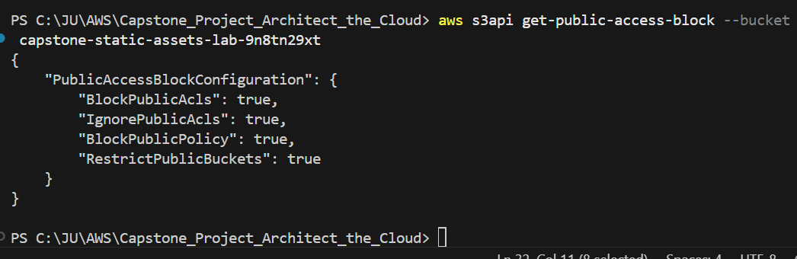
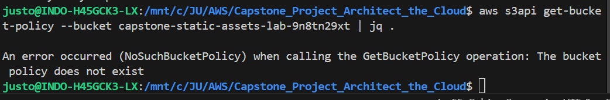
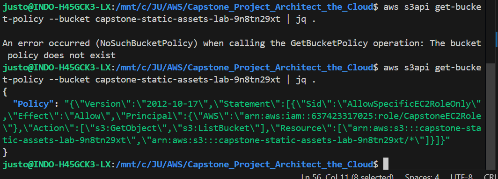

# Phase 4: Security Audit 🛡️

Fase ini bertujuan untuk melakukan audit keamanan pada infrastruktur yang telah dideploy menggunakan AWS CLI. Ini memastikan bahwa desain keamanan "Least Privilege" benar-benar terimplementasi.

---

## 4.1 Pastikan Tidak Ada EC2 dengan Public IP

Jalankan perintah ini untuk memverifikasi bahwa semua instance berada di subnet privat dan tidak memiliki akses publik langsung:

```bash
aws ec2 describe-instances \
  --filters "Name=tag:aws:autoscaling:groupName,Values=[Nama-ASG-Anda]" \
  --query "Reservations[*].Instances[*].{ID:InstanceId, PublicIP:PublicIpAddress, PublicDNS:PublicDnsName}" \
  --output table
```


**Ekspektasi**: Kolom `PublicIP` dan `PublicDNS` harus bernilai `None`.

---

## 4.2 Audit Aturan Security Group

Pastikan Security Group EC2 tidak menerima traffic dari internet (0.0.0.0/0), melainkan hanya dari ALB.

```bash
# Ganti dengan nama SG EC2 Anda
aws ec2 describe-security-groups --filters "Name=group-name,Values=EC2-SG" --query "SecurityGroups[*].IpPermissions[*].{Protocol:IpProtocol, FromPort:FromPort, CIDR:IpRanges[*].CidrIp, SourceSG:UserIdGroupPairs[*].GroupId}" --output table
```


**Ekspektasi**: Sumber traffic port 80 harus berupa SG ID milik ALB, bukan CIDR block.

---

## 4.3 Verifikasi Block Public Access S3

Pastikan semua akses publik ke bucket S3 telah ditutup secara total di level akun/bucket.

```bash
aws s3api get-public-access-block --bucket [Nama-Bucket-S3-Anda]
```


**Ekspektasi**: Empat parameter (`BlockPublicAcls`, `IgnorePublicAcls`, `BlockPublicPolicy`, `RestrictPublicBuckets`) harus bernilai `true`.

## 4.4 Verifikasi Bucket Policy (No Wildcard Principal)

Pastikan kebijakan bucket tidak mengizinkan akses ke semua orang (`"*"`).

```bash
aws s3api get-bucket-policy --bucket [Nama-Bucket-S3-Anda]
```



**Expected**: The `Principal` in the policy is **not** `"*"`. It should reference a specific IAM role ARN or be absent (rely entirely on Block Public Access).

> [!TIP]
> **Cara Setup Bucket Policy (Jika Anda ingin menambahkannya):**
>
> 1. Masuk ke **S3 Console** -> Pilih Bucket Anda -> Tab **Permissions** -> **Bucket policy** -> **Edit**.
> 2. Gunakan JSON berikut (Ganti `ACCOUNT_ID` dan `BUCKET_NAME`):
>
> ```json
> {
>   "Version": "2012-10-17",
>   "Statement": [
>     {
>       "Effect": "Allow",
>       "Principal": {
>         "AWS": "arn:aws:iam::637423317025:role/CapstoneEC2Role"
>       },
>       "Action": "s3:GetObject",
>       "Resource": "arn:aws:s3:::capstone-static-assets-lab-9n8tn29xt/*"
>     }
>   ]
> }
> ```
>
> 3. Klik **Save changes**. Dengan ini, kriteria soal terpenuhi secara eksplisit.
