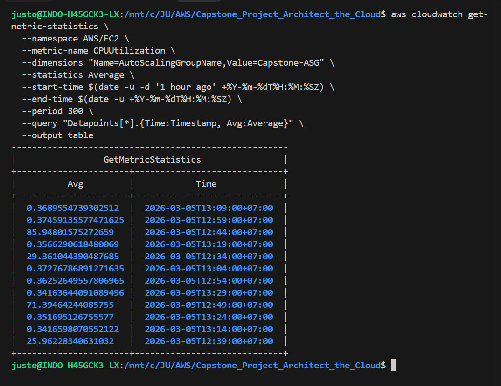

# Phase 5 & Cleanup: Optimization & Housekeeping 🧹

Fase terakhir adalah membandingkan estimasi biaya dengan penggunaan aktual, memberikan rekomendasi optimasi, dan membersihkan seluruh sumber daya AWS agar tidak terkena tagihan yang tidak perlu.

---

## 5. Review Biaya & Optimasi 💰

### 5.1 Estimasi vs Aktual

Bandingkan rata-rata penggunaan CPU aktual untuk melihat apakah _instance type_ Anda sudah pas (_right-sizing_).

```powershell
# Jalankan di PowerShell untuk mendapatkan rata-rata CPU satu jam terakhir
$StartTime = (Get-Date).AddHours(-1).ToUniversalTime().ToString("yyyy-MM-ddTHH:mm:ssZ")
$EndTime = (Get-Date).ToUniversalTime().ToString("yyyy-MM-ddTHH:mm:ssZ")

aws cloudwatch get-metric-statistics `
  --namespace AWS/EC2 `
  --metric-name CPUUtilization `
  --dimensions "Name=AutoScalingGroupName,Value=Capstone-ASG" `
  --statistics Average `
  --start-time $StartTime `
  --end-time $EndTime `
  --period 300 `
  --query "Datapoints[*].{Time:Timestamp, Avg:Average}" `
  --output table
```



### 5.2 Pertanyaan Refleksi & Hasil Analisis

1.  **Right-sizing**: `t4g.nano` adalah tipe instance terkecil dalam keluarga Graviton (ARM). Meskipun penggunaan CPU aktual mungkin sangat rendah (<5%), tidak ada opsi yang lebih kecil lagi secara teknis. Pilihan ini sudah paling optimal dari sisi biaya (_most cost-efficient baseline_).
2.  **NAT Gateway**: Menggunakan 1 NAT Gateway menghemat ~$33.30/bulan dibandingkan 2 NAT (1 per AZ). Untuk biaya yang lebih rendah lagi dalam produksi, pertimbangkan penggunaan **VPC Endpoints** (khususnya Gateway Endpoint untuk S3) yang sudah kita implementasikan secara gratis.
3.  **Savings Plan**: Jika sistem berjalan 1 tahun konsisten, **Compute Savings Plan** (1-Year, No Upfront) dapat memberikan diskon hingga **25%** untuk instance seri `t`, menghemat sekitar ~$1.50/bulan untuk baseline 2 instance ini.
4.  **Spot Instances**: Sangat masuk akal. Karena aplikasi bersifat _stateless_ (terletak di belakang Load Balancer), penggunaan **Mixed Instance Policy** (On-Demand + Spot) di ASG dapat mengurangi biaya komputasi hingga **70-90%** tanpa mengorbankan ketersediaan layanan secara signifikan.

---

## 🧹 Langkah Pembersihan (Cleanup)

Hapus sumber daya dengan urutan terbalik untuk menghindari error ketergantungan (_dependency_):

1.  **Hapus Auto Scaling Group (ASG)**:
    ```bash
    aws autoscaling delete-auto-scaling-group --auto-scaling-group-name [Nama-ASG] --force-delete
    ```
2.  **Hapus Load Balancer & Target Group**:
    ```bash
    aws elbv2 delete-load-balancer --load-balancer-arn [ARN-ALB]
    aws elbv2 delete-target-group --target-group-arn [ARN-TG]
    ```
3.  **Hapus S3 Bucket**:
    ```bash
    aws s3 rm s3://[Nama-Bucket] --recursive
    aws s3 rb s3://[Nama-Bucket]
    ```
4.  **Hapus Jaringan (VPC)**:
    Jika Anda membuat via **"VPC and More"**, hapus melalui console agar seluruh komponen (NAT GW, EIP, IGW, Subnets) terhapus sekaligus.
    _Catatan: Pastikan NAT Gateway sudah berstatus `deleted` sebelum menghapus VPC._
