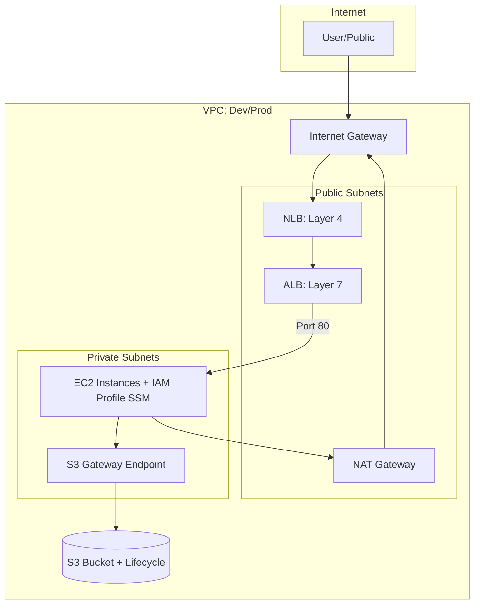

# Architecture Design - Capstone 2 (IaC)

This document outlines the infrastructure architecture for the **Development** and **Production** environments, managed using **Terraform** and **Terragrunt**.

## 1. High-Level Architecture Overview

Each environment is deployed into its own isolated **VPC** to ensure environment parity while maintaining strict security boundaries. The architecture follows a multi-tier design with public and private subnets across multiple Availability Zones (AZs).

### Core Components per Environment:

- **Networking**: 1 VPC, 1 Internet Gateway (IGW), 1 NAT Gateway (redundant per design requirement).
- **Subnets**:
  - **Public Subnets**: Houses NAT Gateway and Load Balancers.
  - **Private Subnets**: Houses application servers (EC2).
- **Compute**:
  - **EC2 Instances**: Deployed in Private Subnets.
  - **IAM Instance Profile**: Shared role with `AmazonSSMManagedInstanceCore` for secure, keyless access via AWS Systems Manager.
- **Load Balancing**:
  - **Network Load Balancer (NLB)**: Entry point for high-performance traffic.
  - **Application Load Balancer (ALB)**: Handles L7 request routing to backend services.
- **Storage**:
  - **S3 Buckets**: Constructed with random suffixes for global uniqueness.
  - **Lifecycle Rules**: Configured with 30-day expiry for non-current versions.
- **Endpoints**:
  - **S3 Gateway Endpoint**: To allow private subnets to access S3 without traversing the internet.

---

## 2. Environment Details

### A. Development Environment (Dev)

| Service                | Configuration                       |
| ---------------------- | ----------------------------------- |
| **VPC CIDR**           | `10.0.0.0/16`                       |
| **Availability Zones** | `us-east-1a`, `us-east-1b`          |
| **Public Subnets**     | `10.0.1.0/24`, `10.0.3.0/24`        |
| **Private Subnets**    | `10.0.2.0/24`, `10.0.4.0/24`        |
| **Scaling Mechanism**  | Driven by list length (up to 2 AZs) |

### B. Production Environment (Prod)

| Service                | Configuration                               |
| ---------------------- | ------------------------------------------- |
| **VPC CIDR**           | `10.1.0.0/16`                               |
| **Availability Zones** | `us-east-1a`, `us-east-1b`, `us-east-1c`    |
| **Public Subnets**     | `10.1.1.0/24`, `10.1.3.0/24`, `10.1.5.0/24` |
| **Private Subnets**    | `10.1.2.0/24`, `10.1.4.0/24`, `10.1.6.0/24` |
| **Scaling Mechanism**  | Driven by list length (up to 3 AZs)         |

---

## 3. Traffic Flow & Routing

### Inbound Traffic:

1. Traffic enters via **Internet Gateway (IGW)**.
2. Hits the **Network Load Balancer (NLB)**.
3. NLB forwards traffic to the **Application Load Balancer (ALB)**.
4. ALB routes traffic to the target EC2 instances in the **Private Subnets**.

### Outbound Traffic (Private Subnets):

1. EC2 instances send outbound requests to the **Private Route Table**.
2. Traffic is routed to the **NAT Gateway** located in the Public Subnet.
3. NAT Gateway forwards traffic to the internet via **IGW**.

---

## 4. Security & Compliance

### Access Management

- **Keyless Access**: EC2 instances do NOT use SSH Key Pairs. Access is managed via **AWS Systems Manager (SSM) Session Manager** through a shared IAM Role.
- **Least Privilege**: Security Groups use separate rules for Ingress and Egress to prevent state conflicts and ensure granular control.

### State Management

- **State Storage**: Securely stored in an encrypted **S3 Bucket**.
- **Locking**: Managed via **S3 Native Locking** (`use_lockfile`).
- **Encryption**: AES256 server-side encryption enabled for all state files and application buckets.

### Storage Policy

- **Versioning**: Enabled for state recovery and data safety.
- **Lifecycle Configuration**: Non-current versions of files are automatically deleted after 30 days to optimize storage costs.

---

## 5. Security Group Design (Least Privilege)

| Component  | Inbound Rules                                               | Outbound Rules                    | Role                         |
| ---------- | ----------------------------------------------------------- | --------------------------------- | ---------------------------- |
| **ALB SG** | Port 80 (HTTP) from `0.0.0.0/0`                             | Port 80 (HTTP) to **EC2 SG**      | Entry point for web traffic. |
| **EC2 SG** | Port 80 (HTTP) from **ALB SG**, Port 22 (SSH) from internal | All Traffic (`-1`) to `0.0.0.0/0` | Application servers.         |

---

## 6. Visual Representation (Mermaid)

