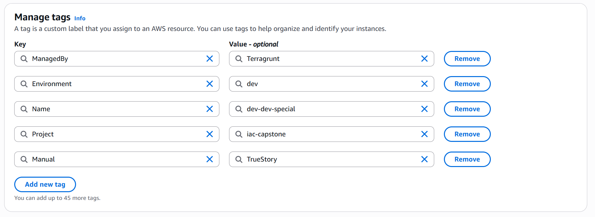
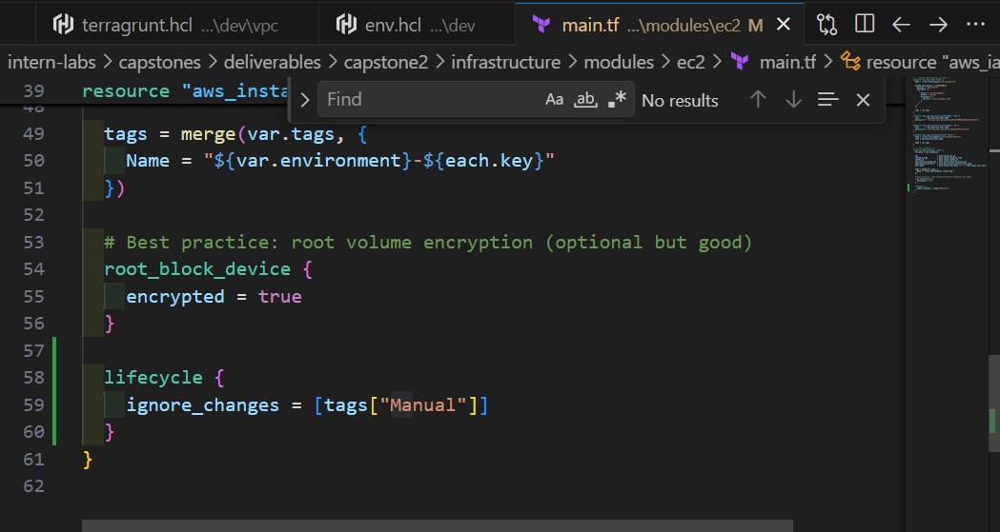

Fase ini mensimulasikan bagaimana alur kerja CI/CD sungguhan menangani perubahan infrastruktur dengan kebijakan keamanan.

## 4.0 Automated Backend Setup

Sebelum memulai pipeline, siapkan backend (S3 Bucket) menggunakan script otomatis.

**[Link To: setup_backend.sh](../../setup_backend.sh)**

```bash
#!/bin/bash
# Configuration
BUCKET_NAME="iac-capstone-tfstate-justo1"
REGION="us-east-1"

# Langkah-langkah utama:
# 1. Cek/Buat S3 Bucket
# 2. Aktifkan Versioning
# 3. Aktifkan Server-Side Encryption (AES256)
```

---

## 4.1 Export Human-Readable Plans

Simpan hasil plan ke dalam format teks agar mudah direview oleh manusia atau script.

```bash
terragrunt plan -out=plan_dev.tfplan
terraform show -no-color plan_dev.tfplan > plan_dev.txt
```

<details>
<summary><b>Terragrunt Plan Export Log (Dev & Prod)</b></summary>

<div style="max-height: 400px; overflow-y: auto; white-space: pre-wrap; word-wrap: break-word;">

```text
justo@INDO-H45GCK3-LX:/mnt/c/JU/AWS/Capstone_Project_Architect_the_Cloud/intern-labs/capstones/deliverables/capstone2/infrastructure/dev/ec2$ terragrunt plan -out=plan_dev.tfplan
14:11:48.847 STDOUT terraform: aws_iam_role.this: Refreshing state... [id=dev-ec2-shared-role]
14:11:50.660 STDOUT terraform: aws_iam_role_policy_attachment.ssm: Refreshing state... [id=dev-ec2-shared-role/arn:aws:iam::aws:policy/AmazonSSMManagedInstanceCore]
14:11:50.661 STDOUT terraform: aws_iam_instance_profile.this: Refreshing state... [id=dev-ec2-instance-profile]
14:11:50.661 STDOUT terraform: aws_iam_role_policy_attachment.s3: Refreshing state... [id=dev-ec2-shared-role/arn:aws:iam::aws:policy/AmazonS3FullAccess]
14:11:51.817 STDOUT terraform: aws_instance.this["dev-special"]: Refreshing state... [id=i-0a764758da75806cf]
14:11:51.819 STDOUT terraform: aws_instance.this["web-1"]: Refreshing state... [id=i-04ba77833db254481]
14:11:51.825 STDOUT terraform: aws_instance.this["web-2"]: Refreshing state... [id=i-0f6cdffef70ff8011]
14:11:57.373 STDOUT terraform: No changes. Your infrastructure matches the configuration.
14:11:57.373 STDOUT terraform: Terraform has compared your real infrastructure against your configuration
14:11:57.373 STDOUT terraform: and found no differences, so no changes are needed.
14:11:57.774 STDOUT terraform: Releasing state lock. This may take a few moments...
justo@INDO-H45GCK3-LX:/mnt/c/JU/AWS/Capstone_Project_Architect_the_Cloud/intern-labs/capstones/deliverables/capstone2/infrastructure/dev/ec2$ find . -name "plan_dev.tfplan"
./.terragrunt-cache/5UJDkDg2zzM7JvCsWpGtfpHXtjU/uq0xvdH1E9j3YWalObgbzqUT1lw/ec2/plan_dev.tfplan
justo@INDO-H45GCK3-LX:/mnt/c/JU/AWS/Capstone_Project_Architect_the_Cloud/intern-labs/capstones/deliverables/capstone2/infrastructure/dev/ec2$ tg show -no-color plan_dev.tfplan > plan_dev.txt


justo@INDO-H45GCK3-LX:/mnt/c/JU/AWS/Capstone_Project_Architect_the_Cloud/intern-labs/capstones/deliverables/capstone2/infrastructure/prod/ec2$ terragrunt plan -out=plan_prod.tfplan
14:18:47.064 STDOUT terraform: aws_iam_role.this: Refreshing state... [id=prod-ec2-shared-role]
14:18:49.827 STDOUT terraform: aws_iam_role_policy_attachment.s3: Refreshing state... [id=prod-ec2-shared-role/arn:aws:iam::aws:policy/AmazonS3FullAccess]
14:18:49.827 STDOUT terraform: aws_iam_instance_profile.this: Refreshing state... [id=prod-ec2-instance-profile]
14:18:49.827 STDOUT terraform: aws_iam_role_policy_attachment.ssm: Refreshing state... [id=prod-ec2-shared-role/arn:aws:iam::aws:policy/AmazonSSMManagedInstanceCore]
14:18:51.041 STDOUT terraform: aws_instance.this["web-1"]: Refreshing state... [id=i-030298c4d07cb8442]
14:18:51.041 STDOUT terraform: aws_instance.this["web-2"]: Refreshing state... [id=i-01708df8fba184696]
14:18:51.041 STDOUT terraform: aws_instance.this["app-special"]: Refreshing state... [id=i-05f4032a631953093]
14:18:51.041 STDOUT terraform: aws_instance.this["web-3"]: Refreshing state... [id=i-04032cb10d4cbc7f5]
14:18:59.617 STDOUT terraform: No changes. Your infrastructure matches the configuration.
14:18:59.617 STDOUT terraform: Terraform has compared your real infrastructure against your configuration
14:18:59.617 STDOUT terraform: and found no differences, so no changes are needed.
14:19:00.018 STDOUT terraform: Releasing state lock. This may take a few moments...
justo@INDO-H45GCK3-LX:/mnt/c/JU/AWS/Capstone_Project_Architect_the_Cloud/intern-labs/capstones/deliverables/capstone2/infrastructure/prod/ec2$ tg show -no-color plan_prod.tfplan > plan_prod.txt
```

</div>

</details>

## 4.2 Policy Gate: No Destroy

Buat script Bash (`policy_check.sh`) yang akan menggagalkan deployment jika ada resource yang akan dihancurkan.

**File: `policy_check.sh`**

```bash
#!/bin/bash
# policy_check.sh — Fails if plan contains any destroy actions
PLAN_FILE="${1:-plan_dev.txt}"

if grep -q "# .* will be destroyed" "$PLAN_FILE"; then
  echo "❌ POLICY VIOLATION: Plan contains destroy actions. Aborting."
  grep "# .* will be destroyed" "$PLAN_FILE"
  exit 1
else
  echo "✅ Policy check passed. No destroy actions found."
  exit 0
fi
```

<details>
<summary><b>Policy Check Execution Log (Dev & Prod)</b></summary>

<div style="max-height: 400px; overflow-y: auto; white-space: pre-wrap; word-wrap: break-word;">

```text
justo@INDO-H45GCK3-LX:/mnt/c/JU/AWS/Capstone_Project_Architect_the_Cloud/intern-labs/capstones/deliverables/capstone2$ ./policy_check.sh ./infrastructure/dev/ec2/plan_dev.txt
✅ Policy check passed. No destroy actions found.
justo@INDO-H45GCK3-LX:/mnt/c/JU/AWS/Capstone_Project_Architect_the_Cloud/intern-labs/capstones/deliverables/capstone2$
justo@INDO-H45GCK3-LX:/mnt/c/JU/AWS/Capstone_Project_Architect_the_Cloud/intern-labs/capstones/deliverables/capstone2$ ./policy_check.sh ./infrastructure/prod/ec2/plan_prod.txt
✅ Policy check passed. No destroy actions found.
justo@INDO-H45GCK3-LX:/mnt/c/JU/AWS/Capstone_Project_Architect_the_Cloud/intern-labs/capstones/deliverables/capstone2$
```

</div>

</details>

<details>
<summary><b>Policy Check Simulation Log (Replacement/Destroy)</b></summary>

<div style="max-height: 400px; overflow-y: auto; white-space: pre-wrap; word-wrap: break-word;">

```text
usto@INDO-H45GCK3-LX:/mnt/c/JU/AWS/Capstone_Project_Architect_the_Cloud/intern-labs/capstones/deliverables/capstone2/infrastructure/dev/ec2$ terragrunt plan -out=plan_dev.tfplan
14:54:56.675 STDOUT terraform: aws_iam_role.this: Refreshing state... [id=dev-ec2-shared-role]
14:54:58.526 STDOUT terraform: aws_iam_role_policy_attachment.s3: Refreshing state... [id=dev-ec2-shared-role/arn:aws:iam::aws:policy/AmazonS3FullAccess]
14:54:58.526 STDOUT terraform: aws_iam_role_policy_attachment.ssm: Refreshing state... [id=dev-ec2-shared-role/arn:aws:iam::aws:policy/AmazonSSMManagedInstanceCore]
14:54:58.526 STDOUT terraform: aws_iam_instance_profile.this: Refreshing state... [id=dev-ec2-instance-profile]
14:54:59.687 STDOUT terraform: aws_instance.this["dev-special"]: Refreshing state... [id=i-0f5197d2c01c5e0c2]
14:54:59.688 STDOUT terraform: aws_instance.this["web-2"]: Refreshing state... [id=i-022cf28de341223c1]
14:54:59.688 STDOUT terraform: aws_instance.this["web-1"]: Refreshing state... [id=i-0050baf9fe2930ddb]
14:55:04.845 STDOUT terraform: Terraform used the selected providers to generate the following execution
14:55:04.845 STDOUT terraform: plan. Resource actions are indicated with the following symbols:
14:55:04.845 STDOUT terraform: -/+ destroy and then create replacement
14:55:04.845 STDOUT terraform: Terraform will perform the following actions:
14:55:04.846 STDOUT terraform:   # aws_instance.this["web-1"] must be replaced
14:55:04.846 STDOUT terraform: -/+ resource "aws_instance" "this" {
14:55:04.846 STDOUT terraform:       ~ ami                                  = "ami-0c02fb55956c7d316" -> "ami-051f8b213d23e1206" # forces replacement
14:55:04.846 STDOUT terraform:       ~ arn                                  = "arn:aws:ec2:us-east-1:916393717574:instance/i-0050baf9fe2930ddb" -> (known after apply)
14:55:04.846 STDOUT terraform:       ~ associate_public_ip_address          = false -> (known after apply)
14:55:04.846 STDOUT terraform:       ~ availability_zone                    = "us-east-1a" -> (known after apply)
14:55:04.846 STDOUT terraform:       ~ disable_api_stop                     = false -> (known after apply)
14:55:04.846 STDOUT terraform:       ~ disable_api_termination              = false -> (known after apply)
14:55:04.847 STDOUT terraform:       ~ ebs_optimized                        = false -> (known after apply)
14:55:04.847 STDOUT terraform:       + enable_primary_ipv6                  = (known after apply)
14:55:04.847 STDOUT terraform:       - hibernation                          = false -> null
14:55:04.847 STDOUT terraform:       + host_id                              = (known after apply)
14:55:04.847 STDOUT terraform:       + host_resource_group_arn              = (known after apply)
14:55:04.847 STDOUT terraform:       ~ id                                   = "i-0050baf9fe2930ddb" -> (known after apply)
14:55:04.847 STDOUT terraform:       ~ instance_initiated_shutdown_behavior = "stop" -> (known after apply)
14:55:04.847 STDOUT terraform:       + instance_lifecycle                   = (known after apply)
14:55:04.847 STDOUT terraform:       ~ instance_state                       = "running" -> (known after apply)
14:55:04.847 STDOUT terraform:       ~ ipv6_address_count                   = 0 -> (known after apply)
14:55:04.847 STDOUT terraform:       ~ ipv6_addresses                       = [] -> (known after apply)
14:55:04.848 STDOUT terraform:       + key_name                             = (known after apply)
14:55:04.848 STDOUT terraform:       ~ monitoring                           = false -> (known after apply)
14:55:04.848 STDOUT terraform:       + outpost_arn                          = (known after apply)
14:55:04.848 STDOUT terraform:       + password_data                        = (known after apply)
14:55:04.848 STDOUT terraform:       + placement_group                      = (known after apply)
14:55:04.848 STDOUT terraform:       + placement_group_id                   = (known after apply)
14:55:04.848 STDOUT terraform:       ~ placement_partition_number           = 0 -> (known after apply)
14:55:04.848 STDOUT terraform:       ~ primary_network_interface_id         = "eni-0443d28ae130fab55" -> (known after apply)
14:55:04.848 STDOUT terraform:       ~ private_dns                          = "ip-10-0-2-209.ec2.internal" -> (known after apply)
14:55:04.848 STDOUT terraform:       ~ private_ip                           = "10.0.2.209" -> (known after apply)
14:55:04.848 STDOUT terraform:       + public_dns                           = (known after apply)
14:55:04.849 STDOUT terraform:       + public_ip                            = (known after apply)
14:55:04.849 STDOUT terraform:       ~ secondary_private_ips                = [] -> (known after apply)
14:55:04.849 STDOUT terraform:       ~ security_groups                      = [] -> (known after apply)
14:55:04.849 STDOUT terraform:       + spot_instance_request_id             = (known after apply)
14:55:04.849 STDOUT terraform:         tags                                 = {
14:55:04.849 STDOUT terraform:             "Environment" = "dev"
14:55:04.849 STDOUT terraform:             "ManagedBy"   = "Terragrunt"
14:55:04.849 STDOUT terraform:             "Name"        = "dev-web-1"
14:55:04.849 STDOUT terraform:             "Project"     = "iac-capstone"
14:55:04.849 STDOUT terraform:         }
14:55:04.849 STDOUT terraform:       ~ tenancy                              = "default" -> (known after apply)
14:55:04.849 STDOUT terraform:       + user_data_base64                     = (known after apply)
14:55:04.849 STDOUT terraform:         # (11 unchanged attributes hidden)
14:55:04.849 STDOUT terraform:       ~ capacity_reservation_specification (known after apply)
14:55:04.849 STDOUT terraform:       - capacity_reservation_specification {
14:55:04.850 STDOUT terraform:           - capacity_reservation_preference = "open" -> null
14:55:04.850 STDOUT terraform:         }
14:55:04.850 STDOUT terraform:       ~ cpu_options (known after apply)
14:55:04.850 STDOUT terraform:       - cpu_options {
14:55:04.850 STDOUT terraform:           - core_count            = 1 -> null
14:55:04.850 STDOUT terraform:           - threads_per_core      = 2 -> null
14:55:04.850 STDOUT terraform:             # (2 unchanged attributes hidden)
14:55:04.850 STDOUT terraform:         }
14:55:04.850 STDOUT terraform:       - credit_specification {
14:55:04.850 STDOUT terraform:           - cpu_credits = "unlimited" -> null
14:55:04.850 STDOUT terraform:         }
14:55:04.850 STDOUT terraform:       ~ ebs_block_device (known after apply)
14:55:04.850 STDOUT terraform:       ~ enclave_options (known after apply)
14:55:04.850 STDOUT terraform:       - enclave_options {
14:55:04.850 STDOUT terraform:           - enabled = false -> null
14:55:04.850 STDOUT terraform:         }
14:55:04.850 STDOUT terraform:       ~ ephemeral_block_device (known after apply)
14:55:04.850 STDOUT terraform:       ~ instance_market_options (known after apply)
14:55:04.851 STDOUT terraform:       ~ maintenance_options (known after apply)
14:55:04.851 STDOUT terraform:       - maintenance_options {
14:55:04.851 STDOUT terraform:           - auto_recovery = "default" -> null
14:55:04.851 STDOUT terraform:         }
14:55:04.851 STDOUT terraform:       ~ metadata_options (known after apply)
14:55:04.851 STDOUT terraform:       - metadata_options {
14:55:04.851 STDOUT terraform:           - http_endpoint               = "enabled" -> null
14:55:04.851 STDOUT terraform:           - http_protocol_ipv6          = "disabled" -> null
14:55:04.851 STDOUT terraform:           - http_put_response_hop_limit = 1 -> null
14:55:04.851 STDOUT terraform:           - http_tokens                 = "optional" -> null
14:55:04.851 STDOUT terraform:           - instance_metadata_tags      = "disabled" -> null
14:55:04.851 STDOUT terraform:         }
14:55:04.851 STDOUT terraform:       ~ network_interface (known after apply)
14:55:04.851 STDOUT terraform:       ~ primary_network_interface (known after apply)
14:55:04.851 STDOUT terraform:       - primary_network_interface {
14:55:04.851 STDOUT terraform:           - delete_on_termination = true -> null
14:55:04.852 STDOUT terraform:           - network_interface_id  = "eni-0443d28ae130fab55" -> null
14:55:04.852 STDOUT terraform:         }
14:55:04.852 STDOUT terraform:       ~ private_dns_name_options (known after apply)
14:55:04.852 STDOUT terraform:       - private_dns_name_options {
14:55:04.852 STDOUT terraform:           - enable_resource_name_dns_a_record    = false -> null
14:55:04.852 STDOUT terraform:           - enable_resource_name_dns_aaaa_record = false -> null
14:55:04.852 STDOUT terraform:           - hostname_type                        = "ip-name" -> null
14:55:04.852 STDOUT terraform:         }
14:55:04.852 STDOUT terraform:       ~ root_block_device {
14:55:04.852 STDOUT terraform:           ~ device_name           = "/dev/xvda" -> (known after apply)
14:55:04.852 STDOUT terraform:           ~ iops                  = 100 -> (known after apply)
14:55:04.852 STDOUT terraform:           ~ kms_key_id            = "arn:aws:kms:us-east-1:916393717574:key/1430b7b3-ee71-4fa7-8720-59c1bce146ad" -> (known after apply)
14:55:04.852 STDOUT terraform:           - tags                  = {} -> null
14:55:04.853 STDOUT terraform:           ~ tags_all              = {
14:55:04.853 STDOUT terraform:               - "Environment" = "dev"
14:55:04.853 STDOUT terraform:               - "ManagedBy"   = "Terragrunt"
14:55:04.853 STDOUT terraform:               - "Project"     = "iac-capstone"
14:55:04.853 STDOUT terraform:             } -> (known after apply)
14:55:04.853 STDOUT terraform:           ~ throughput            = 0 -> (known after apply)
14:55:04.853 STDOUT terraform:           ~ volume_id             = "vol-01cbf91ff96e0a093" -> (known after apply)
14:55:04.853 STDOUT terraform:           ~ volume_size           = 8 -> (known after apply)
14:55:04.853 STDOUT terraform:           ~ volume_type           = "gp2" -> (known after apply)
14:55:04.853 STDOUT terraform:             # (2 unchanged attributes hidden)
14:55:04.853 STDOUT terraform:         }
14:55:04.853 STDOUT terraform:       ~ secondary_network_interface (known after apply)
14:55:04.853 STDOUT terraform:     }
14:55:04.853 STDOUT terraform:   # aws_instance.this["web-2"] must be replaced
14:55:04.853 STDOUT terraform: -/+ resource "aws_instance" "this" {
14:55:04.854 STDOUT terraform:       ~ ami                                  = "ami-0c02fb55956c7d316" -> "ami-051f8b213d23e1206" # forces replacement
14:55:04.854 STDOUT terraform:       ~ arn                                  = "arn:aws:ec2:us-east-1:916393717574:instance/i-022cf28de341223c1" -> (known after apply)
14:55:04.854 STDOUT terraform:       ~ associate_public_ip_address          = false -> (known after apply)
14:55:04.854 STDOUT terraform:       ~ availability_zone                    = "us-east-1b" -> (known after apply)
14:55:04.854 STDOUT terraform:       ~ disable_api_stop                     = false -> (known after apply)
14:55:04.854 STDOUT terraform:       ~ disable_api_termination              = false -> (known after apply)
14:55:04.854 STDOUT terraform:       ~ ebs_optimized                        = false -> (known after apply)
14:55:04.854 STDOUT terraform:       + enable_primary_ipv6                  = (known after apply)
14:55:04.854 STDOUT terraform:       - hibernation                          = false -> null
14:55:04.855 STDOUT terraform:       + host_id                              = (known after apply)
14:55:04.855 STDOUT terraform:       + host_resource_group_arn              = (known after apply)
14:55:04.855 STDOUT terraform:       ~ id                                   = "i-022cf28de341223c1" -> (known after apply)
14:55:04.855 STDOUT terraform:       ~ instance_initiated_shutdown_behavior = "stop" -> (known after apply)
14:55:04.855 STDOUT terraform:       + instance_lifecycle                   = (known after apply)
14:55:04.855 STDOUT terraform:       ~ instance_state                       = "running" -> (known after apply)
14:55:04.855 STDOUT terraform:       ~ ipv6_address_count                   = 0 -> (known after apply)
14:55:04.855 STDOUT terraform:       ~ ipv6_addresses                       = [] -> (known after apply)
14:55:04.855 STDOUT terraform:       + key_name                             = (known after apply)
14:55:04.855 STDOUT terraform:       ~ monitoring                           = false -> (known after apply)
14:55:04.855 STDOUT terraform:       + outpost_arn                          = (known after apply)
14:55:04.855 STDOUT terraform:       + password_data                        = (known after apply)
14:55:04.855 STDOUT terraform:       + placement_group                      = (known after apply)
14:55:04.856 STDOUT terraform:       + placement_group_id                   = (known after apply)
14:55:04.856 STDOUT terraform:       ~ placement_partition_number           = 0 -> (known after apply)
14:55:04.856 STDOUT terraform:       ~ primary_network_interface_id         = "eni-0d2685938db4aba9a" -> (known after apply)
14:55:04.856 STDOUT terraform:       ~ private_dns                          = "ip-10-0-4-121.ec2.internal" -> (known after apply)
14:55:04.856 STDOUT terraform:       ~ private_ip                           = "10.0.4.121" -> (known after apply)
14:55:04.856 STDOUT terraform:       + public_dns                           = (known after apply)
14:55:04.856 STDOUT terraform:       + public_ip                            = (known after apply)
14:55:04.856 STDOUT terraform:       ~ secondary_private_ips                = [] -> (known after apply)
14:55:04.856 STDOUT terraform:       ~ security_groups                      = [] -> (known after apply)
14:55:04.856 STDOUT terraform:       + spot_instance_request_id             = (known after apply)
14:55:04.856 STDOUT terraform:         tags                                 = {
14:55:04.857 STDOUT terraform:             "Environment" = "dev"
14:55:04.857 STDOUT terraform:             "ManagedBy"   = "Terragrunt"
14:55:04.857 STDOUT terraform:             "Name"        = "dev-web-2"
14:55:04.857 STDOUT terraform:             "Project"     = "iac-capstone"
14:55:04.857 STDOUT terraform:         }
14:55:04.857 STDOUT terraform:       ~ tenancy                              = "default" -> (known after apply)
14:55:04.857 STDOUT terraform:       + user_data_base64                     = (known after apply)
14:55:04.857 STDOUT terraform:         # (11 unchanged attributes hidden)
14:55:04.857 STDOUT terraform:       ~ capacity_reservation_specification (known after apply)
14:55:04.860 STDOUT terraform:       - capacity_reservation_specification {
14:55:04.861 STDOUT terraform:           - capacity_reservation_preference = "open" -> null
14:55:04.861 STDOUT terraform:         }
14:55:04.861 STDOUT terraform:       ~ cpu_options (known after apply)
14:55:04.861 STDOUT terraform:       - cpu_options {
14:55:04.861 STDOUT terraform:           - core_count            = 1 -> null
14:55:04.861 STDOUT terraform:           - threads_per_core      = 2 -> null
14:55:04.861 STDOUT terraform:             # (2 unchanged attributes hidden)
14:55:04.861 STDOUT terraform:         }
14:55:04.861 STDOUT terraform:       - credit_specification {
14:55:04.861 STDOUT terraform:           - cpu_credits = "unlimited" -> null
14:55:04.861 STDOUT terraform:         }
14:55:04.861 STDOUT terraform:       ~ ebs_block_device (known after apply)
14:55:04.863 STDOUT terraform:       ~ enclave_options (known after apply)
14:55:04.864 STDOUT terraform:       - enclave_options {
14:55:04.864 STDOUT terraform:           - enabled = false -> null
14:55:04.864 STDOUT terraform:         }
14:55:04.864 STDOUT terraform:       ~ ephemeral_block_device (known after apply)
14:55:04.864 STDOUT terraform:       ~ instance_market_options (known after apply)
14:55:04.864 STDOUT terraform:       ~ maintenance_options (known after apply)
14:55:04.865 STDOUT terraform:       - maintenance_options {
14:55:04.865 STDOUT terraform:           - auto_recovery = "default" -> null
14:55:04.865 STDOUT terraform:         }
14:55:04.865 STDOUT terraform:       ~ metadata_options (known after apply)
14:55:04.865 STDOUT terraform:       - metadata_options {
14:55:04.865 STDOUT terraform:           - http_endpoint               = "enabled" -> null
14:55:04.865 STDOUT terraform:           - http_protocol_ipv6          = "disabled" -> null
14:55:04.865 STDOUT terraform:           - http_put_response_hop_limit = 1 -> null
14:55:04.866 STDOUT terraform:           - http_tokens                 = "optional" -> null
14:55:04.866 STDOUT terraform:           - instance_metadata_tags      = "disabled" -> null
14:55:04.866 STDOUT terraform:         }
14:55:04.866 STDOUT terraform:       ~ network_interface (known after apply)
14:55:04.866 STDOUT terraform:       ~ primary_network_interface (known after apply)
14:55:04.866 STDOUT terraform:       - primary_network_interface {
14:55:04.866 STDOUT terraform:           - delete_on_termination = true -> null
14:55:04.866 STDOUT terraform:           - network_interface_id  = "eni-0d2685938db4aba9a" -> null
14:55:04.866 STDOUT terraform:         }
14:55:04.866 STDOUT terraform:       ~ private_dns_name_options (known after apply)
14:55:04.866 STDOUT terraform:       - private_dns_name_options {
14:55:04.866 STDOUT terraform:           - enable_resource_name_dns_a_record    = false -> null
14:55:04.867 STDOUT terraform:           - enable_resource_name_dns_aaaa_record = false -> null
14:55:04.867 STDOUT terraform:           - hostname_type                        = "ip-name" -> null
14:55:04.867 STDOUT terraform:         }
14:55:04.867 STDOUT terraform:       ~ root_block_device {
14:55:04.867 STDOUT terraform:           ~ device_name           = "/dev/xvda" -> (known after apply)
14:55:04.867 STDOUT terraform:           ~ iops                  = 100 -> (known after apply)
14:55:04.867 STDOUT terraform:           ~ kms_key_id            = "arn:aws:kms:us-east-1:916393717574:key/1430b7b3-ee71-4fa7-8720-59c1bce146ad" -> (known after apply)
14:55:04.867 STDOUT terraform:           - tags                  = {} -> null
14:55:04.867 STDOUT terraform:           ~ tags_all              = {
14:55:04.867 STDOUT terraform:               - "Environment" = "dev"
14:55:04.867 STDOUT terraform:               - "ManagedBy"   = "Terragrunt"
14:55:04.867 STDOUT terraform:               - "Project"     = "iac-capstone"
14:55:04.867 STDOUT terraform:             } -> (known after apply)
14:55:04.867 STDOUT terraform:           ~ throughput            = 0 -> (known after apply)
14:55:04.868 STDOUT terraform:           ~ volume_id             = "vol-011e4855936eb34ec" -> (known after apply)
14:55:04.868 STDOUT terraform:           ~ volume_size           = 8 -> (known after apply)
14:55:04.868 STDOUT terraform:           ~ volume_type           = "gp2" -> (known after apply)
14:55:04.868 STDOUT terraform:             # (2 unchanged attributes hidden)
14:55:04.868 STDOUT terraform:         }
14:55:04.868 STDOUT terraform:       ~ secondary_network_interface (known after apply)
14:55:04.868 STDOUT terraform:     }
14:55:04.868 STDOUT terraform: Plan: 2 to add, 0 to change, 2 to destroy.
14:55:04.868 STDOUT terraform: Changes to Outputs:
14:55:04.868 STDOUT terraform:   ~ instance_ids  = {
14:55:04.868 STDOUT terraform:       ~ web-1       = "i-0050baf9fe2930ddb" -> (known after apply)
14:55:04.868 STDOUT terraform:       ~ web-2       = "i-022cf28de341223c1" -> (known after apply)
14:55:04.868 STDOUT terraform:         # (1 unchanged attribute hidden)
14:55:04.868 STDOUT terraform:     }
14:55:04.868 STDOUT terraform:   ~ private_ips   = {
14:55:04.868 STDOUT terraform:       ~ web-1       = "10.0.2.209" -> (known after apply)
14:55:04.869 STDOUT terraform:       ~ web-2       = "10.0.4.121" -> (known after apply)
14:55:04.869 STDOUT terraform:         # (1 unchanged attribute hidden)
14:55:04.869 STDOUT terraform:     }
14:55:04.869 STDOUT terraform:
14:55:04.869 STDOUT terraform: ─────────────────────────────────────────────────────────────────────────────
14:55:04.869 STDOUT terraform: Saved the plan to: plan_dev.tfplan
14:55:04.869 STDOUT terraform: To perform exactly these actions, run the following command to apply:
14:55:04.869 STDOUT terraform:     terraform apply "plan_dev.tfplan"
14:55:05.248 STDOUT terraform: Releasing state lock. This may take a few moments...
justo@INDO-H45GCK3-LX:/mnt/c/JU/AWS/Capstone_Project_Architect_the_Cloud/intern-labs/capstones/deliverables/capstone2/infrastructure/dev/ec2$ tg show -no-color plan_dev.tfplan > plan_dev.txt
justo@INDO-H45GCK3-LX:/mnt/c/JU/AWS/Capstone_Project_Architect_the_Cloud/intern-labs/capstones/deliverables/capstone2/infrastructure/dev/ec2$ ../../../policy_check.sh plan_dev.txt
✅ Policy check passed. No destroy actions found.
justo@INDO-H45GCK3-LX:/mnt/c/JU/AWS/Capstone_Project_Architect_the_Cloud/intern-labs/capstones/deliverables/capstone2/infrastructure/dev/ec2$ cd ../../..
justo@INDO-H45GCK3-LX:/mnt/c/JU/AWS/Capstone_Project_Architect_the_Cloud/intern-labs/capstones/deliverables/capstone2$ sed -i 's/\r$//' policy_check.sh
justo@INDO-H45GCK3-LX:/mnt/c/JU/AWS/Capstone_Project_Architect_the_Cloud/intern-labs/capstones/deliverables/capstone2$ ./policy_check.sh ./infrastructure/dev/ec2/plan_dev.txt
✅ Policy check passed. No destroy actions found.
justo@INDO-H45GCK3-LX:/mnt/c/JU/AWS/Capstone_Project_Architect_the_Cloud/intern-labs/capstones/deliverables/capstone2$ ./policy_check.sh ./infrastructure/dev/ec2/plan_dev.txt
❌ POLICY VIOLATION: Plan contains destroy or replacement actions. Aborting.
14:55:54.778 STDOUT terraform:   # aws_instance.this["web-1"] must be replaced
14:55:54.818 STDOUT terraform:   # aws_instance.this["web-2"] must be replaced
```

</div>

</details>
## 4.3 Deployment Berlapis (Layered Apply)

Simulasikan alur kerja dari lingkungan rendah ke tinggi dengan gate pengujian otomatis di antaranya.

**File: `layered_deploy.sh`**

```bash
#!/bin/bash
# layered_deploy.sh — Simulates a CI/CD layered deployment (Dev -> Smoke Test -> Prod)

set -e # Exit on any error

echo "🚀 Starting Stage 1: Deploying to DEV..."
cd infrastructure/dev
terragrunt run -all apply --non-interactive

echo "🔍 Starting Stage 2: Smoke Testing DEV instances..."
INSTANCE_ID=$(aws ec2 describe-instances \
  --filters "Name=tag:Environment,Values=dev" "Name=instance-state-name,Values=running" \
  --query "Reservations[0].Instances[0].InstanceId" --output text)

STATE=$(aws ec2 describe-instance-status \
  --instance-ids $INSTANCE_ID \
  --query "InstanceStatuses[0].InstanceState.Name" --output text 2>/dev/null || echo "pending")
echo "Dev instance ($INSTANCE_ID) state: $STATE"

echo "🏁 Starting Stage 3: Decision Gate..."
if [ "$STATE" = "running" ]; then
  echo "✅ Dev smoke test passed. Promoting to PROD..."
  cd ../prod
  terragrunt run -all apply --non-interactive
else
  echo "❌ Dev smoke test failed. Halting PROD deployment."
  exit 1
fi
```

<details>
<summary><b>Layered Deployment Simulation Log</b></summary>

<div style="max-height: 400px; overflow-y: auto; white-space: pre-wrap; word-wrap: break-word;">

```text
# (Isi log simulasi deployment di sini)
```

</div>

</details>

---

## 4.4 Deteksi Drift (Tag Drift)

Simulasikan perubahan manual yang dilakukan di luar Terraform (di AWS Console).

1. Tambah tag manual via Console.
   

2. Jalankan `plan` untuk melihat Terraform mendeteksi perbedaan tersebut.

**Analisis Drift Tag:**

- **Apakah Terraform menghapus tag manual tersebut?**
  Ya, secara default Terraform akan menghapus tag yang ditambahkan secara manual.
- **Mengapa?**
  Terraform bekerja dengan prinsip _declarative_. Ia akan memastikan sumber daya di AWS memiliki status yang **persis sama** dengan yang didefinisikan di dalam kode. Karena tag manual tersebut tidak ada dalam file `.tf` maupun blok `default_tags` di `provider.tf`, Terraform menganggapnya sebagai "drift" dan berusaha menghapusnya untuk kembali ke status yang diinginkan (_desired state_).

3. Gunakan `ignore_tags` untuk mengabaikan perubahan manual.

Jika Anda ingin Terraform mengabaikan tag tertentu (misalnya tag yang otomatis ditambahkan oleh AWS atau tim keamanan via Console), Anda bisa menggunakan blok `ignore_tags` pada level **AWS Provider** di `root.hcl`:

```hcl
provider "aws" {
  # ...
  ignore_tags {
    key_prefixes = ["Manual-", "AWS-"]
  }
}
```

Atau, jika hanya ingin mengabaikan pada satu resource spesifik, gunakan `lifecycle`:

```hcl
lifecycle {
  ignore_changes = [tags["ManualTag"]]
}
```

<details>
<summary><b>Tag Drift Detection Log</b></summary>

<div style="max-height: 400px; overflow-y: auto; white-space: pre-wrap; word-wrap: break-word;">

```text
justo@INDO-H45GCK3-LX:/mnt/c/JU/AWS/Capstone_Project_Architect_the_Cloud/intern-labs/capstones/deliverables/capstone2$ cd ./infrastructure/dev/ec2/
justo@INDO-H45GCK3-LX:/mnt/c/JU/AWS/Capstone_Project_Architect_the_Cloud/intern-labs/capstones/deliverables/capstone2/infrastructure/dev/ec2$ tgp
15:30:42.508 STDOUT terraform: aws_iam_role.this: Refreshing state... [id=dev-ec2-shared-role]
15:30:44.401 STDOUT terraform: aws_iam_role_policy_attachment.s3: Refreshing state... [id=dev-ec2-shared-role/arn:aws:iam::aws:policy/AmazonS3FullAccess]
15:30:44.402 STDOUT terraform: aws_iam_role_policy_attachment.ssm: Refreshing state... [id=dev-ec2-shared-role/arn:aws:iam::aws:policy/AmazonSSMManagedInstanceCore]
15:30:44.402 STDOUT terraform: aws_iam_instance_profile.this: Refreshing state... [id=dev-ec2-instance-profile]
15:30:45.581 STDOUT terraform: aws_instance.this["web-2"]: Refreshing state... [id=i-022cf28de341223c1]
15:30:45.581 STDOUT terraform: aws_instance.this["web-1"]: Refreshing state... [id=i-0050baf9fe2930ddb]
15:30:45.581 STDOUT terraform: aws_instance.this["dev-special"]: Refreshing state... [id=i-0f5197d2c01c5e0c2]
15:30:51.877 STDOUT terraform: Terraform used the selected providers to generate the following execution
15:30:51.877 STDOUT terraform: plan. Resource actions are indicated with the following symbols:
15:30:51.877 STDOUT terraform:   ~ update in-place
15:30:51.877 STDOUT terraform: Terraform will perform the following actions:
15:30:51.877 STDOUT terraform:   # aws_instance.this["dev-special"] will be updated in-place
15:30:51.877 STDOUT terraform:   ~ resource "aws_instance" "this" {
15:30:51.878 STDOUT terraform:         id                                   = "i-0f5197d2c01c5e0c2"
15:30:51.878 STDOUT terraform:       ~ tags                                 = {
15:30:51.878 STDOUT terraform:             "Environment" = "dev"
15:30:51.878 STDOUT terraform:             "ManagedBy"   = "Terragrunt"
15:30:51.878 STDOUT terraform:           - "Manual"      = "TrueStory" -> null
15:30:51.878 STDOUT terraform:             "Name"        = "dev-dev-special"
15:30:51.878 STDOUT terraform:             "Project"     = "iac-capstone"
15:30:51.878 STDOUT terraform:         }
15:30:51.878 STDOUT terraform:       ~ tags_all                             = {
15:30:51.878 STDOUT terraform:           - "Manual"      = "TrueStory" -> null
15:30:51.878 STDOUT terraform:             # (4 unchanged elements hidden)
15:30:51.878 STDOUT terraform:         }
15:30:51.878 STDOUT terraform:         # (40 unchanged attributes hidden)
15:30:51.878 STDOUT terraform:         # (9 unchanged blocks hidden)
15:30:51.878 STDOUT terraform:     }
15:30:51.878 STDOUT terraform: Plan: 0 to add, 1 to change, 0 to destroy.
15:30:51.878 STDOUT terraform:
15:30:51.878 STDOUT terraform: ─────────────────────────────────────────────────────────────────────────────
15:30:51.879 STDOUT terraform: Note: You didn't use the -out option to save this plan, so Terraform can't
15:30:51.879 STDOUT terraform: guarantee to take exactly these actions if you run "terraform apply" now.
15:30:52.278 STDOUT terraform: Releasing state lock. This may take a few moments...
```

</div>

</details>



<details>
<summary><b>Verification: Drift Resolved (No Changes)</b></summary>

<div style="max-height: 400px; overflow-y: auto; white-space: pre-wrap; word-wrap: break-word;">

```text
justo@INDO-H45GCK3-LX:/mnt/c/JU/AWS/Capstone_Project_Architect_the_Cloud/intern-labs/capstones/deliverables/capstone2/infrastructure/dev/ec2$ tgp
15:35:01.997 INFO   Downloading Terraform configurations from ../../modules into ./.terragrunt-cache/5UJDkDg2zzM7JvCsWpGtfpHXtjU/uq0xvdH1E9j3YWalObgbzqUT1lw
15:35:03.719 INFO   terraform: Initializing the backend...
15:35:19.767 INFO   terraform: Initializing provider plugins...
15:35:19.767 INFO   terraform: - Reusing previous version of hashicorp/aws from the dependency lock file
15:35:20.109 INFO   terraform: - Reusing previous version of hashicorp/random from the dependency lock file
15:35:39.374 INFO   terraform: - Using previously-installed hashicorp/aws v6.35.1
15:35:39.634 INFO   terraform: - Using previously-installed hashicorp/random v3.8.1
15:35:39.634 INFO   terraform: Terraform has been successfully initialized!
15:35:39.634 INFO   terraform:
15:35:39.634 INFO   terraform: You may now begin working with Terraform. Try running "terraform plan" to see
15:35:39.634 INFO   terraform: any changes that are required for your infrastructure. All Terraform commands
15:35:39.634 INFO   terraform: should now work.
15:35:39.634 INFO   terraform: If you ever set or change modules or backend configuration for Terraform,
15:35:39.634 INFO   terraform: rerun this command to reinitialize your working directory. If you forget, other
15:35:39.635 INFO   terraform: commands will detect it and remind you to do so if necessary.
15:36:07.776 STDOUT terraform: aws_iam_role.this: Refreshing state... [id=dev-ec2-shared-role]
15:36:09.639 STDOUT terraform: aws_iam_role_policy_attachment.ssm: Refreshing state... [id=dev-ec2-shared-role/arn:aws:iam::aws:policy/AmazonSSMManagedInstanceCore]
15:36:09.640 STDOUT terraform: aws_iam_role_policy_attachment.s3: Refreshing state... [id=dev-ec2-shared-role/arn:aws:iam::aws:policy/AmazonS3FullAccess]
15:36:09.640 STDOUT terraform: aws_iam_instance_profile.this: Refreshing state... [id=dev-ec2-instance-profile]
15:36:10.827 STDOUT terraform: aws_instance.this["web-2"]: Refreshing state... [id=i-022cf28de341223c1]
15:36:10.827 STDOUT terraform: aws_instance.this["dev-special"]: Refreshing state... [id=i-0f5197d2c01c5e0c2]
15:36:10.829 STDOUT terraform: aws_instance.this["web-1"]: Refreshing state... [id=i-0050baf9fe2930ddb]
15:36:15.779 STDOUT terraform: No changes. Your infrastructure matches the configuration.
15:36:15.779 STDOUT terraform: Terraform has compared your real infrastructure against your configuration
15:36:15.780 STDOUT terraform: and found no differences, so no changes are needed.
15:36:16.180 STDOUT terraform: Releasing state lock. This may take a few moments...
```

</div>

</details>

---
