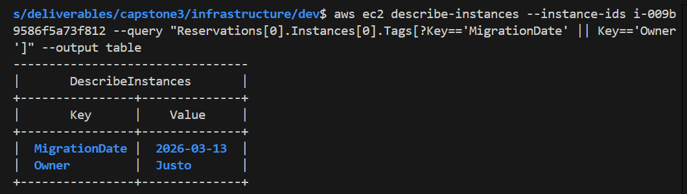
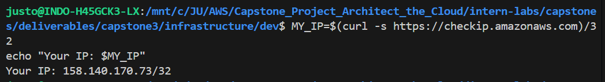
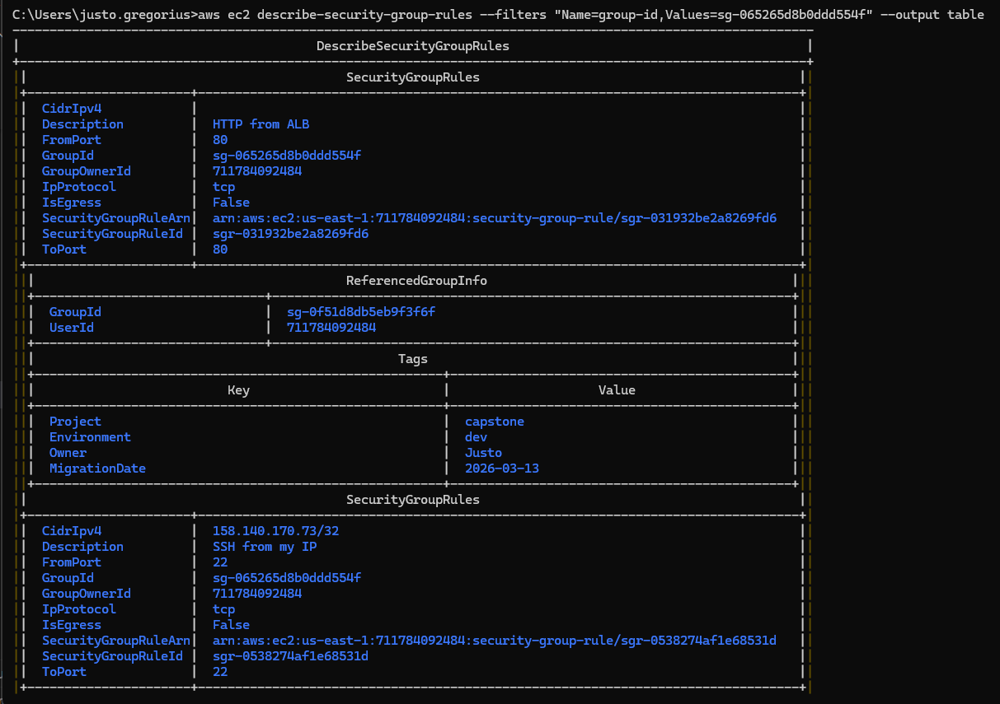
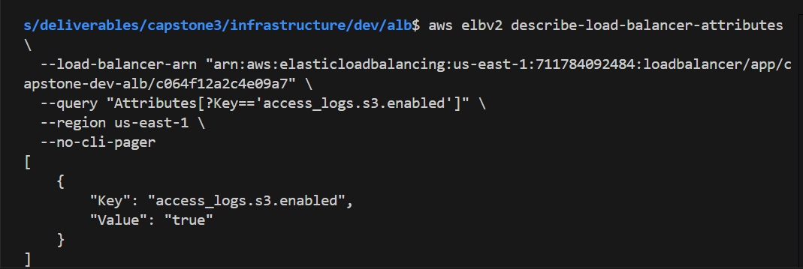
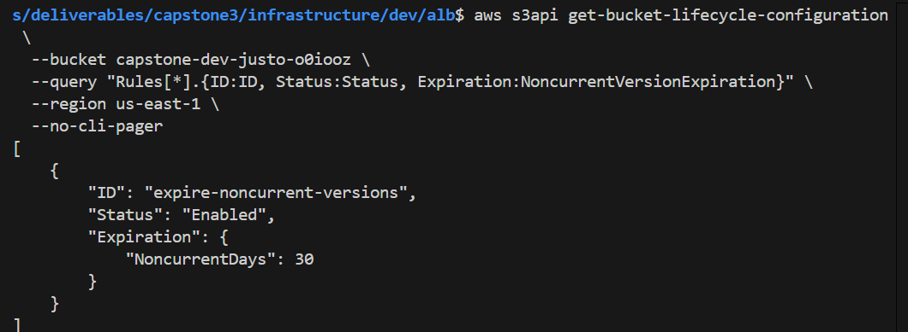
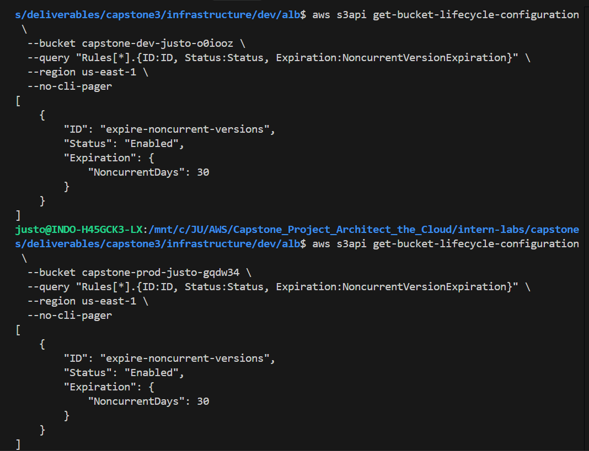

# 🛡️ Phase 5: Lifecycle Management & Hardening Guide

Panduan ini merinci langkah-langkah teknis untuk melakukan pengerasan (hardening) dan manajemen siklus hidup sumber daya AWS menggunakan Terragrunt berdasarkan infrastruktur yang telah di-import.

---

## 📋 Prasyarat
1. Infrastruktur dalam keadaan **Zero Drift** (jalankan `terragrunt plan` di semua folder untuk memastikan).
2. Akses ke Terminal/CLI untuk verifikasi.
3. Tanggal hari ini dalam format `YYYY-MM-DD`.

---

## 🚀 Daftar Tugas

### 5.1 Penegakan Tagging (Tagging Enforcement)
Menambahkan tag global ke seluruh resource melalui level root untuk mempermudah audit.

**Langkah-langkah:**
1. Buka `infrastructure/root.hcl`.
2. Update blok `generate "provider"` untuk menyertakan `default_tags`.

```hcl
generate "provider" {
  path      = "provider.tf"
  if_exists = "overwrite_terragrunt"
  contents  = <<EOF
provider "aws" {
  region = "${local.region}"
  default_tags {
    tags = {
      Project       = "${local.project}"
      Environment   = "${local.env}"
      MigrationDate = "2026-03-13" # Ganti ke tanggal hari ini
      Owner         = "Justo"      # Ganti ke nama Anda
    }
  }
}
EOF
}
```

**Verifikasi:**
Jalankan `terragrunt plan`. Verifikasi bahwa setiap resource akan mendapatkan tambahan tag baru tersebut tanpa merusak resource yang ada.

---

### 5.2 Pengerasan Security Group (SG Hardening)
Membatasi akses SSH (Port 22) agar hanya bisa diakses dari IP publik komputer Anda saat ini.

**Langkah-langkah:**
1. Ambil IP Publik Anda: `curl -s https://checkip.amazonaws.com`.

2. Update `security-groups/terragrunt.hcl` pada bagian `ec2` SG.
3. Hapus rule `10.0.0.0/8` dan ganti dengan IP Anda.

```hcl
    "ec2" = {
      description = "EC2 instance traffic"
      ingress_rules = [
        { description = "HTTP from ALB", from_port = 80, to_port = 80, ip_protocol = "tcp", source_security_group_key = "alb" },
        { description = "SSH from my IP", from_port = 22, to_port = 22, ip_protocol = "tcp", cidr_ipv4 = "X.X.X.X/32" },
      ]
    }
```

**Verifikasi:**
Jalankan `terragrunt apply`. Periksa di Console atau CLI:
```bash
aws ec2 describe-security-group-rules --filters "Name=group-id,Values=SG_ID_ANDA"
```

---

### 5.3 Logging Akses ALB (ALB Access Logging)
Mengaktifkan catatan audit untuk semua request yang masuk ke Application Load Balancer.

**Langkah-langkah:**
1. Tambahkan izin pada modul S3 agar ELB Service Account bisa menulis log ke bucket.
2. Update `alb/terragrunt.hcl` untuk mengaktifkan fitur logging.

```hcl
inputs = {
  # ... existing inputs
  access_logs = {
    bucket  = "capstone-dev-justo-xxxx" # Nama bucket S3 Anda
    prefix  = "alb-logs"
    enabled = true
  }
}
```


**Verifikasi:**
Cek atribut Load Balancer:
```bash
aws elbv2 describe-load-balancer-attributes --load-balancer-arn "ARN_ALB_ANDA"
```

---

### 5.4 S3 Lifecycle Policy
Optimasi biaya dengan menghapus versi lama objek (Non-current versions) setelah 30 hari.

**Langkah-Langkah:**
1. Pastikan `modules/s3/main.tf` memiliki resource `aws_s3_bucket_lifecycle_configuration`.
2. Update `s3/terragrunt.hcl` untuk memberikan parameter hari.

```hcl
inputs = {
  buckets = {
    "nama-bucket-anda" = {
      versioning_enabled     = true
      noncurrent_expiry_days = 30
    }
  }
}
```

**Verifikasi:**
Cek kebijakan siklus hidup bucket:
```bash
aws s3api get-bucket-lifecycle-configuration --bucket NAMA_BUCKET_ANDA
```
