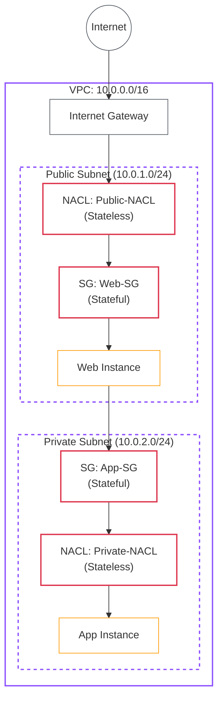

# Lab 05: Secure Networking (NACLs & Security Groups)

| Difficulty | Est. Time | Prerequisites |
|------------|-----------|---------------|
| Advanced   | 90 Mins   | Lab 02, Lab 04|

## 🎯 Objectives
- Understand the **two-layer security model** in AWS: Security Groups (SGs) and Network ACLs (NACLs).
- Configure **inbound and outbound rules** on both SGs and NACLs to control traffic.
- Experience how **stateful vs. stateless** firewalls behave differently in practice.
- Use **VPC Flow Logs** to audit and troubleshoot network traffic.

---

## 🗺️ Architecture Overview



---

## 📚 Concepts

### 1. Security Groups (Stateful Firewall)
Security Groups act as a **virtual firewall at the instance level**.
- **Stateful**: If you allow inbound traffic on port 80, the return traffic is automatically allowed — you don't need an explicit outbound rule.
- **Allow-only**: You can only write *allow* rules. There is no "deny" in a Security Group.
- **Instance-level**: Applied directly to an ENI (Elastic Network Interface).

### 2. Network ACLs (Stateless Firewall)
NACLs act as a **firewall at the subnet boundary**.
- **Stateless**: Return traffic must be explicitly allowed. You need both inbound AND outbound rules for a connection to work.
- **Allow & Deny**: You can write both *allow* and *deny* rules.
- **Rule Order**: Rules are evaluated in **ascending numeric order** (100, 200, 300…). The first match wins.
- **Subnet-level**: Applied to all resources in a subnet.

### 3. Stateful vs. Stateless — The Key Difference

| Feature | Security Group | Network ACL |
|---------|---------------|-------------|
| **Level** | Instance (ENI) | Subnet |
| **State** | Stateful | Stateless |
| **Rules** | Allow only | Allow & Deny |
| **Evaluation** | All rules checked | Ordered (first match) |
| **Return Traffic** | Auto-allowed | Must be explicitly allowed |

### 4. Ephemeral Ports
When a client connects to a server, the server's response goes back to a **random high port** (1024–65535) on the client side — called an ephemeral port. Because NACLs are stateless, you must allow **outbound ephemeral ports** on the subnet that receives the request.

---

## 🛠️ Step-by-Step Lab

> **Prerequisite**: You should have the `Intern-VPC` with `Public-Subnet` and `Private-Subnet` from Lab 02, with an IGW attached and route tables configured.

### Step 1: Launch Two EC2 Instances

1. **Web Instance** (Public Subnet):
   - **Name**: `Web-Server`
   - **Subnet**: `Public-Subnet`, **Auto-assign Public IP**: Enable
   - **Security Group**: Create `Web-SG`
     - Inbound: Allow **SSH (22)** from your IP, **HTTP (80)** from `0.0.0.0/0`
     - Outbound: Allow **All traffic** (default)

2. **App Instance** (Private Subnet):
   - **Name**: `App-Server`
   - **Subnet**: `Private-Subnet`, **Auto-assign Public IP**: Disable
   - **Security Group**: Create `App-SG`
     - Inbound: Allow **All traffic** from `Web-SG` (use the SG ID as source)
     - Outbound: Allow **All traffic** (default)

### Step 2: Enable VPC Flow Logs
Flow Logs let you capture all IP traffic going to/from your VPC for auditing.

1. Go to **VPC Dashboard** > Select `Intern-VPC` > **Flow Logs** tab.
2. Click **Create flow log**.
   - **Filter**: `All`
   - **Destination**: `Send to CloudWatch Logs`
   - **Log group**: Create new `/vpc/intern-flow-logs`
   - **IAM Role**: Create a new role (AWS will prompt you).
3. Click **Create flow log**.

### Step 3: Create Custom NACLs

By default, subnets use the **default NACL** which allows all traffic. We'll create restrictive custom NACLs.

**Public NACL** (`Public-NACL`):
1. Go to **VPC** > **Network ACLs** > **Create network ACL**.
   - **Name**: `Public-NACL`, **VPC**: `Intern-VPC`.
2. **Associate** it with `Public-Subnet`.
3. **Edit Inbound Rules**:
   | Rule # | Type | Port | Source | Action |
   |--------|------|------|--------|--------|
   | 100 | SSH | 22 | Your IP/32 | Allow |
   | 110 | HTTP | 80 | 0.0.0.0/0 | Allow |
   | 120 | Custom TCP | 1024-65535 | 0.0.0.0/0 | Allow |
   | * | All Traffic | All | 0.0.0.0/0 | Deny |

4. **Edit Outbound Rules**:
   | Rule # | Type | Port | Destination | Action |
   |--------|------|------|-------------|--------|
   | 100 | HTTP | 80 | 0.0.0.0/0 | Allow |
   | 110 | HTTPS | 443 | 0.0.0.0/0 | Allow |
   | 120 | Custom TCP | 1024-65535 | 0.0.0.0/0 | Allow |
   | * | All Traffic | All | 0.0.0.0/0 | Deny |

**Private NACL** (`Private-NACL`):
1. Create another NACL named `Private-NACL`, associate with `Private-Subnet`.
2. **Edit Inbound Rules**:
   | Rule # | Type | Port | Source | Action |
   |--------|------|------|--------|--------|
   | 100 | All Traffic | All | 10.0.1.0/24 | Allow |
   | 120 | Custom TCP | 1024-65535 | 0.0.0.0/0 | Allow |
   | * | All Traffic | All | 0.0.0.0/0 | Deny |

3. **Edit Outbound Rules**:
   | Rule # | Type | Port | Destination | Action |
   |--------|------|------|-------------|--------|
   | 100 | All Traffic | All | 10.0.1.0/24 | Allow |
   | 120 | Custom TCP | 1024-65535 | 0.0.0.0/0 | Allow |
   | * | All Traffic | All | 0.0.0.0/0 | Deny |

### Step 4: Test Connectivity

1. SSH into `Web-Server` using its public IP.
2. From `Web-Server`, SSH into `App-Server` using its **private IP**:
   ```bash
   ssh -i your-key.pem ec2-user@10.0.2.x
   ```
3. Verify the connection succeeds — this works because `App-SG` allows traffic from `Web-SG`.

### Step 5: Observe the Stateless NACL Behavior

1. Go to `Private-NACL` > **Edit Inbound Rules**.
2. **Delete** rule `120` (ephemeral ports `1024-65535`).
3. Try to SSH from `Web-Server` to `App-Server` again.
   - *Observation: The connection will hang or fail, even though the Security Group allows it.*
4. **Restore** rule `120`. Confirm SSH works again.
   - *This demonstrates that NACLs require explicit return traffic rules.*

### Step 6: Review Flow Logs

1. Go to **CloudWatch** > **Log Groups** > `/vpc/intern-flow-logs`.
2. Open a recent log stream and find entries for your SSH traffic.
3. Look for `ACCEPT` and `REJECT` entries — rejected traffic from the NACL test should appear here.

---

## ❓ Troubleshooting & Pitfalls

- **Forgot Ephemeral Ports**: The most common NACL mistake. Always allow `1024-65535` on both inbound and outbound for the subnet that initiates connections.
- **NACL Rule Order**: A `DENY *` at rule `*` is automatic, but if you accidentally add a broad `ALLOW` at rule `100` before a specific `DENY`, the allow wins.
- **SG vs NACL Conflict**: Both must allow traffic. If the SG allows port 80 but the NACL denies it, traffic is blocked. Check both layers when troubleshooting.
- **Flow Logs Delay**: Flow logs can take 5–15 minutes to appear in CloudWatch. Be patient.

---

## 🧠 Lab Tasks: The Layered Defense
**Goal**: Implement a deny-list using NACLs while keeping Security Groups permissive.

1.  **Block Outbound to a Specific IP**: Add an **outbound** NACL rule (rule `50`) to `Public-NACL` that **denies** all traffic to `8.8.8.8/32` (Google's DNS). From `Web-Server`, run `ping 8.8.8.8` and verify it fails. Then confirm `ping 8.8.4.4` (another Google DNS) still works, proving the rule is IP-specific.
2. **SG Chaining**: Create a third Security Group `DB-SG`. Configure it to only allow traffic from `App-SG` (not from `Web-SG` directly). Launch a third instance in the private subnet with `DB-SG` and verify that `Web-Server` cannot reach it directly.
3. **Audit with Flow Logs**: After completing tasks 1 and 2, check CloudWatch Flow Logs. Find the `REJECT` entries for the blocked traffic and document the source IP, destination port, and the action logged.

---

## 🧹 Cleanup
1. Terminate `Web-Server` and `App-Server` instances.
2. Delete `Public-NACL` and `Private-NACL` (subnets revert to the default NACL).
3. Delete `Web-SG` and `App-SG`.
4. Delete the CloudWatch Log Group `/vpc/intern-flow-logs`.
5. Delete the Flow Log from the VPC settings.
