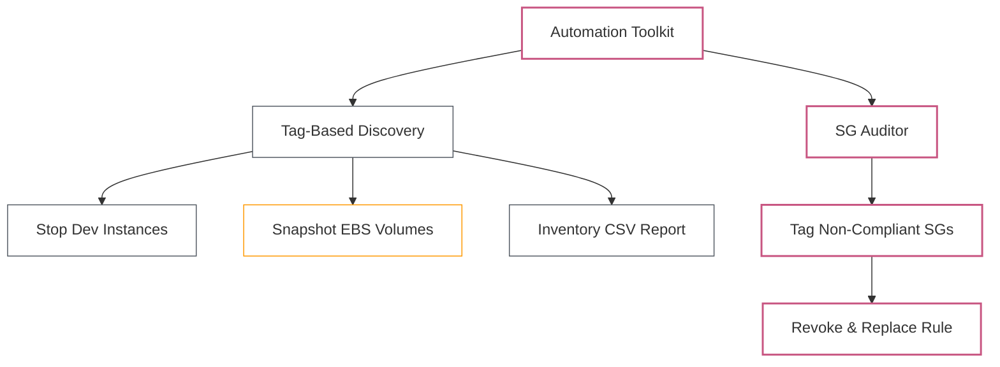

# Lab 07: Automating AWS with Boto3

| Difficulty | Est. Time | Prerequisites |
|------------|-----------|---------------|
| Advanced   | 120 Mins  | Lab 06 Completion |


---

## 🎯 Objectives
- Automate EC2 instance lifecycle management using tags and filters.
- Use **Paginators** to safely handle large result sets.
- Use **DryRun** mode to safely test destructive operations before executing.
- Handle API errors gracefully with `try/except` and `ClientError`.
- Build a **Security Group auditor and auto-remediation** script.
- Generate a structured **infrastructure inventory CSV report**.

---

## 🗺️ Automation Flow



---

## 📚 Concepts

### 1. Waiters
Boto3 **Waiters** block your script until a resource reaches a target state — no manual polling needed.

```python
instance.wait_until_running()   # blocks until state == 'running'
instance.wait_until_stopped()   # blocks until state == 'stopped'
```

### 2. Paginators
API responses are **truncated** when there are many resources. Always use paginators in production scripts.

```python
paginator = ec2.get_paginator('describe_instances')
for page in paginator.paginate(Filters=[...]):
    for reservation in page['Reservations']:
        for instance in reservation['Instances']:
            print(instance['InstanceId'])
```

### 3. DryRun Mode
Most EC2 mutating calls support `DryRun=True` — tests your **IAM permissions** without making real changes.

```python
from botocore.exceptions import ClientError

try:
    ec2.stop_instances(InstanceIds=['i-xxxx'], DryRun=True)
except ClientError as e:
    if 'DryRunOperation' in str(e):
        print("DryRun OK — you have permission.")
    else:
        raise
```

### 4. Error Handling with ClientError
Always wrap Boto3 calls in `try/except`. The error code lives in `e.response['Error']['Code']`.

```python
from botocore.exceptions import ClientError

try:
    ec2.terminate_instances(InstanceIds=['i-xxxx'])
except ClientError as e:
    code = e.response['Error']['Code']
    msg  = e.response['Error']['Message']
    print(f"Error [{code}]: {msg}")
```

### 5. Stateful Tagging
Tags are your metadata layer. Use them to track compliance state (`Status: Non-Compliant`), ownership (`ManagedBy: Boto3-Lab`), and environment (`Environment: Dev`) so scripts can filter resources reliably.

---

## 🛠️ Step-by-Step Lab

> **Setup**: Use **AWS CloudShell** (available in the sandbox console toolbar) or an EC2 instance with an IAM role that has `ec2:*` permissions. All scripts are plain Python 3 — no extra packages needed except `boto3` (pre-installed in CloudShell).

---

### Step 1: Launch Tagged EC2 Instances
Create `launch_instances.py`:

```python
import boto3

ec2 = boto3.resource('ec2', region_name='us-east-1')

def launch_instance(name, environment):
    # Get the latest Amazon Linux 2 AMI dynamically
    ssm = boto3.client('ssm', region_name='us-east-1')
    ami_id = ssm.get_parameter(
        Name='/aws/service/ami-amazon-linux-latest/amzn2-ami-hvm-x86_64-gp2'
    )['Parameter']['Value']

    instances = ec2.create_instances(
        ImageId=ami_id,
        MinCount=1,
        MaxCount=1,
        InstanceType='t3.micro',
        TagSpecifications=[{
            'ResourceType': 'instance',
            'Tags': [
                {'Key': 'Name',        'Value': name},
                {'Key': 'Environment', 'Value': environment},
                {'Key': 'ManagedBy',   'Value': 'Boto3-Lab'},
            ]
        }]
    )
    instance = instances[0]
    print(f"Launching {name} ({environment}): {instance.id} — waiting...")
    instance.wait_until_running()
    instance.reload()
    print(f"  ✅ Running | ID: {instance.id}")
    return instance

if __name__ == '__main__':
    launch_instance('Dev-Server-01', 'Dev')
    launch_instance('Dev-Server-02', 'Dev')
    launch_instance('Prod-Server-01', 'Prod')
```

> **Note**: Using SSM Parameter Store to fetch the latest AMI ID avoids hardcoding an AMI that may be outdated in the sandbox region.

---

### Step 2: Tag-Based Discovery with Paginators
Create `discover_instances.py`:

```python
import boto3

ec2 = boto3.client('ec2', region_name='us-east-1')

def discover_by_tag(tag_key, tag_value):
    paginator = ec2.get_paginator('describe_instances')
    pages = paginator.paginate(
        Filters=[
            {'Name': f'tag:{tag_key}', 'Values': [tag_value]},
            {'Name': 'instance-state-name', 'Values': ['running', 'stopped']}
        ]
    )
    results = []
    for page in pages:
        for reservation in page['Reservations']:
            for inst in reservation['Instances']:
                name = next(
                    (t['Value'] for t in inst.get('Tags', []) if t['Key'] == 'Name'),
                    'N/A'
                )
                results.append({
                    'id':    inst['InstanceId'],
                    'name':  name,
                    'state': inst['State']['Name'],
                    'type':  inst['InstanceType'],
                    'az':    inst['Placement']['AvailabilityZone'],
                })
    return results

if __name__ == '__main__':
    for env in ['Dev', 'Prod']:
        print(f"\n=== {env} Instances ===")
        for inst in discover_by_tag('Environment', env):
            print(f"  {inst['name']:<20} | {inst['id']} | {inst['state']:<10} | {inst['type']} | {inst['az']}")
```

---

### Step 3: Stop Dev Instances (with DryRun Safety Check)
Create `stop_dev_instances.py`:

```python
import boto3
from botocore.exceptions import ClientError

ec2_client   = boto3.client('ec2', region_name='us-east-1')
ec2_resource = boto3.resource('ec2', region_name='us-east-1')

def get_running_dev_ids():
    instances = ec2_resource.instances.filter(
        Filters=[
            {'Name': 'tag:Environment',     'Values': ['Dev']},
            {'Name': 'instance-state-name', 'Values': ['running']}
        ]
    )
    return [i.id for i in instances]

def stop_instances(instance_ids, dry_run=True):
    if not instance_ids:
        print("No running Dev instances found.")
        return

    label = "[DRY RUN]" if dry_run else "[LIVE]"
    try:
        ec2_client.stop_instances(InstanceIds=instance_ids, DryRun=dry_run)
        if not dry_run:
            print(f"{label} Stopped: {instance_ids}")
    except ClientError as e:
        if 'DryRunOperation' in str(e):
            print(f"{label} Permission check passed — would stop: {instance_ids}")
        else:
            print(f"ERROR: {e.response['Error']['Code']} — {e.response['Error']['Message']}")
            raise

if __name__ == '__main__':
    ids = get_running_dev_ids()
    print(f"Found {len(ids)} running Dev instance(s): {ids}")

    # Step 1: DryRun to verify permissions
    stop_instances(ids, dry_run=True)

    # Step 2: Confirm before executing
    confirm = input("\nProceed with stopping? (yes/no): ").strip().lower()
    if confirm == 'yes':
        stop_instances(ids, dry_run=False)
        print("Done.")
    else:
        print("Aborted.")
```

---

### Step 4: Automated EBS Snapshot Backup
Create `snapshot_backup.py`:

```python
import boto3
from datetime import datetime
from botocore.exceptions import ClientError

ec2 = boto3.resource('ec2', region_name='us-east-1')

def backup_volumes():
    instances = ec2.instances.filter(
        Filters=[{'Name': 'tag:ManagedBy', 'Values': ['Boto3-Lab']}]
    )

    snapshots_created = []
    for instance in instances:
        instance_name = next(
            (t['Value'] for t in instance.tags or [] if t['Key'] == 'Name'),
            instance.id
        )
        for volume in instance.volumes.all():
            try:
                snapshot = volume.create_snapshot(
                    Description=f"Auto-backup: {volume.id} from {instance_name}",
                    TagSpecifications=[{
                        'ResourceType': 'snapshot',
                        'Tags': [
                            {'Key': 'Name',       'Value': f"backup-{instance_name}-{datetime.now().strftime('%Y%m%d')}"},
                            {'Key': 'Source',     'Value': volume.id},
                            {'Key': 'AutoBackup', 'Value': 'true'},
                        ]
                    }]
                )
                print(f"  ✅ Snapshot {snapshot.id} created for {volume.id} ({instance_name})")
                snapshots_created.append(snapshot.id)
            except ClientError as e:
                print(f"  ❌ ERROR on {volume.id}: {e.response['Error']['Message']}")

    return snapshots_created

if __name__ == '__main__':
    print("=== EBS Snapshot Backup ===")
    created = backup_volumes()
    print(f"\nTotal snapshots created: {len(created)}")
```

---

### Step 5: Security Group Auditor & Auto-Remediation
Create `audit_sg.py`:

```python
import boto3
import urllib.request
from botocore.exceptions import ClientError

ec2 = boto3.client('ec2', region_name='us-east-1')

def get_my_public_ip():
    with urllib.request.urlopen('https://checkip.amazonaws.com') as r:
        return r.read().decode().strip() + '/32'

def audit_security_groups():
    violations = []
    paginator = ec2.get_paginator('describe_security_groups')
    for page in paginator.paginate():
        for sg in page['SecurityGroups']:
            for rule in sg['IpPermissions']:
                for ip_range in rule.get('IpRanges', []):
                    if ip_range.get('CidrIp') == '0.0.0.0/0':
                        violations.append({
                            'sg_id':    sg['GroupId'],
                            'sg_name':  sg['GroupName'],
                            'port':     rule.get('FromPort', 'All'),
                            'proto':    rule.get('IpProtocol', '-1'),
                            'rule_obj': rule,
                        })
    return violations

def tag_non_compliant(sg_id):
    ec2.create_tags(
        Resources=[sg_id],
        Tags=[{'Key': 'Status', 'Value': 'Non-Compliant'}]
    )

def remediate(sg_id, rule_obj, my_ip):
    # Remove the open rule
    try:
        ec2.revoke_security_group_ingress(
            GroupId=sg_id,
            IpPermissions=[rule_obj]
        )
        print(f"  Revoked 0.0.0.0/0 rule from {sg_id}")
    except ClientError as e:
        print(f"  Revoke failed: {e.response['Error']['Message']}")
        return

    # Replace with your IP only
    try:
        ec2.authorize_security_group_ingress(
            GroupId=sg_id,
            IpPermissions=[{
                'IpProtocol': rule_obj['IpProtocol'],
                'FromPort':   rule_obj.get('FromPort', 22),
                'ToPort':     rule_obj.get('ToPort', 22),
                'IpRanges':   [{'CidrIp': my_ip, 'Description': 'Remediated — my IP only'}]
            }]
        )
        print(f"  Added rule: {my_ip} only")
        ec2.create_tags(
            Resources=[sg_id],
            Tags=[{'Key': 'Status', 'Value': 'Remediated'}]
        )
    except ClientError as e:
        print(f"  Authorize failed: {e.response['Error']['Message']}")

if __name__ == '__main__':
    print("=== Security Group Audit ===")
    violations = audit_security_groups()

    if not violations:
        print("✅ All Security Groups are compliant.")
    else:
        my_ip = get_my_public_ip()
        print(f"Your public IP: {my_ip}\n")
        for v in violations:
            print(f"[NON-COMPLIANT] {v['sg_name']} ({v['sg_id']}) — Port {v['port']} open to 0.0.0.0/0")
            tag_non_compliant(v['sg_id'])

        confirm = input(f"\nAuto-remediate {len(violations)} violation(s)? (yes/no): ").strip().lower()
        if confirm == 'yes':
            for v in violations:
                print(f"\nRemediating {v['sg_name']} ({v['sg_id']})...")
                remediate(v['sg_id'], v['rule_obj'], my_ip)
            print("\n✅ Remediation complete.")
        else:
            print("Skipped remediation.")
```

---

### Step 6: Generate an Infrastructure Inventory CSV
Create `inventory_report.py`:

```python
import boto3
import csv
from datetime import datetime

ec2 = boto3.client('ec2', region_name='us-east-1')

def generate_inventory(filename='inventory_report.csv'):
    paginator = ec2.get_paginator('describe_instances')
    rows = []

    for page in paginator.paginate():
        for reservation in page['Reservations']:
            for inst in reservation['Instances']:
                tags = {t['Key']: t['Value'] for t in inst.get('Tags', [])}
                rows.append({
                    'InstanceId':   inst['InstanceId'],
                    'Name':         tags.get('Name', 'N/A'),
                    'Environment':  tags.get('Environment', 'N/A'),
                    'ManagedBy':    tags.get('ManagedBy', 'N/A'),
                    'State':        inst['State']['Name'],
                    'Type':         inst['InstanceType'],
                    'AZ':           inst['Placement']['AvailabilityZone'],
                    'LaunchTime':   inst['LaunchTime'].strftime('%Y-%m-%d %H:%M:%S'),
                    'PublicIP':     inst.get('PublicIpAddress', 'N/A'),
                    'PrivateIP':    inst.get('PrivateIpAddress', 'N/A'),
                })

    with open(filename, 'w', newline='') as f:
        writer = csv.DictWriter(f, fieldnames=rows[0].keys())
        writer.writeheader()
        writer.writerows(rows)

    print(f"✅ Inventory written to {filename} ({len(rows)} instances)")

if __name__ == '__main__':
    generate_inventory()
```

---

## ❓ Troubleshooting & Pitfalls

- **AMI ID**: The script uses SSM Parameter Store to fetch the latest Amazon Linux 2 AMI — no hardcoded IDs needed.
- **DryRun**: Always run with `DryRun=True` first. It verifies IAM permissions without making changes.
- **Tag Case Sensitivity**: `Environment` ≠ `environment`. Be consistent across all scripts.
- **Paginator vs. `describe_*`**: Always use paginators — a single API call may not return all results.
- **CloudShell Timeout**: Pluralsight CloudShell sessions can time out after ~20 minutes of inactivity. Save your scripts to a file before starting.
- **IAM Permissions**: Your sandbox role needs `ec2:*` and `ssm:GetParameter`. If a call fails with `AccessDenied`, check the sandbox role's attached policies.
- **Snapshot State**: Snapshots start as `pending`. They may not be `completed` immediately — this is normal.

---

## 🧠 Lab Tasks: The Automation Toolkit


### Task 1: The Smart Stopper
**Goal**: Stop instances only if they've been running for more than 30 minutes.

1. Use `describe_instances` with a paginator to list all running `Dev` instances.
2. Check the `LaunchTime` field on each instance.
3. If `datetime.now(timezone.utc) - LaunchTime > timedelta(minutes=30)`, add it to a stop list.
4. Print a table showing each instance, its launch time, and whether it will be stopped or skipped.
5. Run with `DryRun=True` first, then execute for real after confirming.
6. Log each action (stopped / skipped) to `stopper.log` with a timestamp.

### Task 2: The Full Remediation Pipeline
**Goal**: Create a non-compliant SG, detect it, fix it, and prove it's fixed — all programmatically.

1. Write a script that creates `Legacy-SG` with Port 22 open to `0.0.0.0/0`.
2. Run `audit_sg.py` — confirm `Legacy-SG` appears as `[NON-COMPLIANT]`.
3. Run the auto-remediation — confirm the `0.0.0.0/0` rule is replaced with your IP.
4. Run `audit_sg.py` again — confirm `Legacy-SG` is no longer flagged.
5. Print a **before/after table** of the SG rules using `describe_security_groups`.

### Task 3: Backup & Verify
**Goal**: Automate snapshot creation and verify their state.

1. Run `snapshot_backup.py` against your `Boto3-Lab` instances.
2. Write a **verification script** that:
   - Lists all snapshots tagged `AutoBackup: true`.
   - Checks each snapshot's `State` (`pending` / `completed` / `error`).
   - Prints a summary table: `Snapshot ID | Volume ID | State | Start Time`.

---

## 🧹 Cleanup

Run this to terminate all lab instances:

```python
import boto3

ec2 = boto3.resource('ec2', region_name='us-east-1')
instances = ec2.instances.filter(
    Filters=[{'Name': 'tag:ManagedBy', 'Values': ['Boto3-Lab']}]
)
for instance in instances:
    print(f"Terminating {instance.id}...")
    instance.terminate()
print("Done.")
```

Then manually:
1. Delete all snapshots tagged `AutoBackup: true` (use the cleanup function from Task 3).
2. Delete `Legacy-SG` and any other SGs created during the lab.
