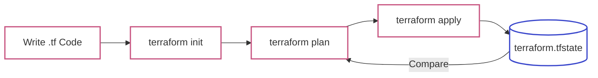
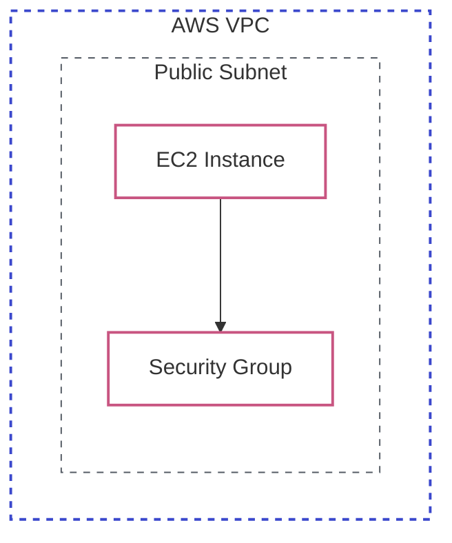

# Lab 08: Terraform Fundamentals

| Difficulty | Est. Time | Prerequisites |
|------------|-----------|---------------|
| Beginner   | 45 Mins   | AWS CLI Setup |

## 🎯 Objectives
- Transition from manual AWS Console work to **Infrastructure as Code (IaC)**.
- Deploy a VPC and Subnet using HashiCorp Terraform.
- Master the **Init -> Plan -> Apply** workflow.
- Understand the **State File** and why it's the "brain" of Terraform.

---

## 🗺️ The Terraform Workflow



### Basic AWS Infrastructure Diagram



---

## 📚 Concepts

### 1. What is Infrastructure as Code (IaC)?
Instead of clicking buttons in a browser, you write text files that describe your desired state. 
*   **Declarative**: You define the *result* (e.g., "I want 3 servers"), and Terraform manages the *process* to get there.
*   **Idempotent**: Running the same code twice won't create duplicate resources if they already exist.

### 2. The Core Commands
- **`terraform init`**: Initializes the working directory and downloads "Providers" (plugins for AWS, Azure, Google Cloud, etc.).
- **`terraform plan`**: The "Dry Run." It shows exactly what will be added, changed, or destroyed.
- **`terraform apply`**: Executes the plan. It creates a `terraform.tfstate` file to track everything.

### 3. The State File (`terraform.tfstate`)
This JSON file is the only way Terraform knows which real-world resources belong to your code. 
> [!CAUTION]
> **NEVER delete or manually edit the state file.** If you lose it, Terraform will try to re-create existing resources, leading to "Resource Already Exists" errors.

---

## 🛠️ Step-by-Step Lab

### Step 1: Initialize the Project
1.  Create a project folder: `mkdir terraform-labs && cd terraform-labs`.
2.  Create `main.tf`:
    ```hcl
    terraform {
      required_providers {
        aws = {
          source  = "hashicorp/aws"
          version = "~> 5.0"
        }
      }
    }

    provider "aws" {
      region = "us-east-1"
    }
    ```
3.  Run `terraform init`. Observe the new `.terraform` folder (don't touch it!).

### Step 2: Define Resources
Add a VPC, Subnet, Security Group, and EC2 Instance to `main.tf`:
```hcl
resource "aws_vpc" "main" {
  cidr_block           = "10.0.0.0/16"
  enable_dns_hostnames = true

  tags = {
    Name = "terraform-vpc"
    Env  = "dev"
  }
}

resource "aws_subnet" "public" {
  vpc_id                  = aws_vpc.main.id
  cidr_block              = "10.0.1.0/24"
  map_public_ip_on_launch = true

  tags = {
    Name = "terraform-public-subnet"
  }
}

resource "aws_security_group" "web" {
  name        = "allow_web"
  description = "Allow inbound web traffic"
  vpc_id      = aws_vpc.main.id

  ingress {
    from_port   = 80
    to_port     = 80
    protocol    = "tcp"
    cidr_blocks = ["0.0.0.0/0"]
  }

  egress {
    from_port   = 0
    to_port     = 0
    protocol    = "-1"
    cidr_blocks = ["0.0.0.0/0"]
  }
}

data "aws_ami" "amazon_linux" {
  most_recent = true
  owners      = ["amazon"]

  filter {
    name   = "name"
    values = ["al2023-ami-2023.*-x86_64"]
  }
}

resource "aws_instance" "web" {
  ami                    = data.aws_ami.amazon_linux.id
  instance_type          = "t2.micro"
  subnet_id              = aws_subnet.public.id
  vpc_security_group_ids = [aws_security_group.web.id]

  tags = {
    Name = "terraform-web-server"
    Env  = "dev"
  }
}
```

### Step 3: Plan & Apply
1.  Run `terraform plan`. Look for `Plan: 1 to add, 0 to change, 0 to destroy`.
2.  Run `terraform apply`. Type `yes` when prompted.
3.  **Verification**: Go to the AWS Console. Your VPC is there, tagged exactly as you wrote in the code!

---

## ❓ Troubleshooting & Pitfalls

- **"No AWS Credentials Found"**: Ensure you have run `aws configure` or set your environment variables.
- **"Provider Version Mismatch"**: If you copy-paste code from 2018, it might use `v1.0` of the AWS provider. Always check the official [Terraform Registry](https://registry.terraform.io/).
- **Formatting**: Use `terraform fmt` to automatically fix your code indentation. It's a best practice!

---

## 🧠 Lab Tasks: The Drift Detective
**Goal**: Manage state and correct manual "out-of-band" changes.

1.  **Preparation**: Ensure your EC2 instance is deployed via Terraform with the tag `Env = "dev"`. 
2.  **The Sabotage**: Go to the **AWS EC2 Console** and manually change the tag to `Env = "prod"`.
3.  **The Detection**: Run `terraform plan`. Observe how Terraform identifies that the real-world resource has "drifted" from your code.
4.  **The Fix**: Run `terraform apply`. Verify that the tag is back to `"dev"` in the console and document why this happens.

---

## 🧹 Cleanup
To avoid costs, destroy everything you built:
```bash
terraform destroy
```
*(Verify that the VPC is gone in the console).*
