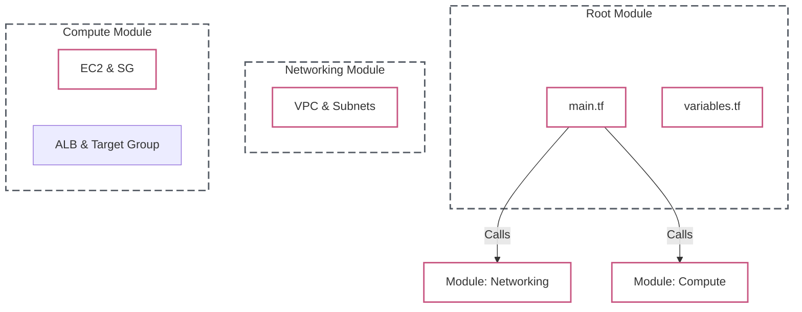

# Lab 09: Reusable Terraform Modules

| Difficulty | Est. Time | Prerequisites |
|------------|-----------|---------------|
| Advanced   | 90 Mins   | Lab 06        |

## 🎯 Objectives
- Organize Terraform code into reusable **Modules**.
- Master **Meta-Arguments**: `count` and `for_each`.
- Handle complex data types (lists, maps) in **Variables** and **Outputs**.
- Understand module scope and logical isolation.

---

## 🗺️ Modular Architecture



---

## 📚 Concepts

### 1. Modules: The Building Blocks
A module is a container for multiple resources that are used together. 
- **Root Module**: The directory where you run `terraform apply`.
- **Child Module**: A separate folder called by the root module.
- **Benefits**: Reusability, testing, and organization.

### 2. Meta-Arguments: Logic in HCL
- **`count`**: Good for creating multiple identical resources based on a number.
- **`for_each`**: Best for creating resources based on a **Map** or **Set of Strings**. It allows you to use keys (e.g., "web-server", "db-server") instead of indices (0, 1, 2).

### 3. Variable Validation
You can now add custom rules to variables to catch errors before they reach AWS:
```hcl
variable "instance_type" {
  type = string
  validation {
    condition     = contains(["t3.micro", "t3.small"], var.instance_type)
    error_message = "Only free-tier-ish instances allowed!"
  }
}
```

---

## 🛠️ Step-by-Step Lab

### Step 1: Create a Networking Module
1.  Create a folder `modules/networking`.
2.  Define a VPC and a Subnet in `modules/networking/main.tf`.
3.  **Crucial**: Use `output "vpc_id"` so the root module can see it.

### Step 2: Use `count` for Subnets
In your networking module:
```hcl
resource "aws_subnet" "public" {
  count             = 2
  vpc_id            = aws_vpc.main.id
  cidr_block        = "10.0.${count.index}.0/24"
  availability_zone = "us-east-1a"
}
```

### Step 3: Use `for_each` for Security Groups
In a new `modules/security` folder, define your rules:
```hcl
variable "ingress_rules" {
  type = map(number)
  default = {
    "http"  = 80
    "https" = 443
    "ssh"   = 22
  }
}

resource "aws_security_group_rule" "ingress" {
  for_each          = var.ingress_rules
  type              = "ingress"
  from_port         = each.value
  to_port           = each.value
  protocol          = "tcp"
  security_group_id = aws_security_group.allow_all.id
  cidr_blocks       = ["0.0.0.0/0"]
}
```

### Step 4: The Compute Module (EC2 & ALB)
Create `modules/compute` and add an Application Load Balancer and EC2 instance (don't forget your variables!):
```hcl
resource "aws_lb" "web_alb" {
  name               = "web-alb"
  internal           = false
  load_balancer_type = "application"
  security_groups    = [var.security_group_id]
  subnets            = var.public_subnet_ids
}

resource "aws_lb_target_group" "web_tg" {
  name     = "web-tg"
  port     = 80
  protocol = "HTTP"
  vpc_id   = var.vpc_id
}

resource "aws_lb_listener" "web_listener" {
  load_balancer_arn = aws_lb.web_alb.arn
  port              = "80"
  protocol          = "HTTP"

  default_action {
    type             = "forward"
    target_group_arn = aws_lb_target_group.web_tg.arn
  }
}

resource "aws_instance" "web" {
  count                  = length(var.public_subnet_ids)
  ami                    = "ami-0abcdef1234567890" # Replace with valid AMI
  instance_type          = "t2.micro"
  subnet_id              = var.public_subnet_ids[count.index]
  vpc_security_group_ids = [var.security_group_id]
}

resource "aws_lb_target_group_attachment" "web_attach" {
  count            = length(aws_instance.web)
  target_group_arn = aws_lb_target_group.web_tg.arn
  target_id        = aws_instance.web[count.index].id
  port             = 80
}
```

### Step 5: The Root Module
In your main `main.tf` (root), tie all modules together:
```hcl
module "vpc" {
  source = "./modules/networking"
}

module "sg" {
  source = "./modules/security"
  vpc_id = module.vpc.vpc_id
}

module "compute" {
  source              = "./modules/compute"
  vpc_id              = module.vpc.vpc_id
  public_subnet_ids   = module.vpc.public_subnet_ids
  security_group_id   = module.sg.security_group_id
}
```

---

## ❓ Troubleshooting & Pitfalls

- **Dependency Cycle**: If Module A needs an output from B, and B needs one from A, Terraform will error. Keep your dependencies linear.
- **Count vs For_Each**: If you use `count` and delete index `1`, index `2` might be destroyed and recreated as the new index `1`. Always use `for_each` for resources that are unique and shouldn't be shifted.
- **Module Versioning**: In real life, point to Git URLs or a Registry, not just local folders.

---

## 🧠 Lab Tasks: The Reusable Factory
**Goal**: Build a dynamic, multi-AZ networking module.

1.  **Dynamic Subnetting**: Refactor your module to use `data "aws_availability_zones" "available" {}`. Use a `for_each` loop to create one public subnet in every available AZ automatically.
2.  **Safety First**: Add a `validation` block to your `vpc_cidr` variable that ensures the CIDR mask is at least `/24`. Test this by trying to deploy a `/16` and recording the error message.
3.  **The Handshake**: Create an `output` in your networking module that returns a list of all Subnet IDs.
4.  **Verification**: Reference the module outputs in your root `main.tf` to print the total count of subnets created. Document how this code behaves differently in `us-east-1` (6 AZs) vs `us-west-1` (3 AZs).
5.  **Load Balancer Test**: Output the ALB DNS name (`output "alb_dns_name"`). Once deployed, curl or open the DNS name in your browser to verify it successfully routes traffic to your instances.

---

## 🧹 Cleanup
To avoid costs, destroy everything you built:
```bash
terraform destroy
```
