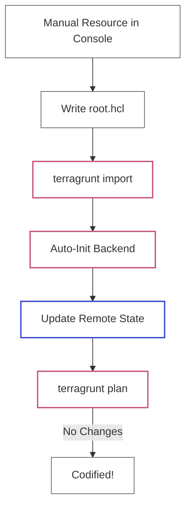

# Lab 13: Terragrunt Import

| Difficulty | Est. Time | Prerequisites |
|------------|-----------|---------------|
| Intermediate | 45 Mins | Lab 12, Lab 13|

## 🎯 Objectives
- Manually create AWS resources to simulate legacy infrastructure.
- Master the `terragrunt import` command.
- Understand how Terragrunt automatically manages remote state during an import.
- Codify existing resources into a DRY Terragrunt structure.

---

## 🗺️ The Terragrunt Import Workflow



---

## 📚 Concepts

### 1. Why `terragrunt import`?
When using Terragrunt, you should always use its wrapper command instead of raw `terraform import`. 
- **Auto-Initialization**: Terragrunt ensures the S3 backend is ready before importing.
- **Remote State Sync**: It automatically places the imported resource into the correct state path based on your folder structure.

### 2. The Import Process
Importing into Terragrunt follows the same rule as Terraform: it only updates the **state**. You still need to provide the matching configuration for the resource to be fully managed.

---

## 🛠️ Step-by-Step Lab

### Step 1: Create Manual Resources
Go to the AWS Console and create the following "legacy" resources:
1.  **Security Group**: Name: `terragrunt-manual-sg`, Allow SSH (Port 22).
2.  **S3 Bucket**: Name: `terragrunt-manual-bucket-[yourname]` (must be unique).
3.  **EC2 Instance**: Launch a `t3.micro` named `manual-ec2` in the default VPC.

### Step 2: Create the Root Configuration
Create a `root.hcl` file in your project root. This file handles remote state and AWS provider generation:

```hcl
remote_state {
  backend = "s3"
  generate = {
    path      = "backend.tf"
    if_exists = "overwrite_terragrunt"
  }
  config = {
    bucket         = "my-unique-terragrunt-state-${get_aws_account_id()}"
    key            = "${path_relative_to_include()}/terraform.tfstate"
    region         = "us-east-1"
    encrypt        = true
    dynamodb_table = "my-lock-table"
  }
}

generate "provider" {
  path      = "provider.tf"
  if_exists = "overwrite_terragrunt"
  contents  = <<EOF
provider "aws" {
  region = "us-east-1"
  default_tags {
    tags = {
      ManagedBy = "Terragrunt"
      Project   = "Intern-Labs"
    }
  }
}
EOF
}
```

### Step 3: Setup Terragrunt Configuration
Navigate to your repository and create the following directory structure:

```text
dev/
├── security-group/
│   └── terragrunt.hcl
├── s3-bucket/
│   └── terragrunt.hcl
└── ec2-instance/
    └── terragrunt.hcl
```

Update each `terragrunt.hcl` with the matching boilerplate below. **Ensure you update the inputs (like IDs and names) to match the manual resources you created in Step 1.**

#### A. Security Group (`dev/security-group/terragrunt.hcl`)
```hcl
include "root" {
  path = find_in_parent_folders("root.hcl")
}

terraform {
  source = "tfr:///terraform-aws-modules/security-group/aws//?version=5.1.0"
}

inputs = {
  name        = "terragrunt-manual-sg"
  vpc_id      = "vpc-xxxxxxxx" # <--- REPLACE WITH YOUR VPC ID
  
  ingress_with_cidr_blocks = [
    {
      from_port   = 22
      to_port     = 22
      protocol    = "tcp"
      cidr_blocks = "0.0.0.0/0"
    }
  ]
}
```

#### B. S3 Bucket (`dev/s3-bucket/terragrunt.hcl`)
```hcl
include "root" {
  path = find_in_parent_folders("root.hcl")
}

terraform {
  source = "tfr:///terraform-aws-modules/s3-bucket/aws//?version=3.15.1"
}

inputs = {
  bucket = "terragrunt-manual-bucket-[yourname]" # <--- MUST MATCH MANUAL BUCKET NAME
}
```

#### C. EC2 Instance (`dev/ec2-instance/terragrunt.hcl`)
```hcl
include "root" {
  path = find_in_parent_folders("root.hcl")
}

terraform {
  source = "tfr:///terraform-aws-modules/ec2-instance/aws//?version=5.6.0"
}

inputs = {
  name           = "manual-ec2"
  instance_type  = "t3.micro"
  # Note: The import will map these to your specific Instance ID in the next step.
}
```

### Step 4: Execute Import
Run the following commands from their respective folders:

**Security Group:**
```bash
terragrunt import aws_security_group.this_name_prefix[0] sg-xxxxxxxx
```

**S3 Bucket:**
```bash
terragrunt import aws_s3_bucket.this[0] terragrunt-manual-bucket-yourname
```

**EC2 Instance:**
```bash
terragrunt import aws_instance.this[0] i-xxxxxxxxxxxx
```

### Step 5: Verify and Modify (The "Real" Test)
How do you know Terragrunt is actually in control?

1.  **Modification**: Change a Tag in your `ec2-instance/terragrunt.hcl`:
    ```hcl
    inputs = {
      # ... existing inputs
      tags = {
        ManagedBy = "Terragrunt"
        Owner     = "[Your Name]"
      }
    }
    ```
2.  **Plan**: Run `terragrunt plan`. Observe that it wants to **update** the tags.
3.  **Apply**: Run `terragrunt apply`.
4.  **Confirm**: Check the AWS Console. Your EC2 instance should now have the new tags!

---

## ❓ Troubleshooting & Pitfalls

- **State Fragmentation**: Always use `terragrunt import` to ensure the S3 backend is used.
- **Module Internal Names**: Different modules use different internal names for resources (e.g., `this` vs `main`). Check the module's `main.tf` if the import fails.
- **Resource Dependencies**: If you import a VPC, remember to import its subnets and route tables too if you want full management.

---

## 🧠 Lab Tasks: The Legacy Refactor
**Goal**: Cleanly import and rename resources via state manipulation.

1.  **Preparation**: Manually create an S3 bucket in the Console.
2.  **The Import**: Use `terragrunt import` to bring the bucket under management in a `dev/storage` folder.
3.  **The Rename**: Use `terragrunt state mv` to rename the resource within the state (e.g., from `aws_s3_bucket.manual` to `aws_s3_bucket.legacy_import`).
4.  **Verification**: Update your code and run `terragrunt plan`. Provide the output showing "No changes" after the rename is complete.
5.  **Emergency Recovery**: Purposefully kill a Terragrunt process to leave a "Stuck Lock". Use `terragrunt force-unlock` to recover the environment. Document the Lock ID you cleared.

---

## 🧹 Cleanup
Delete the resource using Terragrunt:
```bash
terragrunt destroy
```
