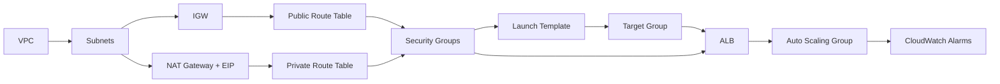

# Capstone Project: Architect the Cloud

| Difficulty | Est. Time | Prerequisites |
|------------|-----------|---------------|
| Advanced | 3–4 Hours | Labs 1–7 |

## 🎯 Vision

You are a **Solutions Architect** hired to design and build a production-grade, highly available web application platform from scratch on AWS. Unlike the other capstones, the **design decisions are yours to make** — and you must justify every one of them.

The application stack is simple: a stateless web application served from EC2 instances behind a load balancer, with an S3 bucket for static assets. Your task is to architect it for **high availability**, **security**, and **cost efficiency**, then build it, test it, and measure it.

> **Pluralsight Sandbox Note**: All services used in this capstone (VPC, EC2, ALB, ASG, S3, CloudWatch) are available in the Pluralsight sandbox. The sandbox does not support Route 53 Alias records for custom domains — you will use the ALB DNS name directly.

---

## 🗺️ Target Architecture

You must deliver an architecture that satisfies all of these non-negotiable constraints:

| Constraint | Requirement |
| :--- | :--- |
| **Availability** | Survive the failure of a **single Availability Zone** without downtime |
| **Security** | No EC2 instance has a public IP address |
| **Traffic** | All inbound traffic enters via a load balancer |
| **Scaling** | EC2 capacity adjusts automatically based on CPU load |
| **Observability** | CPU and HTTP 5xx errors trigger CloudWatch Alarms |
| **Storage** | Static assets are served from S3 with a bucket policy (no public ACLs) |

> You will design the exact CIDR ranges, subnet layout, security group rules, and scaling policies. There is no prescribed answer — only a set of requirements you must meet.

---

## 📋 Technical Specifications

---

### Phase 1: Architecture Design

Before touching the Console, you must **design on paper** (or in a diagram tool). This is the most important phase.

#### 🛠️ Tools Needed
- Pencil & paper, draw.io, Lucidchart, or an ASCII diagram
- AWS Pricing Calculator: https://calculator.aws/pricing/2/home

#### 📦 Deliverables
- **`architecture_design.md`**: Your design document (template below).
- **`cost_estimate.md`**: A cost breakdown using the AWS Pricing Calculator.

---

#### 1.1 Design Requirements

Design a **single-region, multi-AZ** architecture. Your design must include and justify all of the following:

**Networking:**
- A VPC with a CIDR of your choice (document why).
- At least **2 public subnets** (one per AZ) for the load balancer.
- At least **2 private subnets** (one per AZ) for EC2 instances.
- An Internet Gateway and at least **one NAT Gateway** (document the trade-off between 1 NAT GW vs. 1 per AZ).
- Route tables for both public and private tiers.

**Compute:**
- An **Auto Scaling Group** spanning both private subnets.
- A **Launch Template** defining instance type, AMI, and user data.
- Scaling policies: define a **scale-out** and **scale-in** threshold (document your chosen CPU % and why).

**Load Balancing:**
- An **Application Load Balancer** in the public subnets.
- A **Target Group** with a health check path.
- An HTTP listener rule that returns HTTP 200 for the health check path.

**Security:**
- **ALB Security Group**: Define exact inbound rules.
- **EC2 Security Group**: Define exact inbound rules (source must be the ALB SG, not a CIDR).
- **S3 Bucket Policy**: Allow `s3:GetObject` only for a specific IAM role or EC2 instance profile. Do not allow public access.

**Observability:**
- **CloudWatch Alarm 1**: Trigger when average CPU > your scale-out threshold for 2 consecutive minutes.
- **CloudWatch Alarm 2**: Trigger when ALB HTTP 5xx errors > 5 per minute.

---

#### 1.2 Design Document Template (`architecture_design.md`)

Create this file and fill in every section:

```markdown
# Architecture Design: [Your App Name]

## 1. VPC & Networking
- **VPC CIDR**: [x.x.x.x/x] — Justification: [why this range?]
- **AZs Used**: [e.g., us-east-1a, us-east-1b]
- **Public Subnets**: [CIDR] in [AZ] (x2)
- **Private Subnets**: [CIDR] in [AZ] (x2)
- **NAT Gateway Decision**: [1 shared NAT GW vs. 1 per AZ — which did you choose and why?]

## 2. Compute & Scaling
- **Instance Type**: [type] — Justification: [why?]
- **AMI**: [AMI ID or name]
- **Desired / Min / Max Capacity**: [x / x / x] — Justification: [why?]
- **Scale-Out Policy**: CPU > [x]% for [y] minutes
- **Scale-In Policy**: CPU < [x]% for [y] minutes
- **Health Check Grace Period**: [x seconds] — Justification: [how long does your user data take?]

## 3. Load Balancer
- **ALB Subnets**: [list of public subnet IDs/CIDRs]
- **Health Check Path**: [e.g., /health]
- **Health Check Interval**: [seconds]
- **Healthy Threshold**: [count]
- **Unhealthy Threshold**: [count]

## 4. Security Groups
### ALB Security Group
| Direction | Protocol | Port | Source |
| :--- | :--- | :--- | :--- |
| Inbound | TCP | 80 | 0.0.0.0/0 |
| Outbound | TCP | 80 | [EC2 SG ID] |

### EC2 Security Group
| Direction | Protocol | Port | Source |
| :--- | :--- | :--- | :--- |
| Inbound | TCP | 80 | [ALB SG ID] |
| Outbound | TCP | 443 | 0.0.0.0/0 (for yum/SSM) |

## 5. S3 & Static Assets
- **Bucket Name**: [name]
- **Access Method**: [IAM role on EC2 instance profile, or presigned URLs?]
- **Bucket Policy**: [describe what it allows and denies]

## 6. Observability
- **Alarm 1 (CPU Scale-Out)**: Metric: `CPUUtilization`, Threshold: `> [x]%`, Period: `60s`, Eval Periods: `2`
- **Alarm 2 (5xx Errors)**: Metric: `HTTPCode_ELB_5XX_Count`, Threshold: `> 5`, Period: `60s`, Eval Periods: `1`
```

---

#### 1.3 Cost Estimation (`cost_estimate.md`)

Using the [AWS Pricing Calculator](https://calculator.aws/pricing/2/home), estimate the **monthly cost** of your architecture running **24/7** in `us-east-1`. Include:

| Component | Configuration | Est. Monthly Cost |
| :--- | :--- | :--- |
| EC2 (On-Demand) | [type × desired count × hours] | $... |
| NAT Gateway | [× AZs × data processed GB] | $... |
| ALB | [LCU estimate] | $... |
| S3 | [GB storage + GET requests] | $... |
| CloudWatch | [Alarms × metrics] | $... |
| **Total** | | **$...** |

Then answer: **What is the single largest cost driver, and how would you reduce it in a production environment?** (Hint: consider Reserved Instances, Savings Plans, or Spot for the ASG.)

---

### Phase 2: Build It (Console)

Build the architecture you designed in Phase 1. Follow your design document — if you deviate, update the design document to reflect why.

#### 🛠️ Tools Needed
- **AWS Management Console**

#### 📦 Deliverables
- **Live Infrastructure**: Everything running and verified.
- **Console Screenshots**: VPC, Subnets, ASG Activity tab, ALB Target Group health.

---

#### 2.1 Build Order

Follow this order to respect AWS service dependencies:



---

#### 2.2 Launch Template — User Data

Use the following user data script in your Launch Template. It installs a web server and exposes a `/health` endpoint for ALB health checks:

```bash
#!/bin/bash
yum update -y
yum install -y httpd stress
INSTANCE_ID=$(curl -s http://169.254.169.254/latest/meta-data/instance-id)
AZ=$(curl -s http://169.254.169.254/latest/meta-data/placement/availability-zone)

cat > /var/www/html/index.html <<EOF
<html><body>
<h1>Capstone Architecture — Production Web App</h1>
<p>Instance: $INSTANCE_ID</p>
<p>AZ: $AZ</p>
</body></html>
EOF

# Health check endpoint
mkdir -p /var/www/html/health
echo "OK" > /var/www/html/health/index.html

systemctl start httpd
systemctl enable httpd
```

> **Note**: The `stress` tool is installed but not started at boot. You will use it in Phase 3 to simulate CPU load.

---

#### 2.3 Auto Scaling Group Configuration

| Setting | Value |
| :--- | :--- |
| **Launch Template** | Your template from §2.2 |
| **Subnets** | Both private subnets (multi-AZ) |
| **Min / Desired / Max** | Per your design doc |
| **Health Check Type** | `ELB` (not EC2 — this is critical for ALB-based health checks) |
| **Health Check Grace Period** | Per your design doc |
| **Scaling Policy** | `Target Tracking` — CPU, target: your design threshold |

> **Why ELB health checks?** With `EC2` health checks, the ASG only terminates an instance if the underlying VM is down. With `ELB` health checks, the ASG also replaces instances that fail ALB health checks (e.g., the web server crashed). This is the correct production setting.

---

### Phase 3: Resilience & Observability Testing

> **This is what separates a design that exists on paper from one that actually works.** You must prove your architecture is resilient by deliberately breaking it and observing the self-healing behavior.

#### 🛠️ Tools Needed
- **AWS CLI** (for querying CloudWatch and ASG events)
- **AWS Systems Manager Session Manager** (to access private EC2 instances)
- **Web Browser** (to test ALB DNS)

#### 📦 Deliverables
- **AZ Failover Log**: CLI output showing ASG replacing an instance in a failed AZ.
- **CloudWatch Alarm Screenshot**: Alarm in `ALARM` state during the CPU stress test.
- **ASG Scale-Out Log**: `describe-scaling-activities` showing a new instance launched.

---

#### 3.1 Test 1: Health Check Failure & Self-Healing

1. Connect to one of your running EC2 instances using **Session Manager** (no SSH key or public IP required — this validates your security design).
2. Stop the web server to simulate a crash:
   ```bash
   sudo systemctl stop httpd
   ```
3. Watch the ALB Target Group health in the Console. Within 1–2 health check intervals, the target should go `unhealthy`.
4. Verify from the CLI that the ASG replaces the instance:
   ```bash
   aws autoscaling describe-scaling-activities \
     --auto-scaling-group-name [your-asg-name] \
     --query "Activities[?Description != null].{Time:StartTime, Status:StatusCode, Desc:Description}" \
     --output table
   ```
5. Wait for a new instance to register and become healthy. Confirm from the CLI:
   ```bash
   aws elbv2 describe-target-health \
     --target-group-arn "arn:aws:elasticloadbalancing:..." \
     --query "TargetHealthDescriptions[*].{Target:Target.Id, Health:TargetHealth.State}" \
     --output table
   ```

**Expected outcome**: Without any manual intervention, the ASG launches a replacement instance and traffic resumes. Document the time from stop → unhealthy → replaced → healthy.

---

#### 3.2 Test 2: Availability Zone Failure Simulation

Simulate an AZ outage by terminating all instances in one AZ:

```bash
# Find instance IDs per AZ
aws ec2 describe-instances \
  --filters "Name=tag:aws:autoscaling:groupName,Values=[your-asg-name]" \
  --query "Reservations[*].Instances[*].{ID:InstanceId, AZ:Placement.AvailabilityZone, State:State.Name}" \
  --output table

# Terminate all instances in AZ-a (replace with your AZ)
aws autoscaling terminate-instance-in-auto-scaling-group \
  --instance-id i-xxxxxx \
  --should-decrement-desired-capacity false
```

**Observe**:
1. The ASG launches replacement instances and re-balances across AZs.
2. The ALB continues routing traffic to the surviving AZ.
3. Use `curl` repeatedly against the ALB DNS during the replacement to confirm zero downtime:
   ```bash
   for i in $(seq 1 30); do
     curl -so /dev/null -w "%{http_code} " http://[your-alb-dns]/
     sleep 2
   done
   ```

**Expected outcome**: All responses return `200`. Document any failures observed.

---

#### 3.3 Test 3: CPU-Based Auto Scaling

1. Connect to an instance via Session Manager.
2. Run the CPU stress tool to spike CPU above your scale-out threshold:
   ```bash
   # Spike all CPUs to 100% for 5 minutes
   stress --cpu $(nproc) --timeout 300
   ```
3. Monitor the CloudWatch Alarm from the CLI:
   ```bash
   aws cloudwatch describe-alarms \
     --alarm-names "[your-cpu-alarm-name]" \
     --query "MetricAlarms[*].{Name:AlarmName, State:StateValue, Reason:StateReason}" \
     --output table
   ```
4. Wait for the alarm to transition to `ALARM` state. Check ASG scaling activity:
   ```bash
   aws autoscaling describe-scaling-activities \
     --auto-scaling-group-name [your-asg-name] \
     --max-items 5 \
     --query "Activities[*].{Time:StartTime, Status:StatusCode, Desc:Description}" \
     --output table
   ```

**Expected outcome**: When CPU > threshold for 2 consecutive periods, the `ALARM` state triggers the scaling policy and a new instance is launched. After `stress` exits, confirm scale-in occurs (may take several minutes due to cooldown period).

---

### Phase 4: Security Audit

Before declaring success, audit the security posture of your architecture using the CLI.

#### 4.1 Confirm No EC2 Public IPs

```bash
aws ec2 describe-instances \
  --filters "Name=tag:aws:autoscaling:groupName,Values=[your-asg-name]" \
  --query "Reservations[*].Instances[*].{ID:InstanceId, PublicIP:PublicIpAddress, PublicDNS:PublicDnsName}" \
  --output table
```

**Expected**: `PublicIP` and `PublicDNS` columns are `None` for all instances. If not, your placement in private subnets failed — investigate.

---

#### 4.2 Audit Security Group Rules

```bash
# Check EC2 SG — should have NO inbound rules from 0.0.0.0/0
aws ec2 describe-security-groups \
  --filters "Name=tag:Name,Values=capstone-ec2-sg" \
  --query "SecurityGroups[*].IpPermissions[*].{Protocol:IpProtocol, FromPort:FromPort, CIDR:IpRanges[*].CidrIp, SourceSG:UserIdGroupPairs[*].GroupId}" \
  --output table
```

**Expected**: EC2 SG inbound rule sources are **only** the ALB SG ID. Zero CIDR-based inbound rules for port 80.

---

#### 4.3 Verify S3 Bucket Blocks Public Access

```bash
aws s3api get-public-access-block --bucket [your-bucket-name]
```

**Expected**: All four `BlockPublicAcls`, `IgnorePublicAcls`, `BlockPublicPolicy`, `RestrictPublicBuckets` must be `true`.

---

#### 4.4 Verify S3 Bucket Policy (No Wildcard Principal)

```bash
aws s3api get-bucket-policy --bucket [your-bucket-name] | jq .
```

**Expected**: The `Principal` in the policy is **not** `"*"`. It should reference a specific IAM role ARN or be absent (rely entirely on Block Public Access).

---

### Phase 5: Cost Optimization Review

Now that your architecture is running, revisit your cost estimate from Phase 1.

#### 5.1 Actual vs. Estimated

Query actual CloudWatch metrics to compare assumed vs. actual usage:

```bash
# Get average CPU utilization over the last hour
aws cloudwatch get-metric-statistics \
  --namespace AWS/EC2 \
  --metric-name CPUUtilization \
  --dimensions "Name=AutoScalingGroupName,Value=[your-asg-name]" \
  --statistics Average \
  --start-time $(date -u -d '1 hour ago' +%Y-%m-%dT%H:%M:%SZ) \
  --end-time $(date -u +%Y-%m-%dT%H:%M:%SZ) \
  --period 300 \
  --query "Datapoints[*].{Time:Timestamp, Avg:Average}" \
  --output table
```

#### 5.2 Optimization Recommendations

Based on your architecture and observed metrics, answer the following in `cost_estimate.md`:

1. **Right-sizing**: Given the observed CPU utilization during normal operation, is your instance type too large? What would you downsize to?
2. **NAT Gateway Trade-off**: You chose 1 NAT GW or 1 per AZ. Explain the monthly cost difference and which you would use in production.
3. **Savings Plan**: If this architecture ran for 1 year, what would be the estimated monthly saving with a 1-year Compute Savings Plan? (Use the Pricing Calculator.)
4. **Spot Instances in ASG**: Would you use a mixed Spot/On-Demand ASG for this workload? Justify your answer.

---

## 🧹 Cleanup

Delete resources in **reverse** dependency order to avoid errors:

```bash
# 1. Delete the Auto Scaling Group (terminates all instances)
aws autoscaling delete-auto-scaling-group \
  --auto-scaling-group-name [your-asg-name] \
  --force-delete

# 2. Delete the ALB and Target Groups (after ASG is gone)
aws elbv2 delete-load-balancer --load-balancer-arn "arn:..."
aws elbv2 delete-target-group --target-group-arn "arn:..."

# 3. Release Elastic IPs
aws ec2 release-address --allocation-id eipalloc-xxxxxx

# 4. Delete the NAT Gateway (wait for it to reach 'deleted' state)
aws ec2 delete-nat-gateway --nat-gateway-id nat-xxxxxx
# Wait ~1 minute, then delete the VPC
aws ec2 delete-vpc --vpc-id vpc-xxxxxx

# 5. Empty and delete S3 bucket
aws s3 rm s3://[your-bucket-name] --recursive
aws s3 rb s3://[your-bucket-name]
```

---

## ✅ Final Deliverable Checklist

| # | Deliverable | Description |
| :--: | :--- | :--- |
| 1 | `architecture_design.md` | Filled-in design doc with all justifications |
| 2 | `cost_estimate.md` | Pricing Calculator estimate + optimization analysis |
| 3 | Console Screenshots | VPC, ASG, ALB TG health showing all instances healthy |
| 4 | Test 1 Log | ASG scaling activity showing self-healing after `httpd` stop |
| 5 | Test 2 Log | `curl` output showing 200 OK during AZ failover simulation |
| 6 | Test 3 Screenshots | CloudWatch Alarm in `ALARM` state + ASG scale-out activity |
| 7 | Security Audit Output | CLI output from §4.1–§4.4 confirming secure posture |
